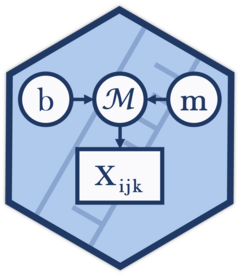
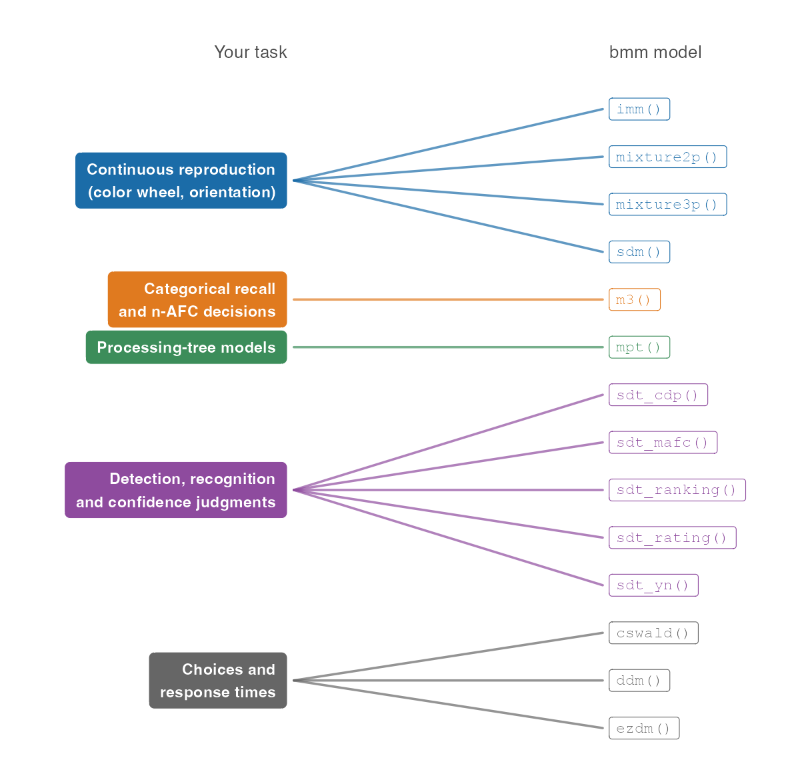

<!-- README.md is generated from README.Rmd. Please edit that file -->
```{r, include = FALSE}
knitr::opts_chunk$set(
  collapse = TRUE,
  comment = "#>",
  fig.path = "man/figures/README-",
  out.width = "100%"
)
desc <- read.dcf("DESCRIPTION")[1, ]
n_imports <- length(strsplit(desc[["Imports"]], ",")[[1]])
n_suggests <- length(strsplit(desc[["Suggests"]], ",")[[1]])
```
# bmm 

<!-- badges: start -->
[](https://popov-lab.github.io/bmm/)
[](https://CRAN.R-project.org/package=bmm)
[](https://popov-lab.r-universe.dev/bmm)
[](https://github.com/popov-lab/bmm/actions/workflows/R-CMD-check.yaml)
[](https://github.com/popov-lab/bmm/actions/workflows/test-coverage.yaml)
[](https://cran.r-project.org/package=bmm)
[](#)
<!-- badges: end -->

*Bayesian Measurement Models for behavioral research in R*

`bmm` fits cognitive measurement models to behavioral data. You write a
`brms` formula for each parameter of the model, and `bmm` translates the
measurement model into a distribution that `brms` can pass to Stan, the
sampler behind it. The result is a hierarchical Bayesian estimate of the
parameters that describe the cognitive processes behind the data, such as
memory precision, the rate of guessing, or the sensitivity in a recognition
task, in the same formula interface you already use for regression.

The [documentation website](https://popov-lab.github.io/bmm/) has a
[Get started](https://popov-lab.github.io/bmm/articles/bmm.html) page and
one article per model family. This page gives you the short version.

## Which model for your task

You arrive with data from a task, so this is how the models are organized.
The lists below are generated from the package, so they show the models of
the version this page was built from.

**Continuous reproduction.** Participants reproduce a color, an orientation
or another continuous feature, and the response error is the dependent
variable. See the [continuous reproduction article](https://popov-lab.github.io/bmm/articles/bmm_vwm_crt.html).

```{r, results = "asis", echo = FALSE}
bmm::print_pretty_models_md(group = "Continuous reproduction")
```

**Categorical recall and n-AFC decisions.** Participants choose one response
from a set of categories (n-alternative forced choice), for example the
correct item, an item from another position, or an item that was not
studied. See the
[M3 article](https://popov-lab.github.io/bmm/articles/bmm_m3.html).

```{r, results = "asis", echo = FALSE}
bmm::print_pretty_models_md(group = "Categorical recall and n-AFC decisions")
```

**Detection, recognition and confidence judgments.** Participants decide
whether a signal was present or an item was studied, rate their confidence,
give Remember/Know judgments, pick the target among several alternatives, or
rank the alternatives. One signal detection model per response format, each
fit to response counts per participant and condition. See the
[signal detection article](https://popov-lab.github.io/bmm/articles/bmm_sdt.html)
and, for the dual-process and meta-d′ versions of `sdt_rating()` and the
Remember/Know model `sdt_cdp()`, the
[dual-process and meta-d′ article](https://popov-lab.github.io/bmm/articles/bmm_sdt_dualprocess_metad.html).
The
[Get started](https://popov-lab.github.io/bmm/articles/bmm.html#detection-recognition-and-confidence-judgments)
page has a table of the response formats and the noise distributions each
model offers.

```{r, results = "asis", echo = FALSE}
bmm::print_pretty_models_md(group = "Detection, recognition and confidence judgments")
```

**Choices and response times.** Participants choose between two options and
the response time is recorded, either on every trial or as means and
variances per condition. See the
[DDM](https://popov-lab.github.io/bmm/articles/bmm_ddm.html),
[censored shifted Wald](https://popov-lab.github.io/bmm/articles/bmm_cswald.html),
[EZ-diffusion](https://popov-lab.github.io/bmm/articles/bmm_ezdm.html) and
[response time contamination](https://popov-lab.github.io/bmm/articles/bmm_rt_contamination.html)
articles.

```{r, results = "asis", echo = FALSE}
bmm::print_pretty_models_md(group = "Choices and response times")
```

**Processing-tree models.** Participants give categorical responses, and
you describe the discrete processes that lead to each response as a
multinomial processing tree: the two-high-threshold model of recognition,
the pair-clustering model of free recall, or a tree of your own. The model is
fit to response counts per participant and condition. See the
[MPT article](https://popov-lab.github.io/bmm/articles/bmm_mpt.html).

```{r, results = "asis", echo = FALSE}
bmm::print_pretty_models_md(group = "Processing-tree models")
```

```{r other-groups, results = "asis", echo = FALSE}
known <- c(
  "Continuous reproduction", "Categorical recall and n-AFC decisions",
  "Detection, recognition and confidence judgments", "Choices and response times",
  "Processing-tree models"
)
other <- setdiff(unique(bmm:::model_registry()$group), known)
if (length(other) > 0) {
  cat("**Other models.**\n\n")
  bmm::print_pretty_models_md(group = other)
}
```

```{r task-map, echo = FALSE, fig.alt = "The tasks bmm covers and the models for each"}

```

`supported_models()` prints the same list in R, and `?modelname` (for
example `?imm`) documents what data a model expects and what its parameters
mean.

## Install

The released version is on CRAN:

``` r
install.packages("bmm")
```

Fitting a model needs a C++ compiler and a Stan backend, `cmdstanr` or
`rstan`; we recommend `cmdstanr`. Run `bmm_setup()` to check both. It
prints one fix for every check that failed and installs nothing itself:

``` r
bmm::bmm_setup()
```

<details>
<summary><b>Install the development version</b></summary>

</br>

``` r
if (!requireNamespace("remotes")) {
  install.packages("remotes")
}
remotes::install_github("popov-lab/bmm", upgrade = "never")
```

`upgrade = "never"` keeps `remotes` from updating the packages `bmm` depends on.
Updating `Rcpp`, `StanHeaders` or `RcppParallel` underneath an installed `rstan`
can leave `rstan` unable to load, in particular on Windows, and `brms` needs
`rstan` to store the results of every fit, also with the `cmdstanr` backend.

</details>

<details>
<summary><b>Install the 0.0.1 version of bmm (if following version 6 of the tutorial paper on the Open Science Framework)</b></summary>

</br>

The package was significantly updated on Feb 03, 2024. If you are
following older versions (earlier than Version 6) of the [Tutorial
preprint](https://osf.io/preprints/psyarxiv/umt57), you need to install
the 0.0.1 version of the bmm package with:

``` r
if (!requireNamespace("remotes")) {
  install.packages("remotes")
}
remotes::install_github("popov-lab/bmm@v0.0.1", upgrade = "never")
```

</details>

## Fit your first model

A fit takes three things: a model object that names the columns of your
data, a formula for each parameter written with `bmf()` (short for
`bmmformula()`), and the data. Here we fit a yes/no
signal detection model to the recognition data of Broeder and Schuetz
(2009) that ships with the package. Its two parameters are the sensitivity
`d` and the response `criterion`. The data has five conditions that varied
the proportion of old items, so we estimate one criterion per condition
(`0 + condition`), and we let both parameters vary between participants
(`(1 | id)`):

``` r
library(bmm)

# one row per participant, condition and stimulus type: n_old counts the
# "old" responses in that cell, n_trials the items shown, and stimulus is 1
# for old items and 0 for new items
model <- sdt_yn(
  response = "n_old",
  stimulus = "stimulus",
  n_trials = "n_trials"
)

formula <- bmf(
  d ~ 1 + (1 | id),
  criterion ~ 0 + condition + (1 | id)
)

fit <- bmm(formula, data = broeder_schuetz_2009_e3, model = model)

summary(fit)
```

The fit is a `brms` fit with extras, so `summary()`, posterior predictive
checks with `pp_check()` and the rest of the `brms` toolbox work as usual.
The [Get started](https://popov-lab.github.io/bmm/articles/bmm.html) page
walks through this example line by line, including how to read the
summary.

## Learn more

- [Articles](https://popov-lab.github.io/bmm/articles/index.html): one per
  model family, plus the
  [bmmformula syntax](https://popov-lab.github.io/bmm/articles/bmm_bmmformula.html)
  and how to
  [extract priors, Stan code and Stan data](https://popov-lab.github.io/bmm/articles/bmm_extract_info.html)
  from a model.
- [Function reference](https://popov-lab.github.io/bmm/reference/index.html)
- [Changelog](https://popov-lab.github.io/bmm/news/index.html)
- Something missing or broken? Open an
  [issue](https://github.com/popov-lab/bmm/issues). For a new model, describe
  it, point to the literature, and link code that already implements it if
  there is any.
- Want to add a model yourself? Start with the
  [Developer Notes](https://popov-lab.github.io/bmm/dev-notes/index.html) and
  the [Contributor Guidelines](https://github.com/popov-lab/bmm/blob/develop/.github/CONTRIBUTING.md).
