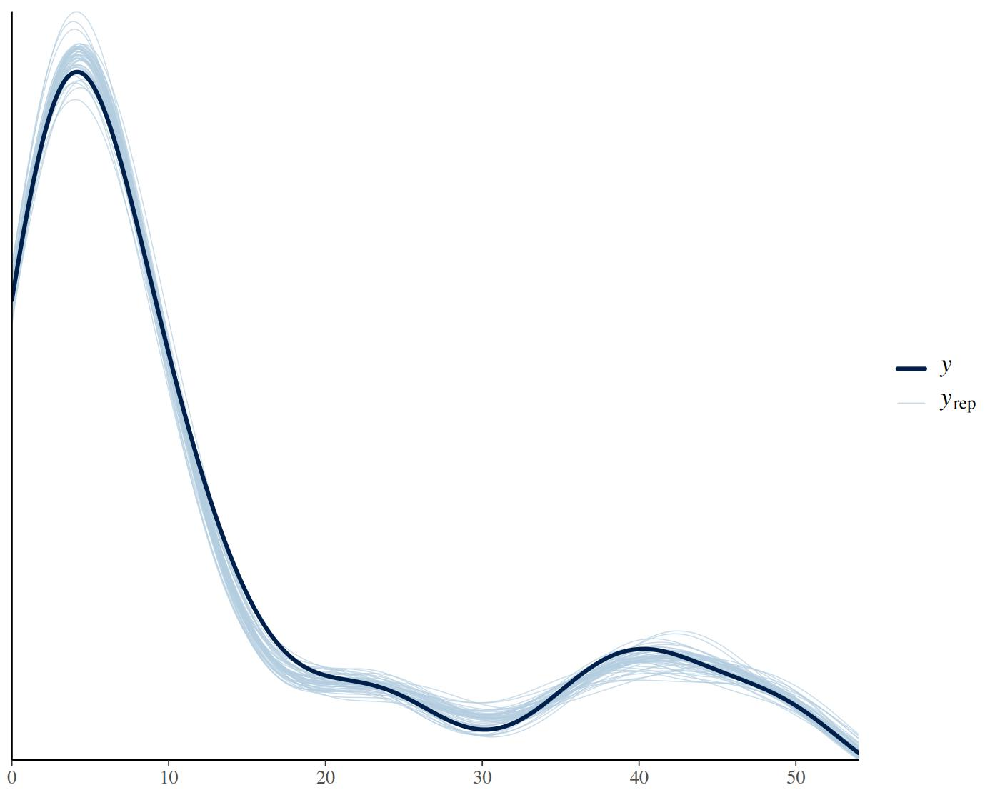

# Get started with bmm

## 1 What bmm does

`bmm` fits cognitive measurement models to behavioral data: models whose
parameters stand for cognitive processes, such as the precision of a
memory representation or the sensitivity in a recognition task. You
write the model for each parameter with the formula syntax of `brms`,
the R package for Bayesian regression, and `bmm` translates the
measurement model into a distribution that `brms` can pass to Stan, the
sampler behind it. In other words, you get hierarchical Bayesian
estimates of interpretable parameters with the same formula interface
you already use for regression.

This page takes you from an installed package to a first fitted model.
It has three parts: checking that your machine can fit models, finding
the model that matches your task, and fitting one model end to end.

## 2 Install and check your machine

The released version is on CRAN, the development version on GitHub:

``` r

install.packages("bmm")

# development version
if (!requireNamespace("remotes")) {
  install.packages("remotes")
}
remotes::install_github("popov-lab/bmm", upgrade = "never")
```

`upgrade = "never"` keeps `remotes` from updating the packages `bmm`
depends on. Updating `Rcpp`, `StanHeaders` or `RcppParallel` underneath
an installed `rstan` can leave `rstan` unable to load, in particular on
Windows. This matters even if `cmdstanr` does the sampling, because
`brms` uses `rstan` to store every fit.

Fitting a model needs more than the package: a C++ compiler, and a Stan
backend, which is the software that compiles the model and samples from
it. There are two backends, `cmdstanr` with CmdStan and `rstan`; we
recommend `cmdstanr`. These are the parts that fail most often on a
fresh machine, and the error usually shows up only when the first model
refuses to compile. Therefore, run
[`bmm_setup()`](https://popov-lab.github.io/bmm/dev/reference/bmm_setup.md)
before anything else:

``` r

library(bmm)
bmm_setup()
```

The function checks each requirement, prints `PASS`, `FAIL` or `SKIP`
per check, and gives one fix for every check that failed. It installs
nothing itself. With the default `smoke_test = TRUE`, it finally
compiles and samples a small mixture model, which is the only check that
shows the whole chain works. This is what the report looked like on the
machine that built this page; we skipped the smoke test here, so its
line reads `SKIP` instead of `PASS`:

``` r

library(bmm)
bmm_setup(smoke_test = FALSE)
```

``` fansi
#> bmm setup check (Linux, R 4.6.1)
#> 
#> PASS  C++ toolchain      R compiled a small test file
#> PASS  cmdstanr           0.9.0.9002
#> PASS  CmdStan            2.40.0
#> PASS  CmdStan toolchain  make and a C++ compiler are on the PATH
#> PASS  rstan              2.32.7
#> PASS  Backend            bmm() will use cmdstanr (the cmdstanr package is
#>                          installed)
#> SKIP  Smoke test         not run (smoke_test = FALSE)
#> 
#> No check failed; run bmm_setup() to compile and sample a test model too.
```

If a check fails, apply the fix it prints, restart R, and run
[`bmm_setup()`](https://popov-lab.github.io/bmm/dev/reference/bmm_setup.md)
again. Once every check passes, you are ready to fit models.

## 3 Which model fits your task

You come to `bmm` with data from a task, so this section is organized by
task. Each entry lists the models `bmm` provides for it and links to the
article that walks through them. The lists are generated from the
package, so they show the models of the version this page was built
from.

### 3.1 Continuous reproduction

Participants reproduce a continuous feature, such as a color or an
orientation, and the response error on the circle is the dependent
variable. The [continuous reproduction
article](https://popov-lab.github.io/bmm/articles/bmm_vwm_crt.html)
describes the task and compares the models.

- [`imm()`](https://popov-lab.github.io/bmm/reference/imm.html):
  Interference measurement model by Oberauer and Lin (2017)
- [`mixture2p()`](https://popov-lab.github.io/bmm/reference/mixture2p.html):
  Two-parameter mixture model by Zhang and Luck (2008)
- [`mixture3p()`](https://popov-lab.github.io/bmm/reference/mixture3p.html):
  Three-parameter mixture model by Bays et al (2009)
- [`sdm()`](https://popov-lab.github.io/bmm/reference/sdm.html): Signal
  Discrimination Model (SDM) by Oberauer (2023)

### 3.2 Categorical recall and n-AFC decisions

Participants pick one response from a set of categories, for example the
correct item, an item from another list position, or an item that was
not studied. The [M3
article](https://popov-lab.github.io/bmm/articles/bmm_m3.html) shows how
to set up the response categories and the activation model.

- [`m3()`](https://popov-lab.github.io/bmm/reference/m3.html): The
  Multinomial / Memory Measurement Model

### 3.3 Detection, recognition and confidence judgments

Participants decide whether a signal was present or an item was studied,
rate their confidence, give Remember/Know judgments, pick the target
among several alternatives, or rank the alternatives. Signal detection
theory separates sensitivity from response bias for each of these
response formats, and `bmm` has one model per format. The models take
response counts per subject and condition.
[`sdt_yn()`](https://popov-lab.github.io/bmm/dev/reference/sdt_yn.md)
also accepts one row per trial, as the first fit below shows; the
rating, ranking and Remember/Know models need one count column per
response category, which
[`aggregate_sdt_cdp_data()`](https://popov-lab.github.io/bmm/dev/reference/aggregate_sdt_cdp_data.md)
builds for
[`sdt_cdp()`](https://popov-lab.github.io/bmm/dev/reference/sdt_cdp.md)
from trial-level data whose confidence runs on one old/new scale. The
[signal detection
article](https://popov-lab.github.io/bmm/articles/bmm_sdt.html) walks
through the yes/no, rating, m-AFC and ranking models, and the
[dual-process and meta-d′
article](https://popov-lab.github.io/bmm/articles/bmm_sdt_dualprocess_metad.html)
through the `dpsdt` and `metad` versions of
[`sdt_rating()`](https://popov-lab.github.io/bmm/dev/reference/sdt_rating.md)
and through
[`sdt_cdp()`](https://popov-lab.github.io/bmm/dev/reference/sdt_cdp.md).

- [`sdt_cdp()`](https://popov-lab.github.io/bmm/reference/sdt_cdp.html):
  Continuous Dual-Process Signal Detection Theory (CDP)
- [`sdt_mafc()`](https://popov-lab.github.io/bmm/reference/sdt_mafc.html):
  Signal Detection Theory (m-AFC)
- [`sdt_ranking()`](https://popov-lab.github.io/bmm/reference/sdt_ranking.html):
  Signal Detection Theory (Ranking)
- [`sdt_rating()`](https://popov-lab.github.io/bmm/reference/sdt_rating.html):
  Signal Detection Theory (Confidence Rating)
- [`sdt_yn()`](https://popov-lab.github.io/bmm/reference/sdt_yn.html):
  Signal Detection Theory (Yes/No)

The models differ in three respects. The response format is what the
participant produces. The `dist` argument names the noise distribution
assumed for the evidence on which the decision is based; the first entry
in the table is the default of that model, and `?modelname` explains the
others. The last column names the parameter that lets the signal
distribution differ in spread from the noise distribution, if the model
has one. This table is built from the package, so a model appears once
it is part of the version this page was built from.

| Response format | Model | dist | Unequal-variance parameter |
|:---|:---|:---|:---|
| yes/no detection, old/new recognition | [`sdt_yn()`](https://popov-lab.github.io/bmm/dev/reference/sdt_yn.md) | normal, gumbel_min, gumbel_max, logistic | `sdratio` |
| confidence ratings | [`sdt_rating()`](https://popov-lab.github.io/bmm/dev/reference/sdt_rating.md), versions `standard`, `dpsdt`, `metad` | normal, gumbel_min, gumbel_max, logistic | `sdratio` |
| m-alternative forced choice | [`sdt_mafc()`](https://popov-lab.github.io/bmm/dev/reference/sdt_mafc.md) | normal, gumbel_min, gumbel_max, logistic | none |
| ranking | [`sdt_ranking()`](https://popov-lab.github.io/bmm/dev/reference/sdt_ranking.md) | gumbel_min, normal | `sdratio` (normal noise only) |
| old/new confidence with Remember/Know judgments | [`sdt_cdp()`](https://popov-lab.github.io/bmm/dev/reference/sdt_cdp.md) | normal | `sigmar` (recollection) |

### 3.4 Choices and response times

Participants choose between two options and the response time is
recorded on every trial. The [DDM
article](https://popov-lab.github.io/bmm/articles/bmm_ddm.html) and the
[censored shifted Wald
article](https://popov-lab.github.io/bmm/articles/bmm_cswald.html) cover
trial-level data. The [EZ-diffusion
article](https://popov-lab.github.io/bmm/articles/bmm_ezdm.html) covers
the case where you only have the mean and variance of the response times
and the accuracy per condition. Fast guesses and other contaminant
responses are the topic of the [response time contamination
article](https://popov-lab.github.io/bmm/articles/bmm_rt_contamination.html).

- [`cswald()`](https://popov-lab.github.io/bmm/reference/cswald.html):
  Censored-Shifted Wald Model
- [`ddm()`](https://popov-lab.github.io/bmm/reference/ddm.html):
  Diffusion Decision Model
- [`ezdm()`](https://popov-lab.github.io/bmm/reference/ezdm.html):
  EZ-Diffusion Model

You can print the same list in R at any time with
[`supported_models()`](https://popov-lab.github.io/bmm/dev/reference/supported_models.md),
and `?modelname` (for example
[`?sdt_yn`](https://popov-lab.github.io/bmm/dev/reference/sdt_yn.md))
documents the data a model expects, its parameters and its default
priors, that is, what the model assumes about each parameter before it
sees the data.

## 4 Fit your first model

We fit a yes/no signal detection model to the recognition data of
Broeder and Schuetz (2009, Experiment 3), which ships with the package
as `broeder_schuetz_2009_e3` (see
[`?broeder_schuetz_2009_e3`](https://popov-lab.github.io/bmm/dev/reference/broeder_schuetz_2009_e3.md)
for the source). 40 participants judged items as old or new under five
base-rate conditions. A higher proportion of old items makes
participants more willing to say “old”, so the conditions shift the
response criterion while sensitivity should stay the same.

### 4.1 The data

[`sdt_yn()`](https://popov-lab.github.io/bmm/dev/reference/sdt_yn.md)
expects one row per subject, condition and stimulus type, with the
number of “old” responses and the number of trials in that cell:

``` r

head(broeder_schuetz_2009_e3)
#>   id condition stimulus n_old n_trials
#> 1  1       br1        1     1        6
#> 2  1       br1        0     1       54
#> 3  1       br2        1    10       15
#> 4  1       br2        0     2       45
#> 5  1       br3        1    22       30
#> 6  1       br3        0    10       30
```

- `stimulus` codes the stimulus type: `1` for old items, `0` for new
  items.
- `n_old` counts the “old” responses in the cell. For old items these
  are the hits, for new items the false alarms.
- `n_trials` is the number of items in the cell, which differs between
  cells because the base rate manipulates it.
- `condition` runs from the most conservative (`br1`) to the most
  liberal (`br5`) base rate. The base rate is set through the number of
  old and new items: in `br1` a participant saw 6 old and 54 new items,
  in `br5` 54 old and 6 new.

### 4.2 The model

A model object names the columns the model needs. Nothing is estimated
yet; this only tells `bmm` where to look:

``` r

model <- sdt_yn(
  response = "n_old",
  stimulus = "stimulus",
  n_trials = "n_trials"
)
```

If your data has one row per trial instead of counts, you can pass it as
is: the column named in `response` then holds `0` or `1`, the column
named in `n_trials` holds `1` on every row, and `stimulus` codes the
item of that trial as before. We leave `dist` at its default,
`"normal"`.

The model has two parameters. `d` is the sensitivity: the distance
between the evidence distributions of old and new items. `criterion` is
the response bias: the point on the evidence axis above which
participants say “old”. A third parameter, `sdratio`, allows the two
distributions to differ in spread, and stays fixed to equal variances
unless you add a formula for it.

### 4.3 The formula

In `bmm`, every parameter gets its own formula. This is the main
difference from `brms`, where you write one formula with the response on
the left-hand side, such as `n_old ~ condition`.
[`bmf()`](https://popov-lab.github.io/bmm/dev/reference/bmmformula.md)
is short for
[`bmmformula()`](https://popov-lab.github.io/bmm/dev/reference/bmmformula.md).
Concretely, we let sensitivity vary between participants, and we
estimate one criterion per base-rate condition, again with
participant-level variation:

``` r

formula <- bmf(
  d ~ 1 + (1 | id),
  criterion ~ 0 + condition + (1 | id)
)
```

`(1 | id)` lets a parameter vary between participants, as in the
mixed-model syntax of `lme4` and `brms`. `0 + condition` drops the
intercept, so each coefficient is the criterion of one condition rather
than a difference from a reference condition. The [bmmformula
article](https://popov-lab.github.io/bmm/articles/bmm_bmmformula.html)
explains the syntax in full, including how to fix a parameter to a
constant.

### 4.4 The fit

[`bmm()`](https://popov-lab.github.io/bmm/dev/reference/bmm.md) takes
the formula, the data and the model. Its `file` argument caches the fit
on disk, creating the folder if it does not exist; this is how this page
avoids refitting the model every time it is built, and deleting the file
forces a refit. Everything else goes to
[`brms::brm()`](https://paulbuerkner.com/brms/reference/brm.html), so
you can set the number of chains, cores and iterations as you would
there. A chain is one run of the sampler. Its first iterations, the
warmup, tune the sampler and are discarded; the remaining iterations are
the posterior draws from which every estimate below is computed. The
defaults are 4 chains of 2000 iterations, the first 1000 of each as
warmup, which gives 4000 posterior draws:

``` r

fit <- bmm(
  formula = formula,
  data = broeder_schuetz_2009_e3,
  model = model,
  cores = 4,
  backend = "cmdstanr",
  file = "assets/bmmfit_sdt_yn_getting_started"
)
```

### 4.5 Reading the results

The summary lists the estimates for each parameter, together with the
convergence diagnostics you know from `brms`:

``` r

summary(fit)
```

``` fansi
  Model: sdt_yn(response = "n_old",
                stimulus = "stimulus",
                n_trials = "n_trials") 
  Links: d = identity; criterion = identity; sdratio = log 
Formula: d ~ 1 + (1 | id)
         criterion ~ 0 + condition + (1 | id)
         sdratio = 0 
   Data: broeder_schuetz_2009_e3 (Number of observations: 400)
  Draws: 4 chains, each with iter = 2000; warmup = 1000; thin = 1;
         total post-warmup draws = 4000

Multilevel Hyperparameters:
~id (Number of levels: 40) 
                        Estimate Est.Error l-95% CI u-95% CI Rhat Bulk_ESS Tail_ESS
sd(d_Intercept)             0.60      0.08     0.46     0.78 1.01      670     1560
sd(criterion_Intercept)     0.15      0.02     0.11     0.21 1.00     1402     2270

Regression Coefficients:
                       Estimate Est.Error l-95% CI u-95% CI Rhat Bulk_ESS Tail_ESS
d_Intercept                1.53      0.10     1.34     1.73 1.01      463      986
criterion_conditionbr1     0.68      0.05     0.60     0.77 1.00     1531     2569
criterion_conditionbr2     0.43      0.04     0.35     0.51 1.00     1280     1931
criterion_conditionbr3     0.09      0.04     0.02     0.17 1.00     1194     2099
criterion_conditionbr4    -0.23      0.04    -0.31    -0.15 1.00     1185     2058
criterion_conditionbr5    -0.37      0.04    -0.45    -0.29 1.00     1356     2171

Constant Parameters:
                      Value
sdratio_Intercept      0.00

Draws were sampled using sample(hmc). For each parameter, Bulk_ESS
and Tail_ESS are effective sample size measures, and Rhat is the potential
scale reduction factor on split chains (at convergence, Rhat = 1).
```

Each row is named after a parameter and the predictor it belongs to. The
first block, headed “Multilevel Hyperparameters”, gives the standard
deviations of the participant-level effects. The second block gives the
population-level estimates: `d_Intercept` is the sensitivity averaged
over participants, and the five `criterion` coefficients are the
criteria of the base-rate conditions. Both parameters use an identity
link here, so the estimates are on the natural scale of the model.
`Estimate` is the posterior mean, `Est.Error` the posterior standard
deviation, and `l-95% CI` and `u-95% CI` bound the 95% credible
interval, the range that holds the parameter with 95% probability given
the data and the priors. The last block lists `sdratio` at its fixed
value of 0, which the `Formula` block shows as `sdratio = 0`; the
parameter is on a log scale, so 0 means a ratio of 1, that is, equal
variances. In the summary above, the criterion decreases from `br1` to
`br5`. That is, participants say “old” more readily the more old items
they expect, which is what the manipulation was meant to do, while
sensitivity is one number for all conditions because we modeled it that
way.

Before you interpret an estimate, check that every `Rhat` is below 1.01
and that `Bulk_ESS` and `Tail_ESS`, the effective sample sizes, are
above 400. If they are not, raise the number of iterations, for example
with `bmm(..., iter = 4000)`, or look at the [Stan guidance on runtime
warnings](https://mc-stan.org/misc/warnings.html).

A posterior predictive check compares the observed counts with counts
simulated from the fitted model. The dark line is the distribution of
the observed counts, each light line the distribution of one simulated
data set. If the model describes the data, the dark line sits inside the
bundle of light ones:

``` r

pp_check(fit, ndraws = 50)
```



## 5 Where to go next

- The [bmmformula
  article](https://popov-lab.github.io/bmm/articles/bmm_bmmformula.html)
  covers the formula syntax: fixed parameters, non-linear predictors,
  and how parameters on a link scale are read.
- The task sections above link to one article per model family, each
  with a worked example on package data.
- [`?bmm`](https://popov-lab.github.io/bmm/dev/reference/bmm.md)
  documents the fitting function, and [Extracting model
  information](https://popov-lab.github.io/bmm/articles/bmm_extract_info.html)
  shows how to get the default priors, the Stan code and the Stan data
  of a model before you fit it.
- If a model you need is missing, or something does not work as this
  page says, open an [issue on
  GitHub](https://github.com/popov-lab/bmm/issues).
