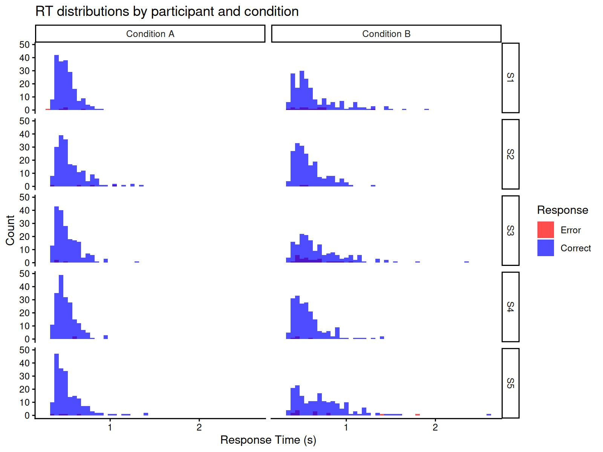
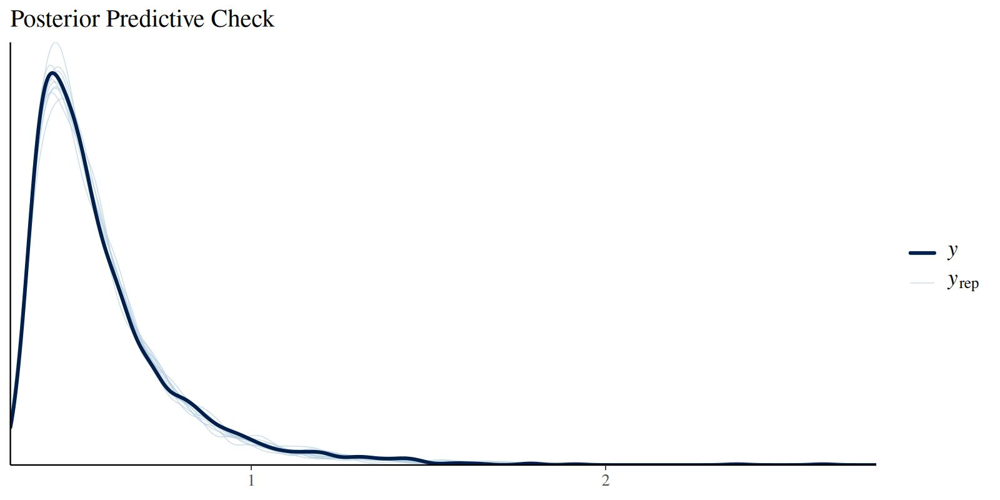

# The Censored Shifted Wald Model (cswald)

## 1 Introduction

The Censored Shifted Wald (cswald) model is a measurement model for
choice response time (RT) tasks, particularly suited for tasks with high
accuracy (few errors). The model was introduced by Miller et al. (2018)
as a simplified alternative to the full Wiener diffusion model (Ratcliff
and McKoon 2008) that is easier to estimate while still capturing
essential features of the decision-making process.

The cswald model is ideal when:

- You have RT data from a two-choice decision task
- Accuracy is relatively high (error rates \< 20%)
- You want to separate different components of the decision process
- You need a computationally efficient alternative to the full diffusion
  model

## 2 Theoretical Background

### 2.1 The Shifted Wald Distribution

The Wald distribution (also known as the inverse Gaussian distribution)
describes the first-passage time of a Wiener process (Brownian motion
with drift) to a single absorbing boundary. In the context of
decision-making, this models the time it takes for evidence to
accumulate to a decision threshold.

The shifted Wald distribution adds a non-decision time component to
account for processes like stimulus encoding and motor response
execution:

\\ RT = T\_{decision} + T\_{ndt} \\

where \\T\_{decision}\\ follows a Wald distribution and \\T\_{ndt}\\ is
the non-decision time.

The probability density function of the shifted Wald is:

\\ f(t \| v, a, \tau) = \frac{a}{\sqrt{2\pi (t-\tau)^3}}
\exp\left(-\frac{(a - v(t-\tau))^2}{2(t-\tau)}\right) \\

for \\t \> \tau\\, where:

- \\v\\ is the drift rate (rate of evidence accumulation)
- \\a\\ is the boundary (decision threshold)
- \\\tau\\ is the non-decision time

### 2.2 Censoring for Error Responses

In tasks with high accuracy, most responses are correct. The “censored”
aspect of the model refers to how error responses are handled. Instead
of modeling errors as arising from a separate accumulation process
toward the wrong boundary (as in the full diffusion model), errors are
treated as **censored** observations — trials where the correct response
had not yet been reached.

This censoring approach assumes that:

1.  Correct responses follow the shifted Wald distribution
2.  Error responses represent trials where the accumulation process was
    interrupted before reaching the correct boundary

The likelihood for a correct response is the Wald density:

\\ L\_{correct}(t) = f\_{Wald}(t - \tau \| v, a) \\

The likelihood for an error response is the survivor function (1 - CDF):

\\ L\_{error}(t) = S\_{Wald}(t - \tau \| v, a) = 1 - F\_{Wald}(t - \tau
\| v, a) \\

### 2.3 Relationship to the Diffusion Model

The cswald model can be seen as a simplification of the Wiener diffusion
model that makes certain assumptions:

1.  **Single boundary**: Only the correct response boundary is
    explicitly modeled
2.  **Unbiased starting point**: The starting point is assumed to be
    equidistant from both boundaries
3.  **High accuracy**: The model works best when error rates are low

For tasks with substantial error rates (\> 20%), the competing risks
version of the model (`version = "crisk"`) provides a more appropriate
fit by modeling both boundaries explicitly.

## 3 Model Versions

The `bmm` package implements two versions of the cswald model:

### 3.1 Simple Version (`version = "simple"`)

The simple version treats errors as censored correct responses. It
estimates:

- **drift**: The drift rate (rate of evidence accumulation toward the
  correct response)
- **bound**: The distance from the starting point to the correct
  boundary
- **ndt**: Non-decision time
- **s**: Diffusion constant (usually fixed to 1 for scaling)

This version is best suited for tasks with error rates below 20%.

**Important note on boundary parameterization:** The `bound` parameter
in the simple version represents only the distance from the (unbiased)
starting point to the correct response boundary. This is **half** the
total boundary separation in the standard diffusion model
parameterization. To convert the simple version’s `bound` estimate to
the equivalent DDM or crisk boundary separation, multiply by 2:

\\ a\_{DDM} = 2 \times \text{bound}\_{simple} \\

### 3.2 Competing Risks Version (`version = "crisk"`)

The competing risks version models both correct and error responses as
arising from racing accumulators toward opposite boundaries. It
estimates:

- **drift**: The drift rate (can be positive or negative; negative drift
  indicates evidence accumulation toward the lower boundary)
- **bound**: Total boundary separation (full distance between both
  boundaries, consistent with DDM parameterization)
- **ndt**: Non-decision time
- **zr**: Relative starting point (proportion of boundary separation,
  0.5 = unbiased)
- **s**: Diffusion constant

This version is better suited for tasks with substantial error rates.
The `bound` parameter is directly comparable to the boundary separation
in the standard diffusion model.

### 3.3 When to Use Each Version

#### 3.3.1 Use `version = "simple"` when:

- Error rates are low (\< 20%)
- You want a computationally efficient model
- The focus is on correct response times
- Errors can reasonably be treated as censored observations

#### 3.3.2 Use `version = "crisk"` when:

- Error rates are substantial (\> 20%)
- You want to model both response types explicitly
- Starting point bias might be present
- You need estimates comparable to full diffusion model parameters

### 3.4 Comparison with the Wiener Diffusion Model

The `cswald` model in `bmm` is related to but distinct from the full
Wiener diffusion model available in
[`brms::wiener()`](https://paulbuerkner.com/brms/reference/brmsfamily.html).
Key differences:

| Feature        | cswald (simple)  | cswald (crisk)    | brms::wiener      |
|----------------|------------------|-------------------|-------------------|
| Boundaries     | Single           | Both              | Both              |
| Starting point | Fixed (unbiased) | Estimated         | Estimated         |
| Bound param    | Half separation  | Full separation   | Full separation   |
| Drift sign     | Positive only    | Positive/negative | Positive/negative |
| Best for       | High accuracy    | Moderate accuracy | Any accuracy      |
| Computation    | Fast             | Moderate          | Slower            |
| Parameters     | 3-4              | 4-5               | 4-5               |

For tasks with low error rates, the `cswald` model provides equivalent
inferences with faster computation. When comparing results across model
versions, remember to multiply the simple version’s `bound` by 2 to get
the equivalent total boundary separation.

## 4 Fitting the Model with `bmm`

### 4.1 Setup

``` r
library(bmm)
library(ggplot2)
```

### 4.2 Example Dataset: Ratcliff & Rouder (1998)

The `rr98` dataset from the `rtdists` package provides a classic example
of choice response time data suitable for evidence accumulation models.
The dataset contains responses from a brightness discrimination task
where participants judged whether pixel arrays were “high” or “low”
brightness.

``` r
# Load the dataset from rtdists (already a dependency of bmm)
data(rr98, package = "rtdists")

# Remove outliers as in the original analysis
rr98 <- rr98[!rr98$outlier, ]

# Examine structure
str(rr98[, c("id", "rt", "response_num", "instruction", "strength")])
#> 'data.frame':    23848 obs. of  5 variables:
#>  $ id          : Factor w/ 3 levels "jf","kr","nh": 1 1 1 1 1 1 1 1 1 1 ...
#>  $ rt          : num  0.801 0.68 0.694 0.582 0.925 0.605 0.626 0.736 0.662 0.8 ...
#>  $ response_num: int  1 1 2 2 1 1 2 1 1 2 ...
#>  $ instruction : Factor w/ 2 levels "speed","accuracy": 2 2 2 2 2 2 2 2 2 2 ...
#>  $ strength    : int  8 7 19 21 19 10 20 14 10 15 ...

# Check error rates by condition
with(rr98, tapply(response_num == 1, list(id, instruction), mean))
#>        speed  accuracy
#> jf 0.5011512 0.4764767
#> kr 0.4444152 0.4538970
#> nh 0.4920598 0.4874612
```

The dataset includes:

- **rt**: Response time in seconds
- **response_num**: Binary response (1 = “dark”, 2 = “light”)
- **instruction**: Speed vs accuracy emphasis
- **strength**: Task difficulty (0-32, brightness level)
- **id**: Participant identifier

This dataset is particularly well-suited for the cswald model because:

1.  **High accuracy**: Most conditions have error rates below 20%, ideal
    for the simple version
2.  **Multiple conditions**: Allows testing how task manipulations
    affect model parameters
3.  **Trial-level data**: Contains the RT and response for every trial
4.  **Classic reference**: Widely used in the evidence accumulation
    literature

For a complete analysis example using this dataset, see the `rtdists`
package vignette:
[`vignette("reanalysis_rr98", package = "rtdists")`](https://cran.rstudio.com/web/packages/rtdists/vignettes/reanalysis_rr98.html).

### 4.3 Generating Simulated Data with Hierarchical Structure

We’ll simulate data from multiple participants with individual
differences in drift rates, demonstrating how to fit hierarchical models
with `bmm`:

``` r
# set seed for reproducibility
set.seed(42)

# simulate data for 3 participants in two conditions
n_subjects <- 5
n_per_condition <- 200  # fewer trials per condition to keep file size manageable

# Population-level parameters
pop_drift_A <- 3.0      # mean drift for condition A
pop_drift_B <- 1.8      # mean drift for condition B
drift_sd <- 0.5         # between-subject SD in drift
bound <- 1.5            # shared boundary
ndt <- 0.3              # shared non-decision time

# Generate subject-specific drift rates
subject_drifts_A <- rnorm(n_subjects, pop_drift_A, drift_sd)
subject_drifts_B <- rnorm(n_subjects, pop_drift_B, drift_sd)

# Simulate data for each subject and condition
dat_list <- list()
for (i in 1:n_subjects) {
  # Condition A
  dat_A <- rcswald(n = n_per_condition, 
                   drift = subject_drifts_A[i], 
                   bound = bound, 
                   ndt = ndt)
  dat_A$id <- paste0("S", i)
  dat_A$condition <- "A"
  
  # Condition B
  dat_B <- rcswald(n = n_per_condition, 
                   drift = subject_drifts_B[i], 
                   bound = bound, 
                   ndt = ndt)
  dat_B$id <- paste0("S", i)
  dat_B$condition <- "B"
  
  dat_list[[2*i-1]] <- dat_A
  dat_list[[2*i]] <- dat_B
}

# Combine all data
dat <- do.call(rbind, dat_list)
dat$id <- factor(dat$id)
dat$condition <- factor(dat$condition)

# Check error rates by subject and condition
error_rates <- aggregate(response ~ id + condition, data = dat, 
                        FUN = function(x) mean(x == 0))
print(error_rates)
#>    id condition response
#> 1  S1         A    0.025
#> 2  S2         A    0.020
#> 3  S3         A    0.015
#> 4  S4         A    0.010
#> 5  S5         A    0.020
#> 6  S1         B    0.075
#> 7  S2         B    0.010
#> 8  S3         B    0.130
#> 9  S4         B    0.020
#> 10 S5         B    0.065
```

Let’s visualize the RT distributions by participant:

``` r
ggplot(dat, aes(x = rt, fill = factor(response))) +
  geom_histogram(binwidth = 0.05, position = "identity", alpha = 0.7) +
  facet_grid(id ~ condition, labeller = labeller(
    condition = c(A = "Condition A", B = "Condition B")
  )) +
  scale_fill_manual(values = c("0" = "red", "1" = "blue"),
                    labels = c("0" = "Error", "1" = "Correct"),
                    name = "Response") +
  labs(x = "Response Time (s)", y = "Count",
       title = "RT distributions by participant and condition") +
  theme_classic()
```



### 4.4 Specifying the Model

First, specify the model using
[`cswald()`](https://venpopov.com/bmm/dev/reference/cswald.md):

``` r
model <- cswald(
  rt = "rt",
  response = "response",
  version = "simple"
)
```

### 4.5 Specifying the Hierarchical Formula

We want to estimate:

1.  **Population-level effects**: How drift rate varies by condition
2.  **Individual differences**: Random effects for drift rate by
    participant
3.  **Shared parameters**: Boundary and non-decision time constant
    across participants

The formula includes both fixed effects for condition and random effects
(varying intercepts) for participants:

``` r
formula <- bmf(
  drift ~ 0 + condition + (0 + condition | id),  # fixed condition effects + random subject effects
  bound ~ 1,                          # shared boundary
  ndt ~ 1                             # shared non-decision time
)
```

The `(0 + condition | id)` term in the drift formula specifies random
slopes for each condition by participant. This allows the model to
estimate:

- A population-level drift rate for each condition
- Individual deviations from these population means for each condition
- The variability (SD) and correlation of these individual differences
  across conditions

This hierarchical structure provides several advantages:

1.  **Partial pooling**: Individual estimates are pulled toward the
    group mean, providing more stable estimates for participants with
    less data
2.  **Uncertainty quantification**: The model quantifies both within-
    and between-subject variability
3.  **Shrinkage**: Extreme individual estimates are regularized toward
    the group mean

### 4.6 Fitting the Hierarchical Model

Now we fit the model with hierarchical structure. The random effects
allow each participant to have their own drift rate while estimating the
population-level mean drift for each condition:

``` r
fit <- bmm(
  formula = formula,
  data = dat,
  model = model,
  cores = 4,
  backend = "cmdstanr",
  # Reduce iterations to keep file size manageable
  iter = 1000,
  warmup = 500,
  control = list(adapt_delta = 0.9),
  file = "assets/bmmfit_cswald_hierarchical_vignette.rds"
)
```

### 4.7 Inspecting Results

``` r
summary(fit)
#> Loading required namespace: rstan
#> Warning: There were 12 divergent transitions after warmup. Increasing
#> adapt_delta above 0.9 may help. See
#> http://mc-stan.org/misc/warnings.html#divergent-transitions-after-warmup
```

``` fansi
#>   Model: cswald(rt = "rt",
#>                 response = "response",
#>                 version = "simple") 
#>   Links: drift = log; bound = log; ndt = log; s = log 
#> Formula: drift ~ 0 + condition + (0 + condition | id)
#>          bound ~ 1
#>          ndt ~ 1
#>          s = 0 
#>    Data: dat (Number of observations: 2000)
#>   Draws: 4 chains, each with iter = 1000; warmup = 500; thin = 1;
#>          total post-warmup draws = 2000
#> 
#> Multilevel Hyperparameters:
#> ~id (Number of levels: 5) 
#>                                        Estimate Est.Error l-95% CI u-95% CI
#> sd(drift_conditionA)                       0.16      0.12     0.04     0.45
#> sd(drift_conditionB)                       0.38      0.21     0.15     0.92
#> cor(drift_conditionA,drift_conditionB)    -0.14      0.46    -0.87     0.76
#>                                        Rhat Bulk_ESS Tail_ESS
#> sd(drift_conditionA)                   1.00      551      954
#> sd(drift_conditionB)                   1.01      491      494
#> cor(drift_conditionA,drift_conditionB) 1.00      760      977
#> 
#> Regression Coefficients:
#>                  Estimate Est.Error l-95% CI u-95% CI Rhat Bulk_ESS Tail_ESS
#> bound_Intercept     -0.23      0.04    -0.30    -0.15 1.00     1219     1052
#> ndt_Intercept       -1.22      0.02    -1.26    -1.20 1.00     1182      951
#> drift_conditionA     1.22      0.09     1.02     1.37 1.00      804      693
#> drift_conditionB     0.80      0.21     0.40     1.27 1.01      587      378
#> 
#> Constant Parameters:
#>                 Value
#> s_Intercept      0.00
#> 
#> Draws were sampled using sample(hmc). For each parameter, Bulk_ESS
#> and Tail_ESS are effective sample size measures, and Rhat is the potential
#> scale reduction factor on split chains (at convergence, Rhat = 1).
```

#### 4.7.1 Population-Level Effects

The model uses link functions for the parameters (log link for all
parameters), so we need to exponentiate to get values on the original
scale:

``` r
# Extract population-level (fixed) effects
fixef_est <- brms::fixef(fit)

# Transform to original scale
cat("Population-level estimates:\n")
#> Population-level estimates:
cat("drift (Condition A):", exp(fixef_est["drift_conditionA", "Estimate"]), "\n")
#> drift (Condition A): 3.381323
cat("drift (Condition B):", exp(fixef_est["drift_conditionB", "Estimate"]), "\n")
#> drift (Condition B): 2.216534
cat("bound (half-separation):", exp(fixef_est["bound_Intercept", "Estimate"]), "\n")
#> bound (half-separation): 0.7945093
cat("ndt:", exp(fixef_est["ndt_Intercept", "Estimate"]), "\n")
#> ndt: 0.2940645

cat("\nTrue population-level parameters:\n")
#> 
#> True population-level parameters:
cat("drift (Condition A):", pop_drift_A, "\n")
#> drift (Condition A): 3
cat("drift (Condition B):", pop_drift_B, "\n")
#> drift (Condition B): 1.8
cat("bound:", bound, "\n")
#> bound: 1.5
cat("ndt:", ndt, "\n")
#> ndt: 0.3
```

#### 4.7.2 Individual Differences

The random effects capture individual differences in drift rate:

``` r
# Extract random effects (deviations from population mean on log scale)
ranef_est <- brms::ranef(fit)

# Get subject-specific drift estimates by adding random effects to fixed effects
cat("\nSubject-specific drift estimates (Condition A):\n")
#> 
#> Subject-specific drift estimates (Condition A):
for (i in 1:n_subjects) {
  subj_id <- paste0("S", i)
  # Add random effect to fixed effect, then exponentiate
  drift_subj <- exp(fixef_est["drift_conditionA", "Estimate"] + 
                    ranef_est$id[subj_id, "Estimate", "drift_conditionA"])
  cat(subj_id, ": ", round(drift_subj, 2), 
      " (true: ", round(subject_drifts_A[i], 2), ")\n", sep = "")
}
#> S1: 3.64 (true: 3.69)
#> S2: 3.02 (true: 2.72)
#> S3: 3.51 (true: 3.18)
#> S4: 3.64 (true: 3.32)
#> S5: 3.34 (true: 3.2)

cat("\nSubject-specific drift estimates (Condition B):\n")
#> 
#> Subject-specific drift estimates (Condition B):
for (i in 1:n_subjects) {
  subj_id <- paste0("S", i)
  drift_subj <- exp(fixef_est["drift_conditionB", "Estimate"] + 
                    ranef_est$id[subj_id, "Estimate", "drift_conditionB"])
  cat(subj_id, ": ", round(drift_subj, 2), 
      " (true: ", round(subject_drifts_B[i], 2), ")\n", sep = "")
}
#> S1: 2.11 (true: 1.75)
#> S2: 2.77 (true: 2.56)
#> S3: 1.84 (true: 1.75)
#> S4: 2.81 (true: 2.81)
#> S5: 1.8 (true: 1.77)

# Between-subject variability
cat("\nEstimated SD of random effects (log scale, Cond A | Cond B):\n")
#> 
#> Estimated SD of random effects (log scale, Cond A | Cond B):
cat("sd(drift):", brms::VarCorr(fit)$id$sd[,"Estimate"], "\n")
#> sd(drift): 0.1556604 0.3827949
cat("True SD (log scale):", drift_sd, "\n")
#> True SD (log scale): 0.5
```

### 4.8 Model Diagnostics

Check posterior predictive distributions:

``` r
brms::pp_check(fit, type = "dens_overlay", ndraws = 10) +
  labs(title = "Posterior Predictive Check")
```



### 4.9 Hypothesis Testing

We can test whether drift rates differ between conditions using the
[`brms::hypothesis()`](https://paulbuerkner.com/brms/reference/hypothesis.brmsfit.html)
function. This tests the difference on the log scale:

``` r
# Test if drift rate is higher in Condition A than B
hyp_test <- brms::hypothesis(fit, "drift_conditionA > drift_conditionB")
print(hyp_test)
#> Hypothesis Tests for class b:
#>                 Hypothesis Estimate Est.Error CI.Lower CI.Upper Evid.Ratio
#> 1 (drift_conditionA... > 0     0.42      0.23     0.06     0.75      22.81
#>   Post.Prob Star
#> 1      0.96    *
#> ---
#> 'CI': 90%-CI for one-sided and 95%-CI for two-sided hypotheses.
#> '*': For one-sided hypotheses, the posterior probability exceeds 95%;
#> for two-sided hypotheses, the value tested against lies outside the 95%-CI.
#> Posterior probabilities of point hypotheses assume equal prior probabilities.
```

The output shows:

- **Estimate**: The posterior mean of the difference (on log scale)
- **Est.Error**: The standard error of the difference
- **CI**: The 95% credible interval for the difference
- **Evid.Ratio**: The evidence ratio (posterior odds) in favor of the
  hypothesis
- **Post.Prob**: The posterior probability that the hypothesis is true

To express the difference on the original scale, we can compute the
ratio of drift rates:

``` r
# Extract posterior samples
posterior <- brms::as_draws_df(fit)

# Compute drift ratio (Condition A / Condition B) on original scale
drift_ratio <- exp(posterior$b_drift_conditionA - posterior$b_drift_conditionB)

cat("Drift rate ratio (A/B):\n")
#> Drift rate ratio (A/B):
cat("  Median:", round(median(drift_ratio), 2), "\n")
#>   Median: 1.54
cat("  95% CI: [", round(quantile(drift_ratio, 0.025), 2), ", ",
    round(quantile(drift_ratio, 0.975), 2), "]\n", sep = "")
#>   95% CI: [0.89, 2.33]
cat("  P(ratio > 1):", round(mean(drift_ratio > 1), 3), "\n")
#>   P(ratio > 1): 0.958

cat("\nTrue drift ratio:", round(pop_drift_A / pop_drift_B, 2), "\n")
#> 
#> True drift ratio: 1.67
```

This shows that the model successfully recovers the difference between
conditions, with strong evidence that drift rates are higher in
Condition A.

## References

Miller, Robert, Stefan Scherbaum, Daniel W. Heck, Thomas Goschke, and
Sören Enge. 2018. “On the Relation Between the (Censored) Shifted Wald
and the Wiener Distribution as Measurement Models for Choice Response
Times.” *Applied Psychological Measurement* 42 (2): 116–35.
<https://doi.org/10.1177/0146621617710465>.

Ratcliff, Roger, and Gail McKoon. 2008. “The Diffusion Decision Model:
Theory and Data for Two-Choice Decision Tasks.” *Neural Computation* 20
(4): 873–922. <https://doi.org/10.1162/neco.2008.12-06-420>.
