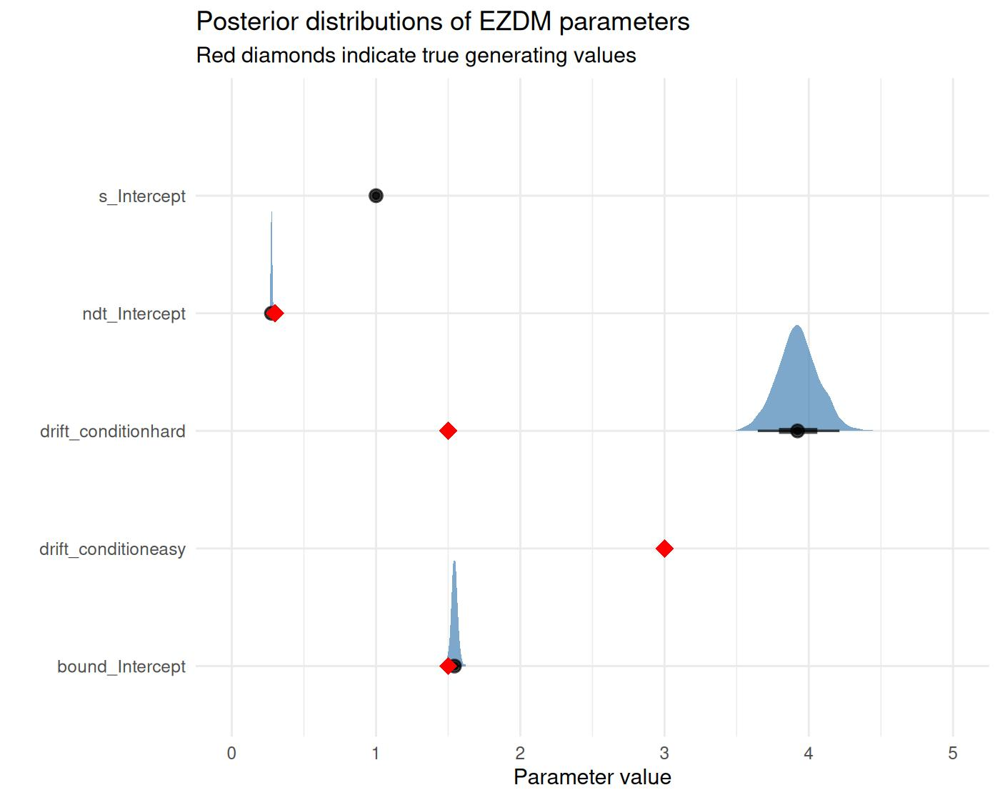

# The EZ-Diffusion Model (EZDM)

## 1 Introduction to the model

The diffusion model (Ratcliff 1978) is a widely used model in speeded
decision-making. It describes how participants accumulate noisy evidence
over time until reaching one of two decision boundaries. Usually, the
diffusion model is fit to trial-level reaction time distributions, which
can be computationally intensive, especially for hierarchical Bayesian
estimation.

The **EZ-Diffusion Model** (Wagenmakers et al. 2007) provides a
simplified alternative building on closed-form equations that relate the
parameters of the diffusion model to easily computed summary statistics:
mean reaction time (MRT), reaction time variance (VRT), and accuracy
(proportion correct, Pc). This makes it possible to calculate diffusion
model parameters from aggregated data without fitting to individual
trials.

### 1.1 The Diffusion Model

In the standard diffusion model, evidence accumulates from a starting
point toward one of two boundaries. The key parameters are:

- **Drift rate (\\v\\)**: The average rate of evidence accumulation,
  reflecting task difficulty or ability
- **Boundary separation (\\a\\)**: The distance between the two decision
  boundaries, reflecting the speed-accuracy tradeoff
- **Non-decision time (\\T\_{er}\\)**: Time for processes outside the
  decision (encoding, motor response)
- **Starting point (\\z\\)**: A response bias indicating where evidence
  accumulation begins relative to the boundaries


Figure 1.1: Illustration of the diffusion model. Evidence accumulates
from the starting point until reaching the upper (correct) or lower
(error) boundary.

### 1.2 The EZ Equations

Wagenmakers et al. (2007) provided closed-form solutions relating the
diffusion model parameters to observable summary statistics. For the
**3-parameter version** (assuming symmetric starting point, \\z =
a/2\\):

Given the proportion correct (\\P_c\\), mean RT of correct responses
(\\MRT\\), and variance of correct RTs (\\VRT\\), the parameters can be
computed as:

\\ v = \text{sign}(P_c - 0.5) \cdot s \cdot \left\[ L(P_c) \cdot
\frac{P_c^2 L(P_c) - P_c \cdot L(P_c) + P_c - 0.5}{VRT} \right\]^{1/4}
\\

\\ a = s^2 \cdot \frac{L(P_c)}{v} \\

\\ T\_{er} = MRT - \frac{a}{2v} \cdot \frac{1 - e^{-\frac{va}{s^2}}}{1 +
e^{-\frac{va}{s^2}}} \\

where \\L(P_c) = \ln\left(\frac{P_c}{1 - P_c}\right)\\ is the logit
function and \\s\\ is the diffusion constant (typically fixed to 1 for
identification).

### 1.3 The 4-Parameter Extension

The original EZ model assumes a symmetric starting point. Srivastava et
al. (2016) derived the moments of first-passage times for the Wiener
diffusion process with arbitrary starting points, enabling a
**4-parameter version** that can estimate starting point bias (\\z_r\\,
the relative starting point). This 4-parameter version, however,
requires separate summary statistics for responses to each boundary:

- Mean and variance of RTs for upper boundary responses (typically
  correct)
- Mean and variance of RTs for lower boundary responses (typically
  errors)

With sufficient responses at both the upper and lower bound, this allows
estimation of response bias, which is important when participants favor
one response over another.

### 1.4 Bayesian Estimation

So far, studies using the EZ-Diffusion model have adopted step-wise
analyses approaches. First, diffusion model parameters are calculated
for summary statistics for each individual in each design cell. Second,
the calculated parameters are submitted to statistical tests evaluating
differences between experimental conditions. This approach has two
downsides: 1) uncertainty in parameter estimation is not sufficiently
propagated between analysis steps, and 2) all parameters of the
diffusion model were allowed to vary over all design cells, bearing the
risk of over fitting. To address these issues, Chávez De la Peña and
Vandekerckhove (2025) introduced a Bayesian hierarchical approach to the
EZ-diffusion model. This approach combines the derivation of summary
statistics from diffusion model parameters with a probabilistic model of
the sampling distributions of the summary statistics. Specifically, this
approach:

1.  Treats the summary statistics as **observed data** generated from a
    known sampling distribution
2.  Uses **likelihood-based inference** to estimate parameters with
    proper uncertainty quantification
3.  Enables **hierarchical modeling** with random effects across
    participants

Chávez De la Peña and Vandekerckhove (2025) shared JAGS code alongside
their model. The downside of this implementation is that the model code
has to be adapted to different experimental designs which likely leads
to errors and increases the bar for using the implementation. The `bmm`
package implements this Bayesian approach, allowing researchers to:

- Estimate uncertainty in parameter estimates
- Include random effects for participants
- Compare conditions using Bayesian hypothesis testing
- Leverage the full power of the `brms` modeling framework

## 2 Parametrization in the `bmm` package

The `bmm` package implements two versions of the EZ-diffusion model:

### 2.1 3-Parameter Version (`version = "3par"`)

Estimates three parameters with a fixed symmetric starting point (\\z_r
= 0.5\\):

| Parameter | Description | Link Function |
|----|----|----|
| `drift` | Drift rate (\\v\\) - rate of evidence accumulation | identity |
| `bound` | Boundary separation (\\a\\) - response caution | log |
| `ndt` | Non-decision time (\\T\_{er}\\) - encoding + motor time | log |

The diffusion constant `s` is fixed to 1 for identification.

### 2.2 4-Parameter Version (`version = "4par"`)

Adds estimation of starting point bias:

| Parameter | Description                         | Link Function |
|-----------|-------------------------------------|---------------|
| `drift`   | Drift rate (\\v\\)                  | identity      |
| `bound`   | Boundary separation (\\a\\)         | log           |
| `ndt`     | Non-decision time (\\T\_{er}\\)     | log           |
| `zr`      | Relative starting point (0-1 scale) | logit         |

Note that `zr = 0.5` indicates no bias (symmetric starting point),
`zr > 0.5` indicates bias toward the upper boundary, and `zr < 0.5`
indicates bias toward the lower boundary.

## 3 Data requirements

Unlike other models in `bmm` that work with trial-level data, the
EZ-diffusion model requires **aggregated summary statistics**:

| Variable   | Description                                    |
|------------|------------------------------------------------|
| `mean_rt`  | Mean reaction time (in **seconds**)            |
| `var_rt`   | Variance of reaction times                     |
| `n_upper`  | Number of responses hitting the upper boundary |
| `n_trials` | Total number of trials                         |

For the **3-parameter version**, `mean_rt` and `var_rt` should be
computed from all correct responses pooled together.

For the **4-parameter version**, you need separate statistics for upper
and lower boundary responses: - `mean_rt_upper`, `var_rt_upper` for
upper boundary (correct) responses - `mean_rt_lower`, `var_rt_lower` for
lower boundary (error) responses

## 4 Preparing data with `ezdm_summary_stats()`

The `bmm` package provides the
[`ezdm_summary_stats()`](https://venpopov.com/bmm/dev/reference/ezdm_summary_stats.md)
function to compute the required aggregated statistics from trial-level
RT data in the correct format. RT contaminants (fast guesses, lapses,
attentional failures) can severely distort mean and variance estimates,
leading to biased parameter estimates (Wagenmakers et al. 2008). The
function offers three methods to address this:

| Method | Description | Use when |
|----|----|----|
| `"simple"` | Standard mean/variance | Data is pre-cleaned |
| `"robust"` | Median + IQR/MAD-based variance | Moderate contamination |
| `"mixture"` | EM mixture modeling (default) | General use; provides contamination estimates |

For detailed coverage of RT contamination handling, including mixture
model theory, distribution options, contaminant bounds, and diagnostics,
see `vignette("bmm_rt_contamination")`.

### 4.1 Example with Simulated Data

To illustrate the impact of contamination, we generate trial-level data
with known parameters and introduce 5% contaminant trials:

``` r

library(bmm)
library(rtdists)
library(dplyr)

set.seed(42)

# Generate clean trial-level data with known parameters
n_trials <- 200
true_drift <- 2.5
true_bound <- 1.2
true_ndt <- 0.25

# Simulate diffusion process
trials_clean <- rdiffusion(
  n = n_trials,
  a = true_bound,
  v = true_drift,
  t0 = true_ndt,
  z = 0.5 * true_bound
)

# Add contaminants (5% fast guesses and lapses)
n_contaminants <- round(n_trials * 0.05)
contaminant_idx <- sample(n_trials, n_contaminants)

trials_contaminated <- trials_clean
trials_contaminated$rt[contaminant_idx] <- runif(n_contaminants, 0.1, 3)
trials_contaminated$response[contaminant_idx] <- sample(c("upper", "lower"),
                                                         n_contaminants,
                                                         replace = TRUE)

trials_contaminated <- trials_contaminated |>
  mutate(
    correct = as.numeric(response == "upper"),
    subject = 1,
    condition = "standard"
  )
```

We can now compare the three methods. The function takes `rt` and
`response` as vectors. For grouped operations, use
[`dplyr::group_by()`](https://dplyr.tidyverse.org/reference/group_by.html)
with [`reframe()`](https://dplyr.tidyverse.org/reference/reframe.html):

``` r

summary_simple <- ezdm_summary_stats(
  trials_contaminated$rt, trials_contaminated$correct,
  method = "simple", version = "3par"
)

summary_robust <- ezdm_summary_stats(
  trials_contaminated$rt, trials_contaminated$correct,
  method = "robust", version = "3par"
)

summary_mixture <- ezdm_summary_stats(
  trials_contaminated$rt, trials_contaminated$correct,
  method = "mixture", version = "3par"
)

comparison <- data.frame(
  Method = c("Simple", "Robust", "Mixture", "TRUE"),
  Mean_RT = c(
    summary_simple$mean_rt,
    summary_robust$mean_rt,
    summary_mixture$mean_rt,
    mean(trials_clean$rt[trials_clean$response == "upper"])
  ),
  Var_RT = c(
    summary_simple$var_rt,
    summary_robust$var_rt,
    summary_mixture$var_rt,
    var(trials_clean$rt[trials_clean$response == "upper"])
  ),
  Contaminant = c(NA, NA, summary_mixture$contaminant_prop, 0.05)
)

print(comparison)
#>    Method   Mean_RT     Var_RT Contaminant
#> 1  Simple 0.5409176 0.10605857          NA
#> 2  Robust 0.4568634 0.02440439          NA
#> 3 Mixture 0.4964177 0.03642890  0.03532347
#> 4    TRUE 0.4755037 0.02050638  0.05000000
```

The mixture method identifies contaminants and provides more accurate
moment estimates.

### 4.2 Accuracy Adjustment

When using the mixture method, the
[`adjust_ezdm_accuracy()`](https://venpopov.com/bmm/dev/reference/adjust_ezdm_accuracy.md)
function can adjust accuracy counts by removing estimated contaminants.
This assumes contaminants are random guesses (50% accuracy by default)
and is applied as a separate step after computing summary statistics:

``` r

summary_no_adjust <- ezdm_summary_stats(
  trials_contaminated$rt, trials_contaminated$correct, version = "3par"
)

summary_adjust <- ezdm_summary_stats(
  trials_contaminated$rt, trials_contaminated$correct, version = "3par"
) |>
  mutate(adjust_ezdm_accuracy(n_upper, n_trials, contaminant_prop))

cat("Unadjusted accuracy:",
    round(summary_no_adjust$n_upper / summary_no_adjust$n_trials, 3), "\n")
#> Unadjusted accuracy: 0.93
cat("Adjusted accuracy:",
    round(summary_adjust$n_upper_adj / summary_adjust$n_trials_adj, 3), "\n")
#> Adjusted accuracy: 0.948
cat("True accuracy (no contaminants):",
    round(mean(trials_clean$response == "upper"), 3), "\n")
#> True accuracy (no contaminants): 0.945
```

### 4.3 Working with the 4-Parameter Version

The 4-parameter version estimates starting point bias (`zr`) and
requires separate statistics for upper and lower boundary responses:

``` r

# Generate data with response bias (zr = 0.6, favoring upper boundary)
trials_biased <- rdiffusion(
  n = 200,
  a = 1.2,
  v = 2.0,
  t0 = 0.25,
  z = 0.7 * 1.2
)

trials_biased <- trials_biased |>
  mutate(
    correct = as.numeric(response == "upper"),
    subject = 1
  )

# Compute summary statistics for 4-parameter model
summary_4par <- ezdm_summary_stats(
  trials_biased$rt, trials_biased$correct, version = "4par"
)

summary_4par
#>    mean_rt_upper mean_rt_lower var_rt_upper var_rt_lower n_upper n_trials
#> mu     0.3952879            NA   0.01637452           NA     195      200
#>    contaminant_prop_upper contaminant_prop_lower
#> mu             0.01116972                     NA
```

Notice the output now includes: - `mean_rt_upper`, `var_rt_upper`:
Statistics for upper boundary responses - `mean_rt_lower`,
`var_rt_lower`: Statistics for lower boundary responses

This format is required for fitting the 4-parameter EZ-DM model.

### 4.4 Complete Workflow: From Trial-Level to Model Fitting

Here’s the complete pipeline from trial-level data to parameter
estimation:

``` r

# Step 1: Generate or load trial-level data
trial_data <- rdiffusion(
  n = 100 * 20,  # 20 subjects, 100 trials each
  a = 1.5, v = 2.5, t0 = 0.3, z = 0.75
) |>
  mutate(
    subject = rep(1:20, each = 100),
    correct = as.numeric(response == "upper")
  )

# Step 2: Compute summary statistics with robust estimation
summary_data <- trial_data |>
  group_by(subject) |>
  reframe(ezdm_summary_stats(
    rt, correct,
    method = "mixture", distribution = "exgaussian", version = "3par"
  ))

# Step 3: Inspect contaminant proportions (quality control)
summary(summary_data$contaminant_prop)

# Step 4: Fit model with bmm
model <- ezdm("mean_rt", "var_rt", "n_upper", "n_trials", version = "3par")
formula <- bmf(drift ~ 1, bound ~ 1, ndt ~ 1)

fit <- bmm(
  formula = formula,
  data = summary_data,
  model = model,
  backend = "cmdstanr"
)

# Step 5: Examine results
summary(fit)
```

This workflow ensures robust parameter estimation by properly handling
RT contaminants throughout the analysis pipeline.

## 5 Fitting the model with `bmm`

We start by loading the `bmm` package:

``` r

library(bmm)
```

### 5.1 Generating simulated data

For illustration, we will generate simulated data with known parameters
using the
[`rezdm()`](https://venpopov.com/bmm/dev/reference/ezdm_dist.md)
function. As for all other models, `bmm` provides a density and random
generation function for all implemented models. In the case of the
`ezdm` there is no single dependent variable for the density function,
which makes efficient illustration challenging. However, the `rezdm`
function allows for evaluating parameter recovery simulations and
predicitions based on the `ezdm`.

``` r

set.seed(123)

# Define true parameters for two conditions
true_params <- data.frame(
  condition = c("easy", "hard"),
  drift = c(3.0, 1.5),
  bound = c(1.5, 1.5),
  ndt = c(0.3, 0.3)
)

# Number of subjects and trials per condition
n_subjects <- 20
n_trials <- 100

# Generate data
sim_data <- data.frame()
for (subj in 1:n_subjects) {
  for (cond in 1:2) {
    # Add some random variation for each subject
    drift_subj <- true_params$drift[cond] + rnorm(1, 0, 0.3)
    bound_subj <- true_params$bound[cond] + rnorm(1, 0, 0.1)
    ndt_subj <- true_params$ndt[cond] + rnorm(1, 0, 0.02)

    # Generate summary statistics
    stats <- rezdm(
      n = 1,
      n_trials = n_trials,
      drift = max(drift_subj, 0.1),
      bound = max(bound_subj, 0.5),
      ndt = max(ndt_subj, 0.1),
      version = "3par"
    )

    stats$subject <- subj
    stats$condition <- true_params$condition[cond]
    sim_data <- rbind(sim_data, stats)
  }
}

# Convert condition to factor
sim_data$condition <- factor(sim_data$condition, levels = c("easy", "hard"))

head(sim_data)
#>     mean_rt     var_rt n_upper n_trials subject condition
#> 1 0.5821563 0.03227199      99      100       1      easy
#> 2 0.7580137 0.09254939      95      100       1      hard
#> 3 0.5170452 0.01770436     100      100       2      easy
#> 4 0.7777224 0.16780351      85      100       2      hard
#> 5 0.4981635 0.02285722      97      100       3      easy
#> 6 0.6836707 0.06894347      93      100       3      hard
```

### 5.2 Specifying the formula

Next, we specify the model formula using
[`bmmformula()`](https://venpopov.com/bmm/dev/reference/bmmformula.md)
(or [`bmf()`](https://venpopov.com/bmm/dev/reference/bmmformula.md)).
For this example, we want to estimate separate drift rates for each
condition while keeping boundary and non-decision time constant:

``` r

model_formula <- bmf(
  drift ~ 0 + condition,
  bound ~ 1,
  ndt ~ 1
)
```

### 5.3 Specifying the model

Next, we specify the `bmmodel`object for the EZDM model by calling
`ezdm` and passing the respective variable names from our dataset:

``` r

model <- ezdm(
  mean_rt = "mean_rt",
  var_rt = "var_rt",
  n_upper = "n_upper",
  n_trials = "n_trials",
  version = "3par"
)
```

As for all other `bmmodel` this provides the necessary information for
`bmm` to properly set up the model for estimation.

### 5.4 Fitting the model

Now we can fit the model using
[`bmm()`](https://venpopov.com/bmm/dev/reference/bmm.md):

``` r

fit <- bmm(
  formula = model_formula,
  data = sim_data,
  model = model,
  cores = 4,
  backend = "cmdstanr",
  file = "assets/bmmfit_ezdm_vignette"
)
```

### 5.5 Inspecting results

First, check the model summary:

``` r
summary(fit)
Loading required namespace: rstan
```

``` fansi
  Model: ezdm(mean_rt = "mean_rt",
              var_rt = "var_rt",
              n_upper = "n_upper",
              n_trials = "n_trials",
              version = "3par") 
  Links: drift = log; bound = log; ndt = log; s = log 
Formula: drift ~ 0 + condition
         bound ~ 1
         ndt ~ 1
         s = 0 
   Data: sim_data (Number of observations: 40)
  Draws: 4 chains, each with iter = 1000; warmup = 500; thin = 1;
         total post-warmup draws = 2000

Regression Coefficients:
                    Estimate Est.Error l-95% CI u-95% CI Rhat Bulk_ESS Tail_ESS
bound_Intercept         0.43      0.01     0.41     0.45 1.00     1028     1329
ndt_Intercept          -1.26      0.02    -1.30    -1.23 1.00     1487     1256
drift_conditioneasy     1.12      0.01     1.09     1.14 1.00     1455     1466
drift_conditionhard     0.38      0.02     0.34     0.43 1.00     1145     1217

Constant Parameters:
                Value
s_Intercept      0.00

Draws were sampled using sample(hmc). For each parameter, Bulk_ESS
and Tail_ESS are effective sample size measures, and Rhat is the potential
scale reduction factor on split chains (at convergence, Rhat = 1).
```

To provide stable sampling all parameters use log link functions, so we
need to exponentiate to get estimates on the natural scale:

``` r

# Extract fixed effects
fixef_est <- brms::fixef(fit)

# Transform to natural scale
cat("Drift rate (easy):", exp(fixef_est["drift_conditioneasy", "Estimate"]), "\n")
#> Drift rate (easy): 3.060362
cat("Drift rate (hard):", exp(fixef_est["drift_conditionhard", "Estimate"]), "\n")
#> Drift rate (hard): 1.467012
cat("Boundary:", exp(fixef_est["bound_Intercept", "Estimate"]), "\n")
#> Boundary: 1.534783
cat("Non-decision time:", exp(fixef_est["ndt_Intercept", "Estimate"]), "\n")
#> Non-decision time: 0.2827719
```

As you can see, these match the generating values well:

``` r

print(true_params)
#>   condition drift bound ndt
#> 1      easy   3.0   1.5 0.3
#> 2      hard   1.5   1.5 0.3
```

### 5.6 Visualizing posterior distributions

``` r

library(tidybayes)
library(dplyr)
library(tidyr)
library(ggplot2)

# Extract posterior draws
draws <- tidybayes::tidy_draws(fit) |>
  select(starts_with("b_")) |>
  mutate(across(everything(), exp))

# Rename for plotting
colnames(draws) <- gsub("b_", "", colnames(draws))

# True values for comparison
true_vals <- data.frame(
  par = c("drift_conditioneasy", "drift_conditionhard", "bound_Intercept", "ndt_Intercept"),
  value = c(3.0, 1.5, 1.5, 0.3)
)

# Plot
draws |>
  pivot_longer(everything(), names_to = "par", values_to = "value") |>
  filter(par != "Intercept") |>
  ggplot(aes(x = value, y = par)) +
  stat_halfeye(normalize = "groups", fill = "steelblue", alpha = 0.7) +
  geom_point(data = true_vals, aes(x = value, y = par),
             color = "red", shape = 18, size = 4) +
  labs(x = "Parameter value", y = "",
       title = "Posterior distributions of EZDM parameters",
       subtitle = "Red diamonds indicate true generating values") +
  coord_cartesian(xlim = c(0,5)) +
  theme_minimal()
```



## 6 Comparing conditions

As `bmm` feeds seamlessly into `brms`, we can use Bayesian hypothesis
testing via Savage-Dickey density ratios to compare drift rates between
conditions:

``` r

# Test if drift rate is higher in easy vs hard condition
brms::hypothesis(fit, "exp(drift_conditioneasy) > exp(drift_conditionhard)")
#> Hypothesis Tests for class b:
#>                 Hypothesis Estimate Est.Error CI.Lower CI.Upper Evid.Ratio
#> 1 (exp(drift_condit... > 0     1.59      0.04     1.52     1.66        Inf
#>   Post.Prob Star
#> 1         1    *
#> ---
#> 'CI': 90%-CI for one-sided and 95%-CI for two-sided hypotheses.
#> '*': For one-sided hypotheses, the posterior probability exceeds 95%;
#> for two-sided hypotheses, the value tested against lies outside the 95%-CI.
#> Posterior probabilities of point hypotheses assume equal prior probabilities.
```

## 7 Adding random effects

For hierarchical models with random effects across subjects:

``` r

# Formula with random effects
model_formula_re <- bmf(
  drift ~ 0 + condition + (0 + condition | subject),
  bound ~ 1 + (1 | subject),
  ndt ~ 1 + (1 | subject)
)

fit_re <- bmm(
  formula = model_formula_re,
  data = sim_data,
  model = model,
  cores = 4,
  backend = "cmdstanr"
)
```

## References

Chávez De la Peña, Adriana F., and Joachim Vandekerckhove. 2025. “An EZ
Bayesian Hierarchical Drift Diffusion Model for Response Time and
Accuracy.” *Psychonomic Bulletin & Review*, ahead of print.
<https://doi.org/10.3758/s13423-025-02729-y>.

Ratcliff, Roger. 1978. “A Theory of Memory Retrieval.” *Psychological
Review* 85 (2): 59–108. <https://doi.org/10.1037/0033-295X.85.2.59>.

Srivastava, Vaibhav, Philip Holmes, and Patrick Simen. 2016. “A
Martingale Analysis of First Passage Times of Time-Dependent Wiener
Diffusion Models.” *Journal of Mathematical Psychology* 77: 94–110.
<https://doi.org/10.1016/j.jmp.2016.10.001>.

Wagenmakers, Eric-Jan, Han L. J. van der Maas, Conor V. Dolan, and Raoul
P. P. P. Grasman. 2008. “EZ Does It! Extensions of the EZ-diffusion
Model.” *Psychonomic Bulletin & Review* 15 (6): 1229–35.
<https://doi.org/10/bwq9dw>.

Wagenmakers, Eric-Jan, Han L. J. Van Der Maas, and Raoul P. P. P.
Grasman. 2007. “An EZ-diffusion Model for Response Time and Accuracy.”
*Psychonomic Bulletin & Review* 14 (1): 3–22.
<https://doi.org/10.3758/BF03194023>.
