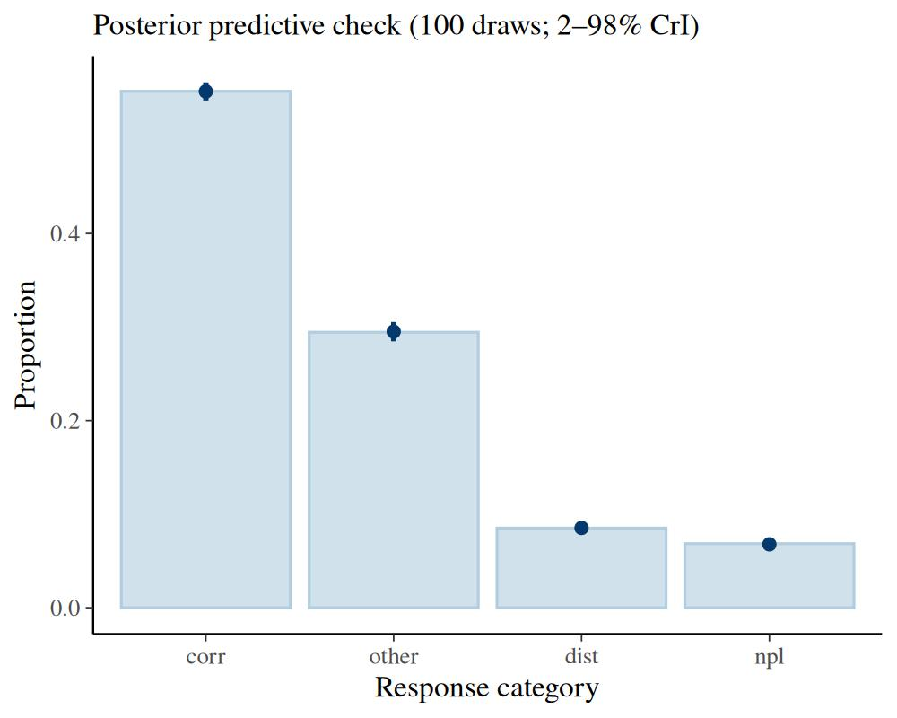
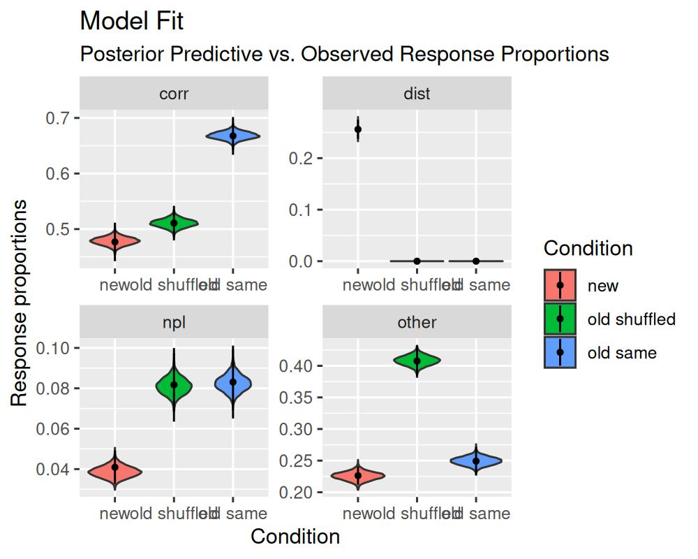

# The Multinomial / Memory Measurement Model (M3)

## 1 Introduction to the model

The multinomial / memory measurement model (`m3`) is a computational
measurement model that was introduced for working memory tasks with
categorical responses (Oberauer and Lewandowsky 2019). Such task
typically use verbal and visual materials, for example: letters, words,
objects, and digits. The only prerequisite for using the `m3` is that
the responses can be grouped into separate response categories. For each
of these response categories the model predicts the frequency of
selecting one item of a category as a function of continuous activation
strengths.

Withing the domain of working memory, the `m3` most commonly
distinguishes two different activation dimensions:

1.  Memory strength of individual elements or items presented during a
    single trial, often labelled item memory
2.  Memory strength of relations, relying on temporary bindings, often
    labelled binding or source memory

The `m3` also allows to include additional hypothetical processes that
might increase or diminishing these activation strengths due to
experimental manipulations, such as manipulating encoding time or
distraction in the domain of memory.

### 1.1 Basic assumptions of the `m3`

The `m3` builds on two general assumptions:

1.  Choosing a response (in memory tasks = memory recall) represents a
    competitive selection from a set of response candidates
2.  Selection from the candidate set is a function of the relative
    activation of each candidate representation at test

The set of response candidates can either a) follow naturally from the
stimulus material, for example all digits from 1 to 9 or all letters
from the alphabet, b) be given in the experimental procedure
implementing recall as the selection from `n` response alternatives
(n-AFC), or c) be constructed by the individual performing the task.
Generally, we recommend focusing on the first and the second use case,
as these provide pretty simple and straightforward implementations of
the `m3`.

To simplify the use of the `m3`, we do not model the activation of each
response candidate seperately, but we group the response candidates into
categories that all share the same sources of activation. For example,
consider a simple short term memory task (simple span task) in which
subjects are asked to remember digits in their serial order and are then
cued with a random serial position to retrieve the respective digit. In
this task, participants can either recall the correct digit that was
associated with the cued position, often labelled the item-in-position.
But they could also recall any of the other digits they had to remember,
often labelled items from other list positions. Finally, they could also
recall a digit that was not part of the memory set at all, usually
labelled not-presented items or lures. Thus, we have three categories of
responses in this task: correct responses or items-in position (labelled
\\correct\\), other list items (labelled \\other\\), and not presented
items (labelled \\npl\\).

After we have decided on the relevant response categories, we need to
specify which activation sources contribute towards each category. For
the above simple short term memory tasks, these would most reasonably
be:

\\ \begin{align} correct & = b + a + c\\ other & = b + a\\ npl & = b
\end{align} \\

In this case, \\b\\ is the baseline activation or background noise, that
can be understood as the activation of all digits, because participants
know that they have to remember digits in general. The parameter \\a\\
is the memory strength for items, or general activation, for all items
that need to be remembered in the current trial. And parameter \\c\\ is
the memory strength for relations, or context activation, that arises
from the context cue of retrieving the cued serial position.

### 1.2 Choice Rules in the `m3`

The activation for each category is then translated into probabilities
of recalling one item or response from each category with a
normalization function as a choice rule. In `bmm` we have implemented
two choice rules, that are different implementations of Luce’s choice
axiom:

1.  Simple normalization (`"simple"`)

This choice rule normalizes the absolute activation over the sum of the
activation of all items:

\\ p_i = \frac{n_i \cdot A_i}{\sum^n\_{j = 1} n_j \cdot A_j} \\

In this normalization the probability \\p_i\\ of recalling an item from
the category \\i\\ results from the number of candidates in the category
\\n_i\\ times the activation of the category \\A_i\\ as specified in the
activation formulas above. This total activation of the category \\i\\
then gets divided by the sum of all categories \\n\\ and their
activation that arises as the product of the number of items in the
category \\n_j\\ times the activation of that category \\A_j\\.

The rationale underlying this choice rule is that it provides a
meaningful zero point. That is, if any category has zero activation the
probability for choosing this category will be zero.

2.  Softmax

The `softmax` choice rule normalizes the exponentiated activation of
each category over the sum of all exponentiated activations:

\\ p_i = \frac{n_i \cdot e^{A_i}}{\sum^n\_{j = 1} n_j \cdot e^{A_j}} \\

This choice rule can be interpreted as an n-alternative SDT model over
the different response candidates with a Gumbel (or double-exponential)
noise distribution.

Finally, the model then links the response frequencies \\Y\\ for each
response category to the probabilities \\p\\ using a multinomial
distribution with the total number of trials:

\\ Y \sim multinomial(p, trials) \\

## 2 Parametization of the `m3` in `bmm`

Given its introduction in the domain of working memory, there are
currently three versions of the `m3` model implemented in `bmm`:

- the `m3` for simple span tasks (`version = "ss"`)
- the `m3` for complex span tasks (`version = "cs"`)
- a fully *custom* `m3` that can be adapted to any kind of task with
  categorical responses (`version = "custom"`).

### 2.1 `m3` for simple and complex span tasks

The simple and complex span versions of the `m3` implement the
activation functions outlined in Formula 1 (simple span, see also the
activation formulas above) and Formula 3 (complex span) in Oberauer and
Lewandowsky (2019). In addition to the three response categories of the
simple span task, the complex span model distinguished two additional
response categories: distractors in or close to the cued position
(\\dist\_{context}\\), and distractors from other or far away positions
(\\dist\_{other}\\). Thus, the `m3` for complex span tasks requires that
you use distractors that could be potentially recalled.[¹](#fn1)

The activation equation for the `m3` for complex span tasks are as
follows[²](#fn2):

\\ \begin{align} corr & = b + a + c \\ other & = b + a \\ dist\_{c} & =
b + f \cdot a + f \cdot c \\ dist\_{o} & = b + f \cdot a \\ npi & = b
\end{align} \\

For both the simple and complex span `m3` you do not have to specify the
activation formulas for the different categories. You only need to
provide linear or non-linear predictor formulas for the different
parameters of the respective `m3` version. Using these models you can
investigate how different activation sources vary over experimental
manipulations or get theoretically grounded indicators of individual
differences of the different activation sources.

### 2.2 Custom `m3` for tasks with categorical responses

The `version = "custom"` of the `m3` allows you to specify custom
activation functions for memory tasks beyond simple and complex span
tasks. Although the `m3` was conceived as a measurement model for
working memory. The `m3` framework can be generalized towards any
decision paradigm involving categorical decision that could be explained
by continuous activation for difference categorical responses.
Therefore, we have relabeled the model from “memory measurement model”
to “multinomial measurement model” to reflect the broader application
beyond the domain of working memory.

For example, you could use a custom `m3` to dissociate different
activation sources and cognitive processes contributing to memory
performance in memory updating tasks. In addition, to recalling the
correct item, items from other positions, or items not presented at all
during the current trial, participants can also recall *outdated items*
that have been updated during the trial in such tasks. The frequency of
recalling such items, can inform us of the processes contributing
towards replacing the initially encoded item with the new item. One such
model is discussed in Oberauer and Lewandowsky (2019).

For the `version = "custom"` of the `m3` you have to provide the
activation functions for all response categories. Apart from that you
then still provide linear prediction formulas for predicting the
different parameters by experimental conditions. For details, please see
the section [Fitting the `m3`](#fitting)

### 2.3 Parameter Scaling the `m3`

Generally, one of the `m3` parameters has to be fixed to set the scaling
of the model. In `bmm` the default is to fix the background noise
parameter `b`. Thus the values of the other parameters should be
interpreted relative to the background noise. The value `b` will be
fixed to depends on the choice rule you choose for fitting the model.
For the `simple` choice rule, `b` will be fixed to `0.1`, for the
`softmax` choice rule, `b` will be fixed to `0`.

We chose two fix the background noise `b` for scaling for two reasons:

1.  Fixing the background noise is similar to fixing noise parameters in
    other cognitive measurement models, such as the diffusion constant
    `s`, or the standard deviation of the noise added to the signal or
    noise distribution in SDT.
2.  In `bmm` we require that all activation formulas contain at least
    the background noise `b`. This ensures that if there is no
    activation from any other source, the model predicts random
    guessing.

In principle, you can decide to fix another parameter for scaling. Then
you need to specify which parameter should be fixed in the `bmmformula`
and additionally provide a formula to predict the background noise `b`.

## 3  Fitting the M3

To fit the `m3` in `bmm`, we need to perform the same three steps as for
all models fitted in `bmm`:

1.  Load data and format it to match the requirements for the `m3`
2.  Specify the `bmmformula`
3.  Create the `bmmodel` object that links the model to the variables
    required for fitting in the data

For the `ss` and `cs` version of the `m3` these steps are practically
identical to fitting any other `bmmodel`. The `custom` version of the
`m3` requires some additional `bmmformula` to specify the custom
activation formulas for each response category. This will be explained
below.

### 3.1 The data

Let’s begin by loading the `bmm` package.

``` r
library(bmm)
```

For this example, we will be using the data from the first experiment
from Oberauer and Lewandowsky (2019). This data set is part of the `bmm`
package as `oberauer_lewandowsky_2019_e1`

``` r
data <- oberauer_lewandowsky_2019_e1
head(data)
```

``` fansi
#> # A tibble: 6 × 10
#>      ID cond             corr other   npl  dist n_corr n_other n_dist n_npl
#>   <int> <fct>           <dbl> <dbl> <dbl> <dbl>  <dbl>   <dbl>  <dbl> <dbl>
#> 1     1 new distractors    78    11     3     8      1       4      5     5
#> 2     1 old reordered      73    23     4    NA      1       4      0    10
#> 3     1 old same           95     4     1    NA      1       4      0    10
#> 4     2 new distractors    49    23     1    27      1       4      5     5
#> 5     2 old reordered      54    44     7    NA      1       4      0    10
#> 6     2 old same           64    23     8    NA      1       4      0    10
```

The data contains the following variables:

- `ID`: an integer uniquely identifying each participant in the
  experiment
- `cond`: a factor distinguishing three experimental conditions that
  varied the type of distractors
- `corr`, `other`, `dist`, and `npl`: The frequencies of responding with
  one item of the respective response categories
- `n_corr`, `n_other`, `n_dist`, and `n_npl`: The number of response
  candidates in each response categories for each experimental condition

This data set already contains all the information required to fit the
M3 model. But if you have a data set that is in long format and contains
which `response_category` the `response` in each trial belongs to, then
you need to aggregate the data and sum the number of responses for each
category in each of the experimental conditions that the model should be
fitted to.

### 3.2 Specifying the `bmmformula` for the `m3`

After having set up the data, we specify the `bmmformula`. For the `ss`
and `cs` versions of the `m3` the `bmmformula` should contain only the
linear model formulas for each of the model parameters. These could look
like this:

``` r
# example formula for version = ss
ss_formula <- bmf(
  c ~ 1 + cond + (1 + cond | ID),
  a ~ 1 + cond + (1 + cond | ID)
)

# example formula for version = cs
cs_formula <- bmf(
  c ~ 1 + cond + (1 + cond | ID),
  a ~ 1 + cond + (1 + cond | ID),
  f ~ 1 + (1 | ID)
)
```

For the `custom` version of the `m3` the `bmmformula` additionally needs
to contain the activation formulas for each response category. This is
done by using the label of each response category and predicting it by
the activation function that you want to use for this category. The
activation function can be any linear combination of different
activation sources or non-linear function of activation sources or model
parameters and other variables in the data, as exemplified in the more
complex models in Oberauer and Lewandowsky (2019):

``` r
cat_label ~ activation_function
```

If we wanted to implement the model proposed by Oberauer and Lewandowsky
(2019) for this data set, we need to specified four activation formulas
for the response categories `corr`, `other`, `dist`, and `npl`:

``` r
act_formulas <- bmf(
  corr ~ b + a + c,
  other ~ b + a,
  dist ~ b + d,
  npl ~ b
)
```

How you label the parameters in the activation formula is up to you,
except for using underscores in the variable names and that the
parameter `b` is reserved for the baseline activation or background
noise that is required to be part of the activation function of each
response category. Apart from that, we recommend using short labels to
avoid parsing errors with special symbols.

Based on the parameter labels that we used in these activation
functions, we can then specify the linear formulas for each parameter:

``` r
par_formulas <- bmf(
  c ~ 1 + cond + (1 + cond | ID),
  a ~ 1 + cond + (1 + cond | ID),
  d ~ 1 + (1 | ID)
)
```

Then, we can combine both formulas into one by adding them using the `+`
operator. Alternatively you can include all formulas in one call to
`bmmformula`:

``` r
full_formula <- act_formulas + par_formulas

# pass all formulas in one call
full_formula <- bmf(
  corr ~ b + a + c,
  other ~ b + a,
  dist ~ b + d,
  npl ~ b,
  c ~ 1 + cond + (1 + cond || ID),
  a ~ 1 + cond + (1 + cond || ID),
  d ~ 1 + (1 || ID)
)
```

### 3.3 Setting up the `bmmodel` object for the `m3`

The last thing we need to do before fitting the `m3` to the data is set
up the `bmmodel` object. For this we need to call the `m3` function and
provide the relevant information for the model. This entails:

- the name of the response categories
- the number of response options in each category or the variable names
  that contain the number of response options in the data
- the choice rule, if not explicitly called `bmm` will use the `softmax`
  as default
- the `m3` version, if not explicitly selected `bmm` will use the
  `custom` version as default

Thus, a basic set up of an `m3` object looks like this:

``` r
my_model <- m3(resp_cats = c("corr","other","dist","npl"),
               num_options = c("n_corr","n_other","n_dist","n_npl"),
               choice_rule = "simple",
               version = "custom")
```

For the `custom` version, you additionally need to provide the `links`
that should be used for each of the model parameters.The `links` ensure
that model parameters stay in the correct value range. In particular for
the `simple` choice rule it is essential, that all activation are
positive. Thus, we recommend using `log` link functions for all
parameters that represent activation sources, such as general or context
activation, especially when using the `simple` choice rule.

Based on the provided links for the model parameters, `bmm` will set
`default_priors` that aim at a reasonable parameter range. We recommend
that you check the priors set for the `custom` version of the `m3`
andconsider what parameter ranges are reasonable for the different model
parameters and provide `default_priors` for all of them. For detailed
information on priors in `bmm` please see the
`vignette("extract_info")`. In short, you can provide priors for
intercepts as `main` and for effects as `effects`.

Setting up a `m3` object including these info looks like this:

``` r
my_links <- list(
  c = "log", a = "log", d = "log"
)

my_model <- m3(resp_cats = c("corr","other","dist","npl"),
               num_options = c("n_corr","n_other","n_dist","n_npl"),
               choice_rule = "simple",
               version = "custom",
               links = my_links)

# print default priors determined based on link functions
default_prior(full_formula, data, my_model)
#> Warning: Default priors for each parameter will be specified internally based on the provided link function.
#> Please check if the used priors are reasonable for your application
#>                 prior class             coef group resp dpar nlpar   lb   ub
#>        normal(0, 0.5)     b condoldreordered                     a <NA> <NA>
#>        normal(0, 0.5)     b      condoldsame                     a <NA> <NA>
#>  student_t(3, 0, 2.5)    sd                                      a    0     
#>  student_t(3, 0, 2.5)    sd                     ID               a    0     
#>  student_t(3, 0, 2.5)    sd condoldreordered    ID               a    0     
#>  student_t(3, 0, 2.5)    sd      condoldsame    ID               a    0     
#>  student_t(3, 0, 2.5)    sd        Intercept    ID               a    0     
#>                (flat)     b                                      b          
#>        normal(0, 0.5)     b condoldreordered                     c <NA> <NA>
#>        normal(0, 0.5)     b      condoldsame                     c <NA> <NA>
#>  student_t(3, 0, 2.5)    sd                                      c    0     
#>  student_t(3, 0, 2.5)    sd                     ID               c    0     
#>  student_t(3, 0, 2.5)    sd condoldreordered    ID               c    0     
#>  student_t(3, 0, 2.5)    sd      condoldsame    ID               c    0     
#>  student_t(3, 0, 2.5)    sd        Intercept    ID               c    0     
#>                (flat)     b                                      d          
#>  student_t(3, 0, 2.5)    sd                                      d    0     
#>  student_t(3, 0, 2.5)    sd                     ID               d    0     
#>  student_t(3, 0, 2.5)    sd        Intercept    ID               d    0     
#>        normal(0, 0.5)     b                                      a <NA> <NA>
#>          normal(1, 1)     b        Intercept                     a <NA> <NA>
#>        normal(0, 0.5)     b                                      c <NA> <NA>
#>          normal(1, 1)     b        Intercept                     c <NA> <NA>
#>          normal(1, 1)     b        Intercept                     d <NA> <NA>
#>         constant(0.1)     b        Intercept                     b <NA> <NA>
#>  tag       source
#>      (vectorized)
#>      (vectorized)
#>           default
#>      (vectorized)
#>      (vectorized)
#>      (vectorized)
#>      (vectorized)
#>           default
#>      (vectorized)
#>      (vectorized)
#>           default
#>      (vectorized)
#>      (vectorized)
#>      (vectorized)
#>      (vectorized)
#>           default
#>           default
#>      (vectorized)
#>      (vectorized)
#>              user
#>              user
#>              user
#>              user
#>              user
#>              user
```

### 3.4 Running `bmm` to estimate parameters

After having set up the `data`, the `bmmformula`, and the `bmmodel`, we
can pass all information to `bmm` to fit the model:

``` r
m3_fit <- bmm(
  formula = full_formula,
  data = data,
  model = my_model,
  sample_prior = "yes",
  cores = 4,
  warmup = 1000, iter = 2000,
  backend = 'cmdstanr',
  file = "assets/bmmfit_m3_vignette",
  refresh = 0
)
```

Running this model takes about 20 to 40 seconds (depending on the speed
of your computer). Using the `bmmfit` object we can have a quick look at
the summary of the fitted model:

``` r
summary(m3_fit)
```

``` fansi
  Model: m3(resp_cats = c("corr", "other", "dist", "npl"),
            num_options = c("n_corr", "n_other", "n_dist", "n_npl"),
            choice_rule = "simple",
            version = "custom",
            links = my_links) 
  Links: c = log; a = log; d = log 
Formula: b = 0.1
         a ~ 1 + cond + (1 + cond || ID)
         c ~ 1 + cond + (1 + cond || ID)
         d ~ 1 + (1 || ID)
         corr ~ b + a + c
         other ~ b + a
         dist ~ b + d
         npl ~ b 
   Data: (Number of observations: 120)
  Draws: 4 chains, each with iter = 2000; warmup = 1000; thin = 1;
         total post-warmup draws = 4000

Multilevel Hyperparameters:
~ID (Number of levels: 40) 
                       Estimate Est.Error l-95% CI u-95% CI Rhat Bulk_ESS
sd(a_Intercept)            0.67      0.11     0.48     0.91 1.00     1744
sd(a_condoldreordered)     0.55      0.12     0.33     0.80 1.00     1662
sd(a_condoldsame)          0.27      0.16     0.02     0.59 1.00      864
sd(c_Intercept)            1.62      0.22     1.25     2.10 1.00     1299
sd(c_condoldreordered)     0.23      0.13     0.02     0.49 1.00      795
sd(c_condoldsame)          0.55      0.12     0.34     0.80 1.00     1586
sd(d_Intercept)            0.69      0.12     0.48     0.97 1.00     1623
                       Tail_ESS
sd(a_Intercept)            2269
sd(a_condoldreordered)     2655
sd(a_condoldsame)          1925
sd(c_Intercept)            2410
sd(c_condoldreordered)     1452
sd(c_condoldsame)          2121
sd(d_Intercept)            2530

Regression Coefficients:
                   Estimate Est.Error l-95% CI u-95% CI Rhat Bulk_ESS Tail_ESS
a_Intercept           -0.30      0.15    -0.60    -0.00 1.00     2112     2304
a_condoldreordered     0.68      0.15     0.37     0.97 1.00     2948     3032
a_condoldsame          0.10      0.14    -0.17     0.36 1.00     3607     3301
c_Intercept            1.60      0.28     1.05     2.14 1.01      466      989
c_condoldreordered     0.03      0.12    -0.22     0.26 1.00     2768     3094
c_condoldsame          0.54      0.14     0.27     0.81 1.00     2887     3132
d_Intercept           -0.45      0.15    -0.75    -0.15 1.00     2203     2615

Constant Parameters:
                Value
b_Intercept      0.10

Draws were sampled using sample(hmc). For each parameter, Bulk_ESS
and Tail_ESS are effective sample size measures, and Rhat is the potential
scale reduction factor on split chains (at convergence, Rhat = 1).
```

First, we can have a look at the estimated regression coefficients. The
first thing we should check is if the sampling converged, this is
indicated by all `Rhat` values being close to one. If you want to do
more inspection of the sampling, you can check out the functionality
implemented in `brms`to do this.

The parameter estimates for `c`, `a`, and `d` are estimated using a
`log` link function, so we have to transform these back to the native
scale using the `exp` function:

``` r
fixedFX <- brms::fixef(m3_fit)

# print posterior means for the c parameter
exp(fixedFX[startsWith(rownames(fixedFX),"c_"),])
#>                    Estimate Est.Error      Q2.5    Q97.5
#> c_Intercept        4.930903  1.320092 2.8541063 8.515983
#> c_condoldreordered 1.025825  1.131547 0.8046311 1.300896
#> c_condoldsame      1.712454  1.150015 1.3079862 2.251764

# print posterior means for the a parameter
exp(fixedFX[startsWith(rownames(fixedFX),"a_"),])
#>                     Estimate Est.Error      Q2.5     Q97.5
#> a_Intercept        0.7431726  1.161537 0.5494346 0.9965668
#> a_condoldreordered 1.9699622  1.162509 1.4450414 2.6462022
#> a_condoldsame      1.1053008  1.146248 0.8457697 1.4306108

# print posterior means for the d parameter
exp(fixedFX[startsWith(rownames(fixedFX),"d_"),])
#>  Estimate Est.Error      Q2.5     Q97.5 
#> 0.6353230 1.1666323 0.4732908 0.8628526
```

These estimates differ from the estimates reported by Oberauer and
Lewandowsky (2019), because we used a `log` link function, whereas in
the original publication an `identity` link was used. This was done with
adding truncation arguments to the priors, to ensure that all
activations are positive. In principle, this is possible in `bmm`, too.
However, such an estimation is less numerically stable and efficient.
Therefore, we recommend using `log` links for activation parameters that
should be positive.

#### 3.4.1 Testing Hypothesis

When comparing the differences between the different conditions, the
results from `bmm` converge with those in Oberauer and Lewandowsky
(2019). The goal of this first experiment was to show a selective
influence of different conditions on the `c` and `a` parameter. This
replicated using the `bmm` implementation of the proposed `m3`. To
evaluate the posterior differences between the conditions, we can use
the `hypothesis` function from `brms`:

``` r
post_diff <- c(
  c_newVoldR = "c_condoldreordered = 0",
  c_newVoldS = "c_condoldsame = 0",
  c_oldRVolds = "c_condoldreordered = c_condoldsame",
  a_newVoldR = "a_condoldreordered = 0",
  a_newVoldS = "a_condoldsame = 0",
  a_oldRVolds = "a_condoldreordered = a_condoldsame"
)

hyp <- brms::hypothesis(m3_fit, post_diff)
hyp
#> Hypothesis Tests for class b:
#>    Hypothesis Estimate Est.Error CI.Lower CI.Upper Evid.Ratio Post.Prob Star
#> 1  c_newVoldR     0.03      0.12    -0.22     0.26       3.90      0.80     
#> 2  c_newVoldS     0.54      0.14     0.27     0.81       0.01      0.01    *
#> 3 c_oldRVolds    -0.51      0.14    -0.79    -0.23       0.03      0.02    *
#> 4  a_newVoldR     0.68      0.15     0.37     0.97       0.00      0.00    *
#> 5  a_newVoldS     0.10      0.14    -0.17     0.36       2.81      0.74     
#> 6 a_oldRVolds     0.58      0.15     0.28     0.87       0.00      0.00    *
#> ---
#> 'CI': 90%-CI for one-sided and 95%-CI for two-sided hypotheses.
#> '*': For one-sided hypotheses, the posterior probability exceeds 95%;
#> for two-sided hypotheses, the value tested against lies outside the 95%-CI.
#> Posterior probabilities of point hypotheses assume equal prior probabilities.
```

These hypothesis will compute the difference between the specified
parameters. You can see that the `c` parameter in the condition
`oldsame` differs from both the `new` and `oldreorderd` condition. In
contrast the `a` parameter in the condition `oldreordered` differs from
both the `new` and the `oldsame` condition. For these differences the
95% CI does not include zero as indicated by the `*` at the end of the
line.

As we included a statement to also sample the priors using the
`sample_prior = TRUE` option from `brms` when running the `bmm`, the
`Evid.Ratio` and `Post.Prob` column given us the Bayes Factor in favor
of the specified hypothesis and the posterior probability for the
hypothesis being true.

#### 3.4.2 Assessing model fit

You can assess model fit by visually inspecting posterior predictive
plots using the `pp_check` function. For multinomial models like the
`m3`, `bmm` provides a custom `pp_check` method that compares observed
and predicted response proportions across experimental conditions.

``` r
pp_check(m3_fit, ndraws = 100)
```



The plot shows observed response proportions as bars and the posterior
predictive median with 95% credible interval as point-ranges for each
response category. If the model fits the data well, the observed bars
should align with the predicted point-ranges.

For this particular model, a good fit is unsurprising as it is saturated
with respect to the number of parameters and the number of observations.

#### 3.4.3 Advanced: custom visualization

For more control over the visualization, you can obtain posterior
predictions directly using the `tidybayes` package and build a custom
plot.

``` r
library(tidybayes)
library(dplyr)
library(ggplot2)

pp_m3 <- m3_fit |>
  # obtain expected predicted draws
  tidybayes::epred_draws(
    newdata = m3_fit$data
  ) |> ungroup() |>
  # select only relevant variables
  select(ID, cond, nTrials, .draw, .category, .epred) |>
  # calculate the mean predicted values in each condition for each response category
  # and each draw
  summarise(.epred = mean(.epred/nTrials),
            .by = c(cond, .category, .draw))

# reshape data to match the format of the posterior predictives
data$n_trials <- rowSums(data[,c("corr","other","dist","npl")], na.rm = T)
data_pp <- data |>
  select(ID, n_trials, cond, corr, other, dist, npl) |>
  tidyr::pivot_longer(cols = c(corr, other, dist, npl), names_to = ".category", values_to = ".value") |>
  mutate(.value = .value/n_trials)

# some responses were not possible in some conditions, so we set them to zero
data_pp[is.na(data_pp)] <- 0

# relabel condition factor for better readability
levels(pp_m3$cond) <- c("new", "old shuffled", "old same")
levels(data_pp$cond) <- c("new", "old shuffled", "old same")

# plot the posterior predictive draws against the observed data
ggplot(data = pp_m3,
       aes(condition, y = .epred, x = cond, fill = cond)) +
  facet_wrap(~.category, scales = "free") +
  geom_violin() +
  stat_summary(data = data_pp, aes (y = .value),
               fun.data = mean_se, size = 0.1) +
  labs(y = "Response proportions",
       x = "Condition",
       fill = "Condition",
       title = "Model Fit",
       subtitle = "Posterior Predictive vs. Observed Response Proportions")
```



## References

Oberauer, Klaus, and Stephan Lewandowsky. 2019. “Simple Measurement
Models for Complex Working-Memory Tasks.” *Psychological Review* 126
(6): 880–932. <https://doi.org/10.1037/rev0000159>.

------------------------------------------------------------------------

1.  Traditional complex span tasks, such as the operation span or
    reading span task are thus not suited for the `m3`, as the
    distractors are different from the to-be-remembered items. For
    example, in the operation span task, participants are instructed
    to-remember a set of letters in order while judging math equations
    to be correct or incorrect in-between the letters. As it is
    unlikely, that participants would recall digits that are part of the
    math equations instead of letters, such tasks are not suited to
    distinguish processes related to the distractor processing. You
    could still fit the `m3` for simple span tasks to these data, this
    model would however not provide any insight on the way distractors
    are encoded and processed in working memory.

2.  Please note that assuming that item and context activation are
    filtered equally for the distractors is just one way that filtering
    might reduce the activation of distractors. More recent research on
    the removal of information from working memory suggests that item
    and binding memory might not be reduced equally. This would require
    assuming different filtering parameter \\f_a\\ for the general
    activation, and \\f_c\\ for the context activation. This would
    require specifying a `custom` M3.
