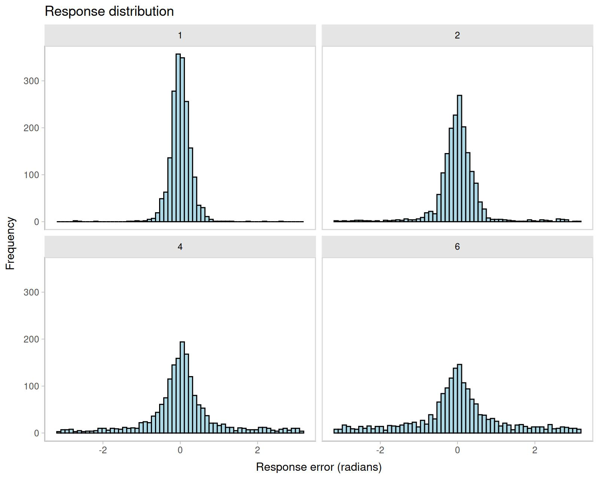

# Mixture models for visual working memory

## 1 Introduction to the models

The two-parameter mixture model (Zhang and Luck 2008) and the
three-parameter mixture model (Bays, Catalao, and Husain 2009) are
measurement models for continuous reproduction tasks in the visual
working memory domain (for details on the task, see [the online
article](https://venpopov.com/bmm/articles/bmm_vwm_crt.html). As other
measurement models for continuous reproduction tasks, their goal is to
model the distribution of angular response errors.

The *two-parameter mixture model*
([`?mixture2p`](https://venpopov.com/bmm/dev/reference/mixture2p.md))
distinguishes two memory states that lead to responses with a mixture of
two different distributions of angular errors. The two states are:

1.  having a representation of the cued object with a certain precision
    of its feature in visual working memory (solid blue distribution in
    Figure [1.1](#fig:mixture-models))

2.  having no representation in visual working memory and thus guessing
    a random response (dashed red distribution).


Figure 1.1: Mixtures of response distributions

Responses based on a noisy memory representation of the correct feature
come from a circular normal distribution (i.e., von Mises) centered on
the correct feature value, while guessing responses come from a uniform
distribution along the entire circle:

\\ p(\theta) = p\_{mem} \cdot \text{vM}(\theta; \mu, \kappa) +
(1-p\_{mem}) \cdot \text{Uniform}(\theta; -\pi, \pi) \\ \\ \\ p\_{guess}
= 1-p\_{mem} \\ \\ \\ vM(\theta; \mu, \kappa) = \frac{e^{\kappa
\cos(\theta - \mu)}}{2\pi I_0(\kappa)} \\

where \\\theta\\ is the response angle, \\p\_{mem}\\ is the probability
that responses come from memory of target feature, \\\mu\\ is the mean
of the von Mises distribution representing the target feature, and
\\\kappa\\ is the concentration parameter of the von Mises distribution,
representing the precision of the target memory representation.

The *three-parameter mixture model*
([`?mixture3p`](https://venpopov.com/bmm/dev/reference/mixture3p.md))
adds a third state: confusing the cued object with another object shown
during encoding and thus reporting the feature of the other object (long
dashed green distribution in Figure [1.1](#fig:mixture-models)).
Responses from this state are sometimes called non-target responses or
swap errors. The non-target responses also come from a von Mises
distribution centered on the feature of the non-target object. The
probability of non-target responses is represented by the parameter
\\p\_{nt}\\, and the complete model is:

\\ p(\theta) = p\_{mem} \cdot \text{vM}(\theta; \mu_t, \kappa) + p\_{nt}
\cdot \frac{\sum\_{i=1}^{n} \text{vM}(\theta; \mu\_{i}, \kappa)}{n} +
(1-p\_{mem}-p\_{nt}) \cdot \text{Uniform}(\theta; -\pi, \pi) \\ \\ \\
p\_{guess} = 1-p\_{mem}-p\_{nt} \\

where \\\mu\_{t}\\ is the location of the target feature, \\\mu\_{i}\\
is the location of the i-th non-target feature, \\n\\ is the number of
non-target features.

In most applications of the model, the responses are coded as the
angular error relative to the target feature. The same is true for the
non-target memory representations, which are assumed to be centered on
the target feature, and the precision of the non-target memory
representation is assumed to be the same as the precision of the target
memory representation. This is the version of the model implemented in
the `bmm` package:

\\ p(\theta) = p\_{mem} \cdot \text{vM}(\theta; 0, \kappa) + p\_{nt}
\cdot \frac{\sum\_{i=1}^{n} \text{vM}(\theta; \mu\_{i}-\mu_t,
\kappa)}{n} + (1-p\_{mem}-p\_{nt}) \cdot \text{Uniform}(\theta; -\pi,
\pi) \\

## 2 The data

Begin by loading the `bmm` package:

``` r
library(bmm)
```

For this example, we will analyze data from Bays, Catalao, and Husain
(2009). The data is included in the `mixtur` R package and can be loaded
with the following command:

``` r
# install the mixtur package if you haven't done so
# install.packages("mixtur")
dat <- mixtur::bays2009_full
```

The data contains the following columns:

|     |  id | set_size | duration | response | target | non_target_1 | non_target_2 | non_target_3 | non_target_4 | non_target_5 |
|:----|----:|---------:|---------:|---------:|-------:|-------------:|-------------:|-------------:|-------------:|-------------:|
| 321 |   1 |        4 |     2000 |    0.846 |  0.100 |        3.025 |       -0.665 |        2.054 |           NA |           NA |
| 322 |   1 |        4 |     2000 |   -1.634 | -0.845 |        2.985 |        2.633 |        2.103 |           NA |           NA |
| 323 |   1 |        4 |      100 |   -1.684 | -1.951 |        0.312 |       -1.924 |        0.622 |           NA |           NA |
| 324 |   1 |        4 |      100 |    0.713 |  0.133 |        1.502 |        3.089 |       -0.958 |           NA |           NA |
| 325 |   1 |        4 |     2000 |    1.317 |  1.439 |       -2.675 |       -1.191 |        1.970 |           NA |           NA |
| 326 |   1 |        4 |     2000 |   -1.316 | -0.384 |        0.845 |        0.274 |       -0.465 |           NA |           NA |

where:

- `id` is a unique identifier for each participant
- `set_size` is the number of items presented in the memory array
- `response` the participant’s recollection of the target orientation in
  radians
- `target` the feature value of the target in radians
- `non_target_1` to `non_target5` are the feature values of the
  non-targets in radians

The trials vary in `set_size` (1, 2, 3 or 6), and also vary in encoding
duration.

To fit the mixture models with `bmm`, first we have to make sure that
the data is in the correct format. The response variable should be in
radians and represent the *angular error relative to the target*, and
the non-target variables should be in radians and be *centered relative
to the target*. You can find these requirements in the help topic for
[`?mixture2p`](https://venpopov.com/bmm/dev/reference/mixture2p.md) and
[`?mixture3p`](https://venpopov.com/bmm/dev/reference/mixture3p.md).

In this dataset, the response and non-target variables are already in
radians, but they is not centered relative to the target. We can check
that by plotting the response distribution. Because memory items are
selected at random on each trial, the non-centered responses show a
uniform distribution:

``` r
library(ggplot2)
ggplot(dat, aes(response)) +
  geom_histogram(binwidth = 0.5, fill = "lightblue", color = "black") +
  labs(title = "Response distribution", x = "Response error (radians)", y = "Frequency")
```


We can center the response and non-target variables by subtracting the
target value from them. We can do this with the `mutate` function from
the `dplyr` package. We also need to make sure that the response is in
the range of \\(-\pi, \pi)\\, and the non-target variables are in the
range of \\(-\pi, \pi)\\. We can do this with the `wrap` function from
the `bmm` package. As we can see from the new plot, the response
distribution is now centered on 0.

``` r
library(dplyr)
dat_preprocessed <- dat |>
  mutate(error = wrap(response - target),
         non_target_1 = wrap(non_target_1 - target),
         non_target_2 = wrap(non_target_2 - target),
         non_target_3 = wrap(non_target_3 - target),
         non_target_4 = wrap(non_target_4 - target),
         non_target_5 = wrap(non_target_5 - target),
         set_size = as.factor(set_size))

ggplot(dat_preprocessed, aes(error)) +
  geom_histogram(bins=60, fill = "lightblue", color = "black") +
  labs(title = "Response distribution", x = "Response error (radians)", y = "Frequency") +
  facet_wrap(~set_size)
```



From the plot above we can also see that performace gets substantially
worse with increasing set size. Now, we can fit the two mixture models
two understand what is driving this pattern.

## 3 Fitting the 2-parameter mixture model with `bmm`

To fit the two-parameter mixture model, we need to specify the model
formula and the model. For the model formula we use the `brms` package’s
`bf` function. For all linear model formulas in brms, the left side of
an equation refers to the to-be predicted variable or parameter and the
right side specifies the variables used to predict it.

In this example, we want to fit a model in which both the probability of
memory responses and the precision of the memory responses vary with set
size. We also want the effect of set size to vary across participants.

The model formula has three components:

1.  The response variable `error` is predicted by a constant term, which
    is internally fixed to have a mean of 0
2.  The precision parameter `kappa` is predicted by set size, and the
    effect of set size varies across participants
3.  The mixture weight[¹](#fn1) for memory responses `thetat` is
    predicted by set size, and the effect of set size varies across
    participants.

``` r
ff <- bmf(thetat ~ 0 + set_size + (0 + set_size | id),
          kappa ~ 0 + set_size + (0 + set_size | id))
```

Then we specify the model as simply as:

``` r
model <- mixture2p(resp_error = "error")
```

Finally, we fit the model with the
[`bmm()`](https://venpopov.com/bmm/dev/reference/bmm.md) function. The
fit model function uses the `brms` package to fit the model, so you can
pass to it any argument that you would pass to the `brm` function.

``` r
fit <- bmm(
  formula = ff,
  data = dat_preprocessed,
  model = model,
  cores = 4,
  refresh = 100,
  backend = 'cmdstanr',
  file = "assets/bmmfit_mixture2p_vignette"
)
```

## 4 Results of the 2-parameter mixture model

We can now inspect the model fit:

``` r
summary(fit)
Warning: There were 1 divergent transitions after warmup. Increasing adapt_delta above 0.8 may help. See http://mc-stan.org/misc/warnings.html#divergent-transitions-after-warmup
```

``` fansi
  Model: mixture2p(resp_error = "error") 
  Links: mu1 = tan_half; kappa = log; thetat = identity 
Formula: mu1 = 0
         kappa ~ 0 + set_size + (0 + set_size || id)
         thetat ~ 0 + set_size + (0 + set_size || id) 
   Data: dat_preprocessed (Number of observations: 7271)
  Draws: 4 chains, each with iter = 2000; warmup = 1000; thin = 1;
         total post-warmup draws = 4000

Multilevel Hyperparameters:
~id (Number of levels: 12) 
                     Estimate Est.Error l-95% CI u-95% CI Rhat Bulk_ESS Tail_ESS
sd(kappa_set_size1)      0.36      0.10     0.22     0.60 1.00     1267     2370
sd(kappa_set_size2)      0.21      0.08     0.08     0.39 1.00     1302     1020
sd(kappa_set_size4)      0.34      0.11     0.18     0.60 1.00     1924     2711
sd(kappa_set_size6)      0.43      0.15     0.21     0.79 1.00     1779     2444
sd(thetat_set_size1)     0.57      0.45     0.03     1.73 1.00     1265     1452
sd(thetat_set_size2)     0.93      0.29     0.51     1.64 1.00     1747     2568
sd(thetat_set_size4)     0.95      0.27     0.55     1.63 1.00     1412     2109
sd(thetat_set_size6)     0.67      0.20     0.39     1.15 1.00     1643     2310

Regression Coefficients:
                 Estimate Est.Error l-95% CI u-95% CI Rhat Bulk_ESS Tail_ESS
kappa_set_size1      2.89      0.12     2.66     3.12 1.00     1406     1716
kappa_set_size2      2.40      0.08     2.24     2.56 1.00     2632     2527
kappa_set_size4      2.08      0.12     1.84     2.32 1.00     2426     2690
kappa_set_size6      1.94      0.15     1.65     2.25 1.00     2517     2627
thetat_set_size1     4.53      0.40     3.89     5.43 1.00     2316     1088
thetat_set_size2     2.56      0.31     1.94     3.17 1.00     1658     1999
thetat_set_size4     1.08      0.29     0.50     1.67 1.00     1312     1735
thetat_set_size6     0.32      0.21    -0.08     0.75 1.00     1502     2120

Constant Parameters:
                  Value
mu1_Intercept      0.00

Draws were sampled using sample(hmc). For each parameter, Bulk_ESS
and Tail_ESS are effective sample size measures, and Rhat is the potential
scale reduction factor on split chains (at convergence, Rhat = 1).
```

The summary shows the estimated fixed effects for the precision and the
mixture weight, as well as the estimated random effects for the
precision and the mixture weight. All Rhat values are close to 1, which
is a good sign that the chains have converged. The effective sample
sizes are also high, which means that the chains have mixed well.

We now want to understand the estimated parameters.

- `kappa` is coded within `brms` with a log-link function, so we need to
  exponentiate the estimates to get the precision parameter. We can
  further use the `k2sd` function to convert the precision parameter to
  the standard deviation units.
- `thetat` is the mixture weight for memory responses. As described in
  footnote 1, we can use the softmax function to get the probability of
  memory responses.

``` r
# extract the fixed effects from the model and determine the rows that contain
# the relevant parameter estimates
fixedEff <- brms::fixef(fit)
thetat <- fixedEff[grepl("thetat",rownames(fixedEff)),]
kappa <- fixedEff[grepl("kappa_",rownames(fixedEff)),]

# transform parameters because brms uses special link functions
kappa <- exp(kappa)
sd <- k2sd(kappa[,1]) 
p_mem <- exp(thetat)/(exp(thetat)+1)
pg <- exp(0)/(exp(thetat)+1)
```

Our estimates for kappa over set_size are:

``` r
kappa
#>                  Estimate Est.Error      Q2.5    Q97.5
#> kappa_set_size1 17.974163  1.126196 14.314425 22.69904
#> kappa_set_size2 11.069807  1.079969  9.431975 12.87640
#> kappa_set_size4  7.981807  1.126819  6.305204 10.17838
#> kappa_set_size6  6.979520  1.162236  5.189384  9.47424
```

Standard deviation:

``` r
names(sd) <- paste0("Set size ", c(1,2,4,6))
round(sd,3)
#> Set size 1 Set size 2 Set size 4 Set size 6 
#>      0.239      0.308      0.366      0.394
```

Probability that responses comes from memory:

``` r
rownames(p_mem) <- paste0("Set size ", c(1,2,4,6))
round(p_mem,3)
#>            Estimate Est.Error  Q2.5 Q97.5
#> Set size 1    0.989     0.598 0.980 0.996
#> Set size 2    0.928     0.577 0.874 0.960
#> Set size 4    0.746     0.571 0.623 0.841
#> Set size 6    0.579     0.553 0.480 0.680
```

It is even better to visualize the entire posterior distribution of the
parameters.

``` r
library(tidybayes)
library(tidyr)

# extract the posterior draws
draws <- tidybayes::tidy_draws(fit)
draws_theta <- select(draws, b_thetat_set_size1:b_thetat_set_size6)
draws_kappa <- select(draws, b_kappa_set_size1:b_kappa_set_size6)

# transform parameters because brms uses special link functions
draws_theta <- exp(draws_theta)/(exp(draws_theta) + 1)
draws_kappa <- exp(draws_kappa)

# plot posterior
as.data.frame(draws_theta) |> 
  gather(par, value) |>
  mutate(par = gsub("b_thetat_set_size", "", par)) |>
  ggplot(aes(par, value)) +
  tidybayes::stat_halfeyeh(normalize = "groups", orientation = "vertical") +
  labs(y = "Probability of memory response", x = "Set size", parse = TRUE)

as.data.frame(draws_kappa) |> 
  gather(par, value) |>
  mutate(value = k2sd(value)) |> 
  mutate(par = gsub("b_kappa_set_size", "", par)) |>
  ggplot(aes(par,value)) +
  tidybayes::stat_halfeyeh(normalize = "groups", orientation = "vertical") +
  labs(y = "Memory imprecision (SD)", x = "Set size", parse = TRUE)
```


where the black dot represents the median of the posterior distribution,
the thick line represents the 50% credible interval, and the thin line
represents the 95% credible interval.

## 5 Fitting the 3-parameter mixture model with `bmm`

Fitting the 3-parameter mixture model is very similar. We have an extra
parameter `thetant` that represents the mixture weight for non-target
responses[²](#fn2). We also need to specify the names of the non-target
variables and the set_size[³](#fn3) variable in the `mixture3p`
function.

``` r
ff <- bmf(
  thetat ~ 0 + set_size + (0 + set_size | id),
  thetant ~ 0 + set_size + (0 + set_size | id),
  kappa ~ 0 + set_size + (0 + set_size | id)
)

model <- mixture3p(resp_error = "error", nt_features = paste0('non_target_',1:5), set_size = 'set_size')
```

Then we run the model just like before:

``` r
fit3p <- bmm(
  formula = ff,
  data = dat_preprocessed,
  model = model,
  cores = 4,
  refresh = 100,
  backend = 'cmdstanr'
)
```

The rest of the analysis is the same as for the 2-parameter model. We
can inspect the model fit, extract the parameter estimates, and
visualize the posterior distributions.

In the above example we specified all column names for the non_targets
explicitely via `paste0('non_target_',1:5)`. Alternatively, you can use
a regular expression to match the non-target feature columns in the
dataset. This is useful when the non-target feature columns are named in
a consistent way, e.g. `non_target_1`, `non_target_2`, `non_target_3`,
etc. For example, you can specify the model a few different ways via
regular expressions:

``` r
model <- mixture3p(resp_error = "error", 
                   nt_features = "non_target_[1-5]", 
                   set_size = 'set_size', 
                   regex = TRUE)
model <- mixture3p(resp_error = "error", 
                   nt_features = "non_target_", 
                   set_size = 'set_size', 
                   regex = TRUE)
```

## References

Bays, Paul M., Raquel F. G. Catalao, and Masud Husain. 2009. “The
Precision of Visual Working Memory Is Set by Allocation of a Shared
Resource.” *Journal of Vision* 9 (10): 7–7.
<https://doi.org/10.1167/9.10.7>.

Zhang, Weiwei, and Steven J. Luck. 2008. “Discrete Fixed-Resolution
Representations in Visual Working Memory.” *Nature* 453 (7192): 233–35.
<https://doi.org/10.1038/nature06860>.

------------------------------------------------------------------------

1.  `brms` does not directly estimate the probabilities that each
    response comes from each distribution (e.g. \\p\_{mem}\\ and
    \\p\_{guess}\\). Instead, brms estimates mixing proportions that are
    weights applied to each of the mixture distributions and they are
    transformed into probabilities (e.g. \\p\_{mem}\\ and
    \\p\_{guess}\\) using a softmax normalization. To get \\p\_{mem}\\
    we can use the softmax function, that is: \\p\_{mem} =
    \frac{exp(\theta\_{target})}{1+exp(\theta\_{target})}\\

2.  because now we have three mixture weights, you will need later to
    calculate the probability of target responses as \\p\_{mem} =
    \frac{exp(\theta\_{target})}{1+exp(\theta\_{target})+exp(\theta\_{nontarget})}\\,
    the probability of non-target responses as \\p\_{nt}
    =\frac{exp(\theta\_{nontarget})}{1+exp(\theta\_{target})+exp(\theta\_{nontarget})}\\,
    and the probability of guessing as \\p\_{guess} =
    1-p\_{mem}-p\_{nt}\\

3.  When the set_size varies in an experiment, provide the name of the
    variable containing the set_size information. If the set size is the
    same for all trials, provide a number, e.g. `set_size=4`
