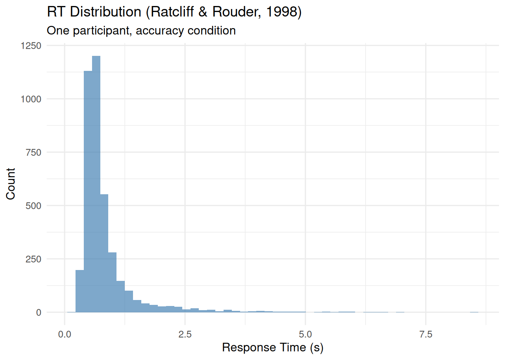
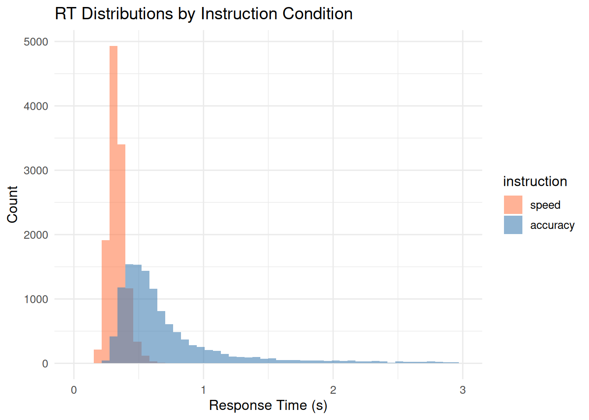
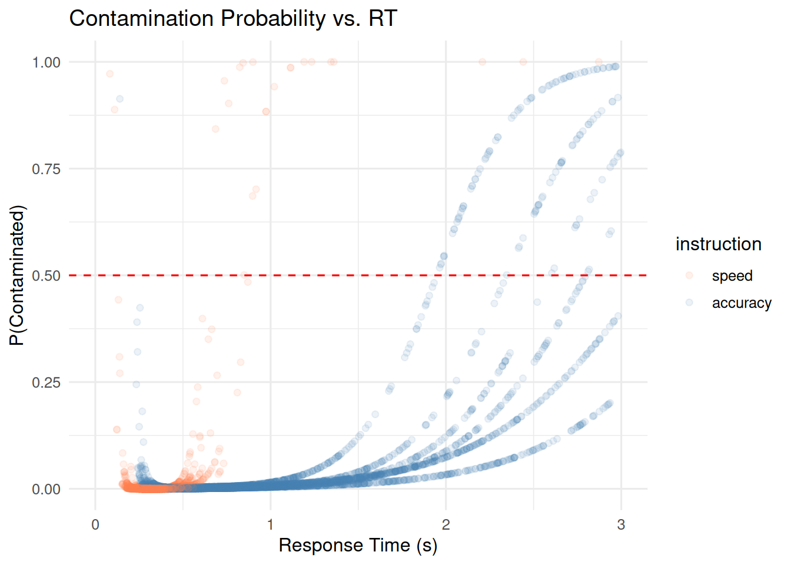

# Handling RT Contamination in Evidence Accumulation Models

``` r
library(bmm)
library(dplyr)
library(ggplot2)
library(tidyr)
library(rtdists)

theme_set(theme_minimal(base_size = 12))
```

## 0.1 Introduction

Evidence accumulation models assume that all observed RTs arise from a
single cognitive process. In practice, some trials reflect something
else entirely: anticipatory responses, attention lapses, or accidental
button presses. Even a few such contaminant trials can bias parameter
estimates and distort model fit (Ratcliff and Tuerlinckx 2002).

The `bmm` package provides two functions for dealing with contamination,
one for each type of model it supports:

| Model        | Data type        | Function                                                                                   | Role                        |
|--------------|------------------|--------------------------------------------------------------------------------------------|-----------------------------|
| EZDM         | Aggregated stats | [`ezdm_summary_stats()`](https://venpopov.com/bmm/dev/reference/ezdm_summary_stats.md)     | Required during aggregation |
| DDM / csWald | Trial-level      | [`flag_contaminant_rts()`](https://venpopov.com/bmm/dev/reference/flag_contaminant_rts.md) | Optional preprocessing      |

Both fit a mixture model via the EM algorithm, separating cognitive RTs
from a uniform contaminant distribution (Ratcliff and Tuerlinckx 2002):

\\ f(RT) = (1 - \pi) \cdot f\_{\text{cognitive}}(RT) + \pi \cdot
f\_{\text{uniform}}(RT) \\

where \\\pi\\ is the contamination proportion. The cognitive component
\\f\_{\text{cognitive}}\\ can be ex-Gaussian (default), log-normal, or
inverse Gaussian. For background on the EZ diffusion model, see
Wagenmakers, Van Der Maas, and Grasman (2007) and Wagenmakers et al.
(2008); for the full diffusion model, see Ratcliff and McKoon (2008).

## 0.2 Contamination handling for EZDM

EZDM estimates parameters from pre-computed moments of the reaction
times (mean RT, variance) and proportion correct. Once data are
aggregated, individual trials are gone, so contamination must be
addressed during the aggregation step.

### 0.2.1 Method options

``` r
my_data |>
  group_by(subject, condition) |>
  reframe(ezdm_summary_stats(rt, response, method = "mixture"))
```

| Method      | Description                                               | Use when                                  |
|-------------|-----------------------------------------------------------|-------------------------------------------|
| `"simple"`  | Standard mean/variance                                    | Data is pre-cleaned                       |
| `"robust"`  | Median + IQR/MAD-based variance (Wagenmakers et al. 2008) | Moderate contamination                    |
| `"mixture"` | EM mixture modeling (Ratcliff and Tuerlinckx 2002)        | Default; provides contamination estimates |

### 0.2.2 Example: method comparison

As an example, we use data from Ratcliff and Rouder (1998), available in
the `rtdists` package. First we show how the
[`ezdm_summary_stats()`](https://venpopov.com/bmm/dev/reference/ezdm_summary_stats.md)
method options work on a single participant’s data from the accuracy
instruction condition in this data. The histogram below shows a long
tail of slow RTs, which are likely contaminants:

``` r
data(rr98)

rr98_subset <- rr98 |>
  filter(id == "jf", instruction == "accuracy") |>
  mutate(response = ifelse(response == "dark", "upper", "lower")) |>
  select(rt, response, strength, correct)

ggplot(rr98_subset, aes(x = rt)) +
  geom_histogram(bins = 50, fill = "steelblue", alpha = 0.7) +
  labs(title = "RT Distribution (Ratcliff & Rouder, 1998)",
       subtitle = "One participant, accuracy condition",
       x = "Response Time (s)", y = "Count")
```



``` r
stats_simple <- ezdm_summary_stats(
  rr98_subset$rt, rr98_subset$response, method = "simple"
)
stats_robust <- ezdm_summary_stats(
  rr98_subset$rt, rr98_subset$response, method = "robust"
)
stats_mixture <- ezdm_summary_stats(
  rr98_subset$rt, rr98_subset$response,
  method = "mixture"
)

bind_rows(
  stats_simple |> mutate(method = "simple"),
  stats_robust |> mutate(method = "robust"),
  stats_mixture |> mutate(method = "mixture")
) |>
  mutate(accuracy = n_upper / n_trials) |>
  select(method, mean_rt, var_rt, accuracy, contaminant_prop)
#>       method   mean_rt     var_rt  accuracy contaminant_prop
#> ...1  simple 0.8231905 0.39684254 0.4752726               NA
#> ...2  robust 0.6440000 0.05804206 0.4752726               NA
#> mu   mixture 0.7500098 0.11366415 0.4752726       0.02797548
```

The mixture method also returns a contamination proportion estimate. The
robust method is faster and makes no distributional assumptions, but
does not quantify contamination.

### 0.2.3 3-parameter vs 4-parameter version

The `version` argument controls whether moments are computed jointly or
separately by response boundary:

``` r
stats_3par <- ezdm_summary_stats(
  rr98_subset$rt, rr98_subset$response,
  method = "mixture", version = "3par"
)

stats_4par <- ezdm_summary_stats(
  rr98_subset$rt, rr98_subset$response,
  method = "mixture", version = "4par"
)

cat("3par - overall contamination:", round(stats_3par$contaminant_prop, 3), "\n")
#> 3par - overall contamination: 0.028
cat("4par - upper:", round(stats_4par$contaminant_prop_upper, 3),
    "  lower:", round(stats_4par$contaminant_prop_lower, 3), "\n")
#> 4par - upper: 0.032   lower: 0.024
```

The `"4par"` version is useful when contamination rates might differ
between response boundaries and users are interested in estimating
response bias for one response over the other. In most cases, `"3par"`
is more stable and sufficient.

### 0.2.4 EZDM workflow

In a typical analysis, you would aggregate data for all subjects and
conditions with `ezdm_summary_stats(method = "mixture")`, then fit the
EZDM to those summary stats. If you want to adjust accuracy for
contamination, use
[`adjust_ezdm_accuracy()`](https://venpopov.com/bmm/dev/reference/adjust_ezdm_accuracy.md)
before fitting the model. This accounts for the fact that some
contaminant trials are likely random guesses, which can bias accuracy
estimates.

``` r
# Step 1: Aggregate with contamination handling
ezdm_data <- raw_trial_data |>
  group_by(subject, condition) |>
  reframe(ezdm_summary_stats(rt, response, method = "mixture"))

# Step 2 (optional): Adjust accuracy for contamination
ezdm_data <- ezdm_data |>
  mutate(adjust_ezdm_accuracy(n_upper, n_trials, contaminant_prop))

# Step 3: Fit EZDM model
fit <- bmm(
  formula = bmf(drift ~ condition, bound ~ 1, ndt ~ 1),
  data = ezdm_data,
  model = ezdm(
    mean_rt = "mean_rt", var_rt = "var_rt",
    n_upper = "n_upper", n_trials = "n_trials"
  )
)
```

------------------------------------------------------------------------

## 0.3 Contamination handling for DDM/csWald

DDM and csWald work with individual trials, so contamination handling is
optional.
[`flag_contaminant_rts()`](https://venpopov.com/bmm/dev/reference/flag_contaminant_rts.md)
implements the same mixture modelling approach as
`ezdm_summary_stats(method = "mixture")` and returns a contamination
probability for each trial; You can use these probabilities in various
ways, such as filtering, probabilistic flagging, or weighting trials.

### 0.3.1 Basic usage

``` r
flagged <- rr98_subset |>
  mutate(contam_prob = flag_contaminant_rts(rt))

head(flagged)
#>      rt response strength correct contam_prob
#> 1 0.801    upper        8    TRUE 0.002307926
#> 2 0.680    upper        7    TRUE 0.001599957
#> 3 0.694    lower       19    TRUE 0.001669003
#> 4 0.582    lower       21   FALSE 0.001215204
#> 5 0.925    upper       19   FALSE 0.003359771
#> 6 0.605    upper       10    TRUE 0.001286841
```

Diagnostics (convergence, parameters, log-likelihood) are available via
`attr(result, "diagnostics")`:

``` r
probs <- flag_contaminant_rts(rr98_subset$rt)
attr(probs, "diagnostics")
#>   mixture_params contaminant_prop converged iterations    loglik n_trials
#> 1   0.420729....       0.02797548      TRUE         13 -926.5735     3943
#>   distribution     method
#> 1   exgaussian mixture_em
```

### 0.3.2 Grouped fitting

For obtaining the probability of contamination by subject, condition, or
response, use
[`dplyr::group_by()`](https://dplyr.tidyverse.org/reference/group_by.html):

``` r
rr98_grouped <- rr98 |>
  filter(id %in% c("jf", "kr")) |>
  mutate(response = ifelse(response == "dark", "upper", "lower"))

flagged_grouped <- rr98_grouped |>
  group_by(id, instruction) |>
  mutate(contam_prob = flag_contaminant_rts(rt))

head(flagged_grouped)
#> # A tibble: 6 × 13
#> # Groups:   id, instruction [1]
#>   id    session block trial instruction source strength response response_num
#>   <fct>   <int> <int> <int> <fct>       <fct>     <int> <chr>           <int>
#> 1 jf          2     1    21 accuracy    dark          8 upper               1
#> 2 jf          2     1    22 accuracy    dark          7 upper               1
#> 3 jf          2     1    23 accuracy    light        19 lower               2
#> 4 jf          2     1    24 accuracy    dark         21 lower               2
#> 5 jf          2     1    25 accuracy    light        19 upper               1
#> 6 jf          2     1    26 accuracy    dark         10 upper               1
#> # ℹ 4 more variables: correct <lgl>, rt <dbl>, outlier <lgl>, contam_prob <dbl>
```

### 0.3.3 Filtering strategies

The simplest approach is a hard threshold: remove trials where
\\P(\text{contaminant} \mid RT) \> 0.5\\.

``` r
clean_data <- my_data |>
  mutate(contam_prob = flag_contaminant_rts(rt)) |>
  filter(contam_prob <= 0.5)
```

Alternatively, you can probabilistically sample removal decisions
proportional to each trial’s contamination probability from a binomial
distribution, which avoids the sharp cutoff:

``` r
set.seed(123)
clean_data <- my_data |>
  mutate(contam_prob = flag_contaminant_rts(rt)) |>
  filter(rbinom(n(), 1, contam_prob) == 0)
```

### 0.3.4 DDM/csWald workflow

In a full analysis, you would flag contaminated trials first, then
either filter or weight them before fitting the DDM or csWald. The
example below shows a simple filtering workflow:

``` r
# Step 1: Flag contaminated trials
flagged_data <- raw_data |>
  group_by(subject, condition) |>
  mutate(contam_prob = flag_contaminant_rts(rt)) |>
  ungroup()

# Step 2: Filter
clean_data <- flagged_data |> filter(contam_prob < 0.5)

# Step 3: Fit model
fit <- bmm(
  formula = bmf(drift ~ condition, bound ~ 1, ndt ~ 1),
  data = clean_data,
  model = ddm(resp1 = "rt", resp2 = "response")
)
```

### 0.3.5 Validating fast guesses

In 2AFC tasks, if fast contaminants are truly random guesses, their
accuracy should be around 50%. The helper function
[`validate_fast_guesses()`](https://venpopov.com/bmm/dev/reference/validate_fast_guesses.md)
checks this with a Bayesian Beta-Binomial test (Savage-Dickey Bayes
Factor):

``` r
my_data$is_contaminant <- flag_contaminant_rts(my_data$rt) > 0.5

validation <- validate_fast_guesses(
  contam_flag = my_data$is_contaminant,
  rt_data = my_data$rt,
  response = my_data$response
)

validation$bf_01        # BF for guessing hypothesis
validation$bf_evidence  # Jeffreys scale category
validation$guess_in_hdi # Is 0.5 in 95% HDI?
```

This function can also be used with grouped data to check for
differences in fast guess rates across conditions or subjects.

## 0.4 Case study: multi-subject analysis

The full Ratcliff and Rouder (1998) dataset has three participants in a
brightness discrimination task under speed and accuracy instructions. We
walk through both workflows on these data.

### 0.4.1 Data preparation

``` r
data(rr98)

case_study_data <- rr98 |>
  mutate(response = ifelse(response == "dark", "upper", "lower")) |>
  select(id, instruction, rt, response, correct, strength)

cat("Trials:", nrow(case_study_data),
    " Subjects:", n_distinct(case_study_data$id),
    " Instructions:", paste(unique(case_study_data$instruction), collapse = ", "), "\n")
#> Trials: 24358  Subjects: 3  Instructions: accuracy, speed
```

``` r
ggplot(case_study_data, aes(x = rt, fill = instruction)) +
  geom_histogram(bins = 50, alpha = 0.6, position = "identity") +
  scale_fill_manual(values = c("speed" = "coral", "accuracy" = "steelblue")) +
  labs(title = "RT Distributions by Instruction Condition",
       x = "Response Time (s)", y = "Count") +
  xlim(0, 3)
```



### 0.4.2 Workflow A: EZDM

``` r
ezdm_data <- case_study_data |>
  group_by(id, instruction) |>
  reframe(ezdm_summary_stats(
    rt, response,
    method = "mixture", version = "4par",
  ))

ezdm_data |>
  select(id, instruction, contaminant_prop_upper, contaminant_prop_lower)
#> # A tibble: 6 × 4
#>   id    instruction contaminant_prop_upper contaminant_prop_lower
#>   <fct> <fct>                        <dbl>                  <dbl>
#> 1 jf    speed                      0.00161                0.00145
#> 2 jf    accuracy                   0.0316                 0.0240 
#> 3 kr    speed                      0.00241                0.00362
#> 4 kr    accuracy                   0.0147                 0.0285 
#> 5 nh    speed                      0.00257                0.00155
#> 6 nh    accuracy                   0.0396                 0.0506
```

``` r
ezdm_simple <- case_study_data |>
  group_by(id, instruction) |>
  reframe(ezdm_summary_stats(rt, response, method = "simple"))

ezdm_mixture <- case_study_data |>
  group_by(id, instruction) |>
  reframe(ezdm_summary_stats(
    rt, response, method = "mixture",
  ))

bind_rows(
  ezdm_simple |> mutate(method = "simple"),
  ezdm_mixture |> mutate(method = "mixture")
) |>
  group_by(instruction, method) |>
  summarize(grand_mean_rt = mean(mean_rt), grand_var_rt = mean(var_rt),
            .groups = "drop")
#> # A tibble: 4 × 4
#>   instruction method  grand_mean_rt grand_var_rt
#>   <fct>       <chr>           <dbl>        <dbl>
#> 1 speed       mixture         0.331      0.00378
#> 2 speed       simple          0.332      0.00575
#> 3 accuracy    mixture         0.713      0.134  
#> 4 accuracy    simple          0.793      0.463
```

### 0.4.3 Workflow B: DDM/csWald

``` r
flagged_data <- case_study_data |>
  group_by(id, instruction, response) |>
  mutate(contam_prob = flag_contaminant_rts(
    rt, contaminant_bound = c("min", "max")
  )) |>
  ungroup()
```

``` r
ggplot(flagged_data, aes(x = rt, y = contam_prob, color = instruction)) +
  geom_point(alpha = 0.1) +
  geom_hline(yintercept = 0.5, linetype = "dashed", color = "red") +
  scale_color_manual(values = c("speed" = "coral", "accuracy" = "steelblue")) +
  xlim(0, 3) +
  labs(title = "Contamination Probability vs. RT",
       x = "Response Time (s)", y = "P(Contaminated)")
```



``` r
clean_data <- flagged_data |> filter(contam_prob < 0.5)

case_study_data |>
  group_by(instruction) |>
  summarize(original_n = n(), .groups = "drop") |>
  left_join(
    clean_data |>
      group_by(instruction) |>
      summarize(filtered_n = n(), .groups = "drop"),
    by = "instruction"
  ) |>
  mutate(removed_pct = round(100 * (original_n - filtered_n) / original_n, 1))
#> # A tibble: 2 × 4
#>   instruction original_n filtered_n removed_pct
#>   <fct>            <int>      <int>       <dbl>
#> 1 speed            12153      12130         0.2
#> 2 accuracy         12205      11876         2.7
```

Both workflows pick up on contamination differences between instruction
conditions.

## 0.5 Practical guidance

Before applying these functions, filter out implausible RTs that clearly
cannot reflect any cognitive process. For example, RTs below 100ms are
too fast for a voluntary motor response, and in many experiments RTs
exceeding 10s in a speeded task likely reflect disengagement rather than
slow accumulation. Removing these extreme values before mixture modeling
ensures the algorithm focuses on distinguishing genuine slow responses
from moderate contaminants, rather than being distorted by impossible
values.

Group by factors that affect the RT distribution (subject, condition),
but keep at least 50 to 100 trials per group so the mixture model has
enough data to work with.

The default data-driven bounds (`c("min", "max")`) adapt the uniform
component to the observed RT range and work well in most cases. If you
need fixed bounds for cross-study comparability, specify them explicitly
(e.g., `contaminant_bound = c(0.1, 3.0)`). RTs outside the contaminant
bounds receive a contamination probability of zero, so ensure that
implausible RTs are filtered beforehand.

The ex-Gaussian distribution is a safe starting point. Try log-normal if
you have heavy tails, or inverse Gaussian if you want a closer match to
the Wiener process. See
[`?ezdm_summary_stats`](https://venpopov.com/bmm/dev/reference/ezdm_summary_stats.md)
for details.

Check convergence with `attr(result, "diagnostics")$converged`. When the
EM fails to converge, it usually means too few trials or bounds that do
not fit the data well.
[`ezdm_summary_stats()`](https://venpopov.com/bmm/dev/reference/ezdm_summary_stats.md)
falls back to simple moments in that case.

If estimated contamination rates exceed 20%, first check that RTs are in
seconds, not milliseconds. Then verify your bounds. If the rates still
seem high, the data may genuinely be noisy.

A 0.5 filtering threshold means you remove trials that are more likely
contaminant than not. Raise it to 0.7 to keep more borderline trials, or
lower it to 0.3 to filter more aggressively.

## References

Ratcliff, Roger, and Gail McKoon. 2008. “The Diffusion Decision Model:
Theory and Data for Two-Choice Decision Tasks.” *Neural Computation* 20
(4): 873–922. <https://doi.org/10.1162/neco.2008.12-06-420>.

Ratcliff, Roger, and Jeffrey N. Rouder. 1998. “Modeling Response Times
for Two-Choice Decisions.” *Psychological Science* 9 (5): 347–56.
<https://doi.org/10.1111/1467-9280.00067>.

Ratcliff, Roger, and Francis Tuerlinckx. 2002. “Estimating Parameters of
the Diffusion Model: Approaches to Dealing with Contaminant Reaction
Times and Parameter Variability.” *Psychonomic Bulletin & Review* 9 (3):
438–81. <https://doi.org/cjg24z>.

Wagenmakers, Eric-Jan, Han L. J. van der Maas, Conor V. Dolan, and Raoul
P. P. P. Grasman. 2008. “EZ Does It! Extensions of the EZ-diffusion
Model.” *Psychonomic Bulletin & Review* 15 (6): 1229–35.
<https://doi.org/bwq9dw>.

Wagenmakers, Eric-Jan, Han L. J. Van Der Maas, and Raoul P. P. P.
Grasman. 2007. “An EZ-diffusion Model for Response Time and Accuracy.”
*Psychonomic Bulletin & Review* 14 (1): 3–22.
<https://doi.org/10.3758/BF03194023>.
