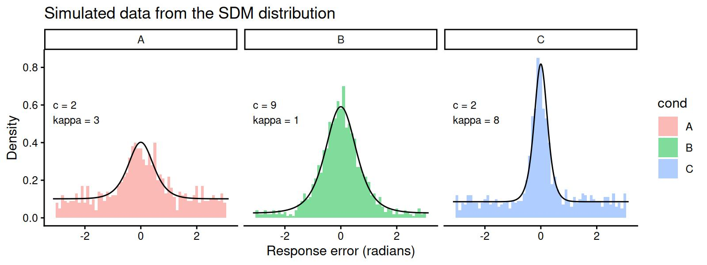
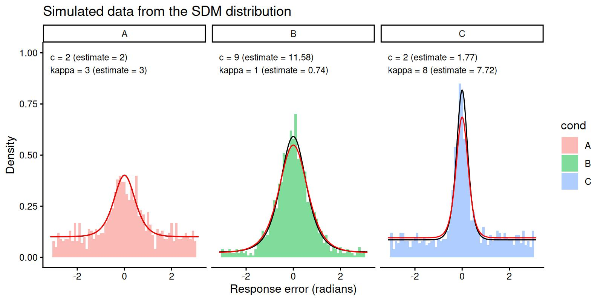

# The Signal Discrimination Model (SDM)

## 1 Introduction to the model

The Signal Discrimination Model is a measurement model for continuous
reproduction tasks in the visual working memory domain. The model was
originally introduced by Oberauer (2023). As other measurement models
for continuous reproduction tasks, its goal is to model the distribution
of angular response errors.

The model assumes that when a test probe appears, all possible responses
on the circle (\\\theta\\) are activated with a strength that depends on
the distance between the feature stored in memory (\\\mu\\) and the
response options. Formally, this is given by the following activation
function:

\\ S(\theta) = c \cdot \frac{\exp(\kappa \cdot \cos(\theta-\mu))}{2\pi
I_0(\kappa)} \\

where \\c\\ is the memory strength parameter, \\\kappa\\ is the
precision parameter, and \\I_0\\ is the modified Bessel function of the
first kind of order 0. Thus, the activation function follows a von Mises
distribution, weigthed by a memory strength parameter.

The activation of response options is corrupted by noise, which is
assumed to follow a Gumbel distribution. Then the response is the option
with the highest activation value:

\\ Pr(\theta) = argmax(S(\theta) + \epsilon) \\ \epsilon \sim
Gumbel(0,1) \\ This is equivalent to the following softmax function
(also known as the exponentiated Luce’s choice rule):

\\ Pr(\theta) = \frac{\exp(S(\theta)}{\sum\_{i=1}^{n} \exp(S(\theta_i))}
\\

where n is the number of response options, most often 360 in typical
visual working memory experiments.

In summary, the model assumes that response errors come from the
following distribution, where \\\mu = 0\\:

\\ \Large{f(\theta\\ \|\\ \mu,c,\kappa) = \frac{e^ {c \\ \frac{e^{k\\
cos(\theta-\mu)}}{2\pi I_o(k)}}}{Z}} \\

and Z is the normalizing constant to ensure that the probability mass
sums to 1.

## 2 Parametrization in the `bmm` package

In the `bmm` package we use a different parametrization. The
parametrization is chosen for numerical stability and efficiency. Three
features of the parametrization above make it difficult to work with in
practice. First, the modified bessel function \\I_0\\ increases rapidly,
often leading to numerical overflow. Second, the bessel function is
expensive to compute, and estimating this model with MCMC methods can be
slow. Third, the normalizing constant in the denominator requires
summing 360 terms, which is also slow.

To address these issues, we use the following parametrization of the SDM
distribution:

\\ \Large{f(\theta\\ \|\\ \mu,c,\kappa) = \frac{ e^{c \\
\sqrt{\frac{k}{2\pi}} e^{k \\ (cos(\theta-\mu)-1)}} }{Z}} \\

This parametrization is derived from the known approximation of the
modified bessel function for large \\k\\ (Abramowitz et al. (1988)):

\\ I_0(\kappa) \sim ~ \frac{e^{\kappa}}{\sqrt{2\pi \kappa}}, \\ \\ \\ \\
\kappa \rightarrow \infty \\

If needed, the \\c\\ parameter of the original formulation by Oberauer
(2023) can be computed by:

\\ c\_{oberauer} = c\_{bmm} \\ e^{-\kappa} I_0(\kappa)\sqrt{2 \pi
\kappa} \\

This parametrization does not change the predicted shape of the
distribution, but it produces slightly different values of \\c\\ for
small values of \\kappa\\. The parametrization is the default in the
`bmm` package.

A second optimization concerns the calculation of the normalizing
constant \\Z\\. The original model assumed that responses can only be
one of 360 discrete values, resulting in a probability mass function. In
`bmm` we treat the response variable as continuous, which makes
\\f(\theta)\\ a probability density function. This means that we can
calculate the normalizing constant \\Z\\ by integrating \\f(\theta)\\
over the entire circle:

\\ Z = \int\_{-\pi}^{\pi} f(\theta) d\theta \\

This integral cannot be expressed in closed form, but it can be
approximated using numerical integration methods. The results between
the discrete and continuous formulations are nearly identical, for large
number of response options (as in typical applications), but not when
the number of response options is small, for example in 4-AFC tasks.

## 3 Fitting the model with `bmm`

Begin by loading the `bmm` package:

``` r

library(bmm)
```

### 3.1 Generating simulated data

If you already have data you want to fit, you can skip this section. For
the current illustration, we will generate some simulated data with
known parameters. `bmm` provides density functions in typical R style,
with the prefix `d` for density (`dsdm`), `p` for the cumulative
distribution function (`psdm`), `q` for the quantile function (`qsdm`),
and (`rsdm`) for generating random deviates. Here’s how to simulate data
from the SDM distribution for three conditions:

``` r

# set seed for reproducibility
set.seed(123)

# define parameters:
cs <- c(2, 9, 2)
kappas <- c(3, 1, 8)

# simulate data from the model
y <- c(rsdm(n = 1000, mu=0, c = cs[1], kappa = kappas[1], parametrization = "sqrtexp"),
       rsdm(n = 1000, mu=0, c = cs[2], kappa = kappas[2], parametrization = "sqrtexp"),
       rsdm(n = 1000, mu=0, c = cs[3], kappa = kappas[3], parametrization = "sqrtexp"))
dat <- data.frame(y = y, cond = factor(rep(c('A','B','C'), each=1000)))
```

This gives us the following distribution of response errors, with lines
overlaying the predicted density generated with `dsdm`:

``` r

# generate predicted SDM density:
dd <- data.frame(y = rep(seq(-pi, pi, length.out=1000),3),
                 cond = factor(rep(c('A','B','C'), each=1000)),
                 c = rep(cs, each=1000),
                 kappa = rep(kappas, each=1000))
dd$d <- dsdm(dd$y, mu = 0, c = dd$c, kappa = dd$kappa, parametrization = "sqrtexp")

# prepare labels for plots
par_labels <- data.frame(cond = c('A','B','C'),
                         c = c(2, 9, 2),
                         kappa = c(3, 1, 8))
par_labels$label <- paste0('c = ', par_labels$c, '\nkappa = ', par_labels$kappa)

# plot the data and the predicted density
library(ggplot2)
ggplot(dat, aes(x=y, fill=cond)) +
  geom_histogram(aes(y=..density..), binwidth = 0.1, position = "identity", alpha = 0.5) +
  theme_classic() +
  facet_wrap(~cond) +
  geom_line(data=dd, fun=dsdm, aes(y, d)) +
  scale_x_continuous(limits = c(-pi, pi)) +
  labs(title = "Simulated data from the SDM distribution",
       x = "Response error (radians)",
       y = "Density") +
  geom_text(data=par_labels, aes(x = -pi, y = 0.5, label = label), 
            hjust = 0, vjust = 0, size = 3)
```



### 3.2 Estimating the model with `bmm`

To estimate the parameters of the SDM distribution, we can use the
[`bmm()`](https://venpopov.com/bmm/dev/reference/bmm.md) function.
First, let’s specify the model formula. We want `c` and `kappa` to vary
over conditions. The first two lines of the formula specify how the
parameters vary over conditions. In this case, we want them to vary over
the `cond` variable, so we use `c ~ 0 + cond` and `kappa ~ 0 + cond`:

``` r

ff <- bmf(c ~ 0 + cond, kappa ~ 0 + cond)
```

Then we specify the model, which in this case is just
[`sdmSimple()`](https://venpopov.com/bmm/dev/reference/sdm.md), and we
provide the name of the response error variable in the dataset:

``` r

model <- sdm(resp_error = "y")
```

Finally, we can fit the model. We strongly recommend using `cmdstanr` as
a backend for fitting the SDM model, as it is much faster and more
stable than the default `rstan` backend for this particular model.
Here’s how to fit the model with `cmdstanr`:

``` r

fit <- bmm(
  formula = ff,
  data = dat,
  model = model,
  cores = 4,
  init = 0.5,
  backend = 'cmdstanr',
  file = "assets/bmmfit_sdm_vignette.rds"
)
```

The model takes about 30 seconds to fit after it is compiled.

We can now inspect the results of the model fit:

``` r
summary(fit)
Loading required namespace: rstan
```

``` fansi
  Model: sdm(resp_error = "y") 
  Links: mu = tan_half; c = log; kappa = log 
Formula: mu = 0
         c ~ 0 + cond
         kappa ~ 0 + cond 
   Data: dat (Number of observations: 3000)
  Draws: 4 chains, each with iter = 2000; warmup = 1000; thin = 1;
         total post-warmup draws = 4000

Regression Coefficients:
            Estimate Est.Error l-95% CI u-95% CI Rhat Bulk_ESS Tail_ESS
c_condA         0.69      0.11     0.49     0.90 1.00     2049     1910
c_condB         2.45      0.21     2.09     2.93 1.00     1870     1957
c_condC         0.57      0.07     0.44     0.71 1.00     2142     2109
kappa_condA     1.10      0.17     0.76     1.43 1.00     2150     2032
kappa_condB    -0.30      0.20    -0.73     0.05 1.00     1859     2018
kappa_condC     2.04      0.12     1.79     2.28 1.00     2188     2110

Constant Parameters:
                 Value
mu_Intercept      0.00

Draws were sampled using sample(hmc). For each parameter, Bulk_ESS
and Tail_ESS are effective sample size measures, and Rhat is the potential
scale reduction factor on split chains (at convergence, Rhat = 1).
```

We see that all Rhat values are less than 1.01, which is a good sign
that the chains have converged. In principle you have to do more
inspection, but let us see the estimated parameters. The model uses a
log-link function for the `c` and `kappa` parameters, so we have to
exponentiate the coefficients to get the estimated parameters:

``` r

exp(brms::fixef(fit)[2:7,1])
#>     c_condA     c_condB     c_condC kappa_condA kappa_condB kappa_condC 
#>   1.9954823  11.5761748   1.7743522   2.9970034   0.7443611   7.7180565
```

which are close to the true values we used to simulate the data:

``` r

par_labels[,1:3]
#>   cond c kappa
#> 1    A 2     3
#> 2    B 9     1
#> 3    C 2     8
```

We can see that even though the estimated parameters are close, they are
not exactly the same as the true parameters. To get a better picture, we
can plot the estimated posterior distributions of the parameters:

``` r

library(tidybayes)
library(dplyr)
library(tidyr)

# extract the posterior draws
draws <- tidybayes::tidy_draws(fit)
draws <- select(draws, b_c_condA:b_kappa_condC)

# plot posterior with original parameters overlayed as diamonds
as.data.frame(draws) |> 
  gather(par, value) |> 
  mutate(value = exp(value)) |> 
  ggplot(aes(value, par)) +
  tidybayes::stat_halfeyeh(normalize = "groups") +
  geom_point(data = data.frame(par = c('b_c_condA', 'b_c_condB', 'b_c_condC',
                                       'b_kappa_condA', 'b_kappa_condB', 'b_kappa_condC'),
                               value = c(cs, kappas)),
             aes(value, par), color = "red",
             shape = "diamond", size = 2.5) +
  scale_x_continuous(lim = c(0, 20))
```


The true parameters all lie within the 50% credible intervals, which is
a good sign that the model is able to recover the true parameters from
the data.

As a final step, we can plot our data again, adding another line overlay
with the density predicted by the estimated parameters:

``` r

# generate predicted SDM density:
ddest <- data.frame(
  y = rep(seq(-pi, pi, length.out = 1000), 3),
  cond = factor(rep(c("A", "B", "C"), each = 1000)),
  c = rep(exp(brms::fixef(fit)[2:4, 1]), each = 1000),
  kappa = rep(exp(brms::fixef(fit)[5:7, 1]), each = 1000)
)

# prepare labels for plots
par_labels <- data.frame(
  cond = c("A", "B", "C"),
  c_est = exp(brms::fixef(fit)[2:4, 1]),
  kappa_est = exp(brms::fixef(fit)[5:7, 1]),
  c = c(2, 9, 2),
  kappa = c(3, 1, 8)
)
par_labels$label <- paste0(
  "c = ", par_labels$c, " (estimate = ", round(par_labels$c_est, 2), ")\n",
  "kappa = ", par_labels$kappa, " (estimate = ", round(par_labels$kappa_est, 2), ")"
)

ddest$d <- dsdm(ddest$y, mu = 0, c = ddest$c, kappa = ddest$kappa, parametrization = "sqrtexp")

# plot the data and the predicted density
ggplot(dat, aes(x = y, fill = cond)) +
  geom_histogram(aes(y = ..density..), binwidth = 0.1, position = "identity", alpha = 0.5) +
  theme_classic() +
  facet_wrap(~cond) +
  geom_line(data = dd, fun = dsdm, aes(y, d), color = "black") +
  geom_line(data = ddest, fun = dsdm, aes(y, d), color = "red") +
  scale_x_continuous(limits = c(-pi, pi)) +
  labs(
    title = "Simulated data from the SDM distribution",
    x = "Response error (radians)",
    y = "Density"
  ) +
  geom_text(data = par_labels, aes(x = -pi, y = 0.9, label = label), 
            hjust = 0, vjust = 0, size = 3) +
  scale_y_continuous(limits = c(0, 1))
```



The histograms represent the data, the black lines represent the
predicted density from the true parameters, and the red lines represent
the predicted density from the estimated parameters. We can see that the
estimated parameters are able to capture the main features of the data.

## References

Abramowitz, Milton, Irene A Stegun, and Robert H Romer. 1988. *Handbook
of Mathematical Functions with Formulas, Graphs, and Mathematical
Tables*. American Association of Physics Teachers.

Oberauer, Klaus. 2023. “Measurement Models for Visual Working Memory—a
Factorial Model Comparison.” *Psychological Review* (US) 130 (3):
841–52. <https://doi.org/10.1037/rev0000328>.
