# Signal Detection Theory models

``` r

library(bmm)
library(ggplot2)
```

## 1 Signal detection theory in bmm

Signal detection theory (SDT) separates an observer’s *sensitivity* —
how well two classes of stimuli (signal vs. noise, old vs. new) can be
told apart — from their *response bias* — where they place the decision
criterion (Green and Swets 1966; DeCarlo 1998). `bmm` ships four SDT
measurement models, one per response format. Each is a self-contained
model with its own data requirements; they are not modes of a single
function.

| Constructor | Response format | Key parameters | ROC defined? |
|----|----|----|----|
| [`sdt_yn()`](https://popov-lab.github.io/bmm/dev/reference/sdt_yn.md) | counts of “signal”/“old” responses | `d`, `criterion`, `sdratio` | yes |
| [`sdt_rating()`](https://popov-lab.github.io/bmm/dev/reference/sdt_rating.md) | counts per confidence-rating category | `d`, `criterion`, threshold params, `sdratio` | yes |
| [`sdt_mafc()`](https://popov-lab.github.io/bmm/dev/reference/sdt_mafc.md) | counts of correct m-AFC responses | `d` | no |
| [`sdt_ranking()`](https://popov-lab.github.io/bmm/dev/reference/sdt_ranking.md) | counts per rank position | `d`, `sdratio` (`dist = "normal"` only) | no |

All four assume a latent evidence variable whose noise distribution is
selected with the `dist` argument: `"normal"` (Gaussian SDT),
`"logistic"`, `"gumbel_min"` (extreme-value SDT), or `"gumbel_max"`.

Two of the models —
[`sdt_yn()`](https://popov-lab.github.io/bmm/dev/reference/sdt_yn.md)
and
[`sdt_rating()`](https://popov-lab.github.io/bmm/dev/reference/sdt_rating.md)
— have an explicit response criterion, so a **receiver operating
characteristic (ROC)** curve and its **area under the curve (AUC)** are
defined. The m-AFC and ranking models have no criterion: accuracy
already integrates over the decision rule, so
[`roc_sdt()`](https://popov-lab.github.io/bmm/dev/reference/roc_sdt.md)
and
[`auc_sdt()`](https://popov-lab.github.io/bmm/dev/reference/auc_sdt.md)
deliberately error for them. The latent decision-variable distributions
([`latent_sdt()`](https://popov-lab.github.io/bmm/dev/reference/latent_sdt.md))
and posterior predictive checks
([`pp_check()`](https://popov-lab.github.io/bmm/dev/reference/pp_check.bmmfit.md))
are available for all four — for the criterion-free models the latent
plot simply shows the noise and signal densities without a boundary
line.

This article walks through fitting each model and then through the
post-processing toolkit:
[`roc_sdt()`](https://popov-lab.github.io/bmm/dev/reference/roc_sdt.md),
[`roc_observed()`](https://popov-lab.github.io/bmm/dev/reference/roc_observed.md),
[`auc_sdt()`](https://popov-lab.github.io/bmm/dev/reference/auc_sdt.md),
[`latent_sdt()`](https://popov-lab.github.io/bmm/dev/reference/latent_sdt.md),
[`sdt_thresholds()`](https://popov-lab.github.io/bmm/dev/reference/sdt_thresholds.md),
[`sdt_sensitivity()`](https://popov-lab.github.io/bmm/dev/reference/sdt_sensitivity.md),
the [`plot()`](https://rdrr.io/r/graphics/plot.default.html) methods
(including the quantile-transformed ROC via `scale = "quantile"`), and
[`pp_check()`](https://popov-lab.github.io/bmm/dev/reference/pp_check.bmmfit.md).

### 1.1 The bmm workflow for SDT models

Fitting any of the four models follows the same recipe as every `bmm`
model; only the ingredients are SDT-specific.

1.  **Aggregate the data.** All four models consume *pre-aggregated
    counts*, not trial-level responses: one row per design cell (for
    example per subject and stimulus type), with the counts in the
    columns the constructor names. If your data hold one row per trial,
    aggregate them first (e.g. with
    [`dplyr::count()`](https://dplyr.tidyverse.org/reference/count.html)
    or [`stats::aggregate()`](https://rdrr.io/r/stats/aggregate.html));
    the Rating SDT section below shows a real reshaping example.
2.  **Create the model object.** The constructor maps your column names
    onto the model’s response format — for example
    `sdt_yn(response = "n_old", stimulus = "stimulus", n_trials = "n_trials")`
    — and selects the noise distribution via `dist`. Printing the model
    object lists its parameters and data requirements.
3.  **Specify the formula and fit.**
    [`bmf()`](https://popov-lab.github.io/bmm/dev/reference/bmmformula.md)
    takes one regression formula per model parameter, each with full
    `brms` syntax: predictors for design effects and random effects such
    as `(1 | id)` for hierarchical estimation. Parameters you leave out
    of the formula are held fixed at their default — this is how
    `sdratio` stays at 0 (equal variance) until you add `sdratio ~ 1`.
    [`bmm()`](https://popov-lab.github.io/bmm/dev/reference/bmm.md) then
    compiles and samples the model through `brms`/Stan, and all `brms`
    arguments (`cores`, `iter`, `prior`, `file`, …) pass through.
4.  **Post-process.** The fitted object is a `brmsfit`, so the general
    `brms` toolkit applies
    ([`summary()`](https://rdrr.io/r/base/summary.html), `hypothesis()`,
    [`brms::fixef()`](https://rdrr.io/pkg/nlme/man/fixed.effects.html),
    …). The SDT-specific extractors add the signal-detection views: ROC
    curves, AUC, latent distributions, and threshold locations.

Every example below follows these four steps.

## 2 SDT in brief

All SDT models share one idea. On each trial the observer obtains a
noisy sample of *evidence* from a latent variable \\X\\. Noise items and
signal items generate evidence from two distributions that overlap; the
observer cannot see which distribution a sample came from, only its
value. For the Gaussian (`"normal"`) model the two distributions are

\\ X \mid \text{noise} \sim \mathrm{Normal}(0,\\ 1), \qquad X \mid
\text{signal} \sim \mathrm{Normal}(\delta,\\ s^2), \\

where \\\delta\\ is the mean separation and \\s\\ is the signal-to-noise
SD ratio (the `sdratio` parameter, fixed to \\s = 1\\ unless estimated).
In a binary task the observer responds “signal” whenever the evidence
exceeds a **criterion** \\k\\. The two response probabilities are then
tail areas of the two distributions:

\\ \text{FA} = P(X \> k \mid \text{noise}) = 1 - \Phi(k), \qquad
\text{Hit} = P(X \> k \mid \text{signal}) = 1 - \Phi\\\left(\tfrac{k -
\delta}{s}\right). \\

**Sensitivity** is that separation expressed in standard-deviation
units. With equal variances (\\s = 1\\, the default in every bmm SDT
model) there is only one SD to divide by, and the separation is the
familiar \\d' = \delta\\. That is the `d` parameter in every formula
below, and nothing else in this section changes it.

Once \\s\\ is estimated the two distributions have *different* SDs, so
which one is the yardstick has to be stated. bmm then reports

\\ d_a = \frac{\delta}{\sqrt{(1 + s^2)/2}}, \\

the separation in units of the root-mean-square of the two SDs, which
weights noise and signal equally. Dividing by the noise SD instead gives
\\d_N = \delta\\ (the \\d'\\ of most unequal-variance analyses) and by
the signal SD gives \\d_S\\;
[`sdt_sensitivity()`](https://popov-lab.github.io/bmm/dev/reference/sdt_sensitivity.md)
returns all three from a fitted model, and
[`summary()`](https://rdrr.io/r/base/summary.html) adds a note whenever
`d` is \\d_a\\. \\d_a\\ is the default because it is the only one that
remains comparable across conditions whose \\s\\ differs (Simpson and
Fitter 1973; Macmillan and Creelman 2005). The Binary SDT section below
shows how far the indices lie apart on real data.

bmm places the two distributions symmetrically, at \\-\delta/2\\ and
\\+\delta/2\\, and its `criterion` parameter is the boundary measured
from their midpoint, \\k - \delta/2\\ in the notation above. The
criterion is in noise-SD units whether or not \\s\\ is estimated.


Figure 2.1: Latent evidence model. Noise and signal distributions
overlap; responses above the criterion are labelled as signal. The
shaded right tails are the false-alarm rate (noise) and the hit rate
(signal); their separation is the sensitivity d-prime.

Sweeping the criterion from strict to lenient traces every (false-alarm,
hit) pair the observer could produce — the **receiver operating
characteristic (ROC)**. When the two distributions have equal variance
(\\s = 1\\) the ROC is symmetric about the minor diagonal; when the
signal distribution is wider (\\s \> 1\\, as is typical for recognition
memory) the ROC becomes asymmetric. This is why a single (hit,
false-alarm) point cannot identify \\s\\: separating \\d'\\ from \\s\\
requires *several* operating points along the curve.


Figure 2.2: ROC geometry. Equal-variance models give a symmetric curve;
unequal variance (wider signal distribution) bends it asymmetrically.
The dashed line is chance (d’ = 0).

The four response formats below reuse this latent model and differ only
in the decision rule mapped onto it. The `dist` argument selects the
*shape* of the latent distributions; Gaussian is the safe default, but
it is not the only option. The next section explains the alternatives
and when a non-Gaussian shape is worth choosing.

## 3 Noise distributions

The Gaussian assumption in the model above is a modelling choice, not
part of SDT itself. Because the model never observes the latent samples
— only the two response probabilities — the shape of the noise
distribution is exactly what fixes the shape of the ROC. `bmm` exposes
that choice through the `dist` argument, shared by all four
constructors: `"normal"`, `"logistic"`, `"gumbel_min"`, and
`"gumbel_max"`.

### 3.1 Why the shape matters

Although the Gaussian model is by far the most common, signal detection
theory is not committed to it. The framework needs only two overlapping
evidence distributions and a criterion; the *shape* of those
distributions is a separate, substantive assumption. The Gaussian became
the default for historical and mathematical reasons — Fechner’s and
Thurstone’s psychophysics, and the pull of the central limit theorem —
and Green and Swets (1966) adopted it on frankly pragmatic grounds
(tractable mathematics) while conceding that other distributions would
serve just as well (Meyer-Grant et al. 2026).

The choice is not cosmetic, because the shape of the distribution
controls the shape of the ROC. Empirical recognition ROCs are almost
always *asymmetric*: read off the z-axes, the operating points fall on a
straight line with a slope below 1 (typically around 0.8), so the curve
is pulled toward the upper-left rather than being symmetric about the
minor diagonal (DeCarlo 1998). A model has to manufacture that asymmetry
somehow, and there are two routes.

The first keeps the Gaussian distribution and spends a parameter on it:
let the signal distribution be *wider* than the noise distribution (\\s
\> 1\\, the `sdratio` parameter). This is the unequal-variance Gaussian
model fitted in the Binary SDT section below, and its zROC slope is
exactly \\1/s\\.

The second changes the *distribution* instead of adding a parameter. If
the latent evidence follows an extreme-value (Gumbel) distribution
rather than a Gaussian, the ROC comes out asymmetric *intrinsically* —
with equal variance and one fewer parameter. This is the extreme-value
signal detection (EVSDT) model (Meyer-Grant et al. 2026), and it is why
[`sdt_ranking()`](https://popov-lab.github.io/bmm/dev/reference/sdt_ranking.md)
defaults to `"gumbel_min"`.

These two routes are easy to conflate, but ROC asymmetry and the
variance ratio are in fact *logically independent*: a skewed
equal-variance distribution can produce an asymmetric ROC, and unequal
variances can produce a symmetric one (Meyer-Grant et al. 2026). Nor are
the routes equally clean. The unequal-variance Gaussian buys the
asymmetry at a conceptual cost: the extra variance it posits implies
that some study events *lower* an item’s familiarity, its likelihood
ratio is non-monotonic (so it can predict below-chance hit rates at
extreme criteria), and the simple \\d'\\ must give way to \\d_a\\, which
no longer guarantees that a larger value means a uniformly higher ROC
(Meyer-Grant et al. 2026). The extreme-value route sidesteps all three.

### 3.2 Where the distributions come from

The deeper reason to care about the noise distribution is that it
encodes an assumption about *how* an observer turns many noisy sensory
or memory signals into a single decision variable. Two aggregation rules
lead to two limiting shapes. If the evidence for an item is the *sum* or
*average* of many small contributions, the central limit theorem drives
the decision variable toward a Gaussian. If instead it is the *most
extreme* contribution — the single strongest match, or the most glaring
mismatch — the extreme-value theorem drives it toward a Gumbel
distribution, in the same way and for the same mathematical reasons
(Meyer-Grant et al. 2026; Robinson et al. 2023). Pooling gives the bell
curve; a max (or min) rule gives the skew.

The parallel is exact: a signal-detection model with extreme-value noise
and a maximum decision rule is *formally equivalent* to the softmax
(normalized exponential) choice rule — that is, to Luce’s choice axiom
(Yellott 1977; Robinson et al. 2023). Choosing the noise distribution is
therefore also choosing a theory of choice, and the link is visible in
`bmm`: the m-AFC and ranking models decide by comparing the maximum (or
the rank order) of evidence across the `m` alternatives, so an
extreme-value distribution is their natural home —
[`sdt_ranking()`](https://popov-lab.github.io/bmm/dev/reference/sdt_ranking.md)
defaults to `"gumbel_min"` for exactly this reason.

Whether human evidence is better described as pooled or as maximised is
an empirical question, and the answer can depend on the task. In
recognition memory the extreme-value model is principled and
parsimonious, and can be grounded in a behavioural invariance axiom
rather than in distributional convenience (Meyer-Grant et al. 2026). In
visual working memory, by contrast, the Gaussian (pooling) account
reproduces a *stable* sensitivity across changes in the number of
alternatives, whereas the softmax (max-rule) account does not —
favouring pooling in that domain (Robinson et al. 2023). `bmm` keeps the
distribution switchable so the data can answer this question.

Statistically, the choice of distribution is the choice of a *link
function*. Written as a generalized linear model, SDT pairs the probit
link with the Gaussian model, the logit link with the logistic, and
complementary-log-log links with the extreme-value models (DeCarlo 1998)
— the same correspondence `bmm` exposes through `dist`.

### 3.3 The four options

| `dist` | Latent shape | Equal-variance ROC | Typical motivation |
|----|----|----|----|
| `"normal"` | symmetric (Gaussian) | symmetric, slope 1 | textbook default; pooling rule; comparability with the SDT literature |
| `"logistic"` | symmetric, heavier tails | very nearly symmetric | logit-link convenience; ≈ normal in criterion tasks |
| `"gumbel_min"` | skewed | asymmetric, slope \< 1 | extreme-value / EVSDT; max-rule decisions |
| `"gumbel_max"` | mirror of `"gumbel_min"` | asymmetric, slope \> 1 | completeness; opposite asymmetry, disfavoured for recognition |

Only two of these are live theoretical choices. `"normal"` and
`"gumbel_min"` are the SDT instantiations of the two aggregation rules
above — pooling and the max rule — and they are the *only* distributions
[`sdt_ranking()`](https://popov-lab.github.io/bmm/dev/reference/sdt_ranking.md)
offers, the model where the choice bites hardest. The other two are best
read as completeness options. `"logistic"` is so close to `"normal"`
once both are rescaled that the two are nearly indistinguishable in the
criterion-based models (its honest role is the logit link for users
coming from logistic regression, not a separate theory of evidence).
`"gumbel_max"` is the extreme-value family pointed the other way: it
predicts the *opposite* (slope \> 1) asymmetry that recognition data
rarely show, and the choice rule it entails has been found empirically
inadequate (Meyer-Grant et al. 2026; Robinson et al. 2023). It is kept
for the rare opposite-asymmetry case and for non-recognition tasks, not
as a co-equal recognition model.

All four distributions enter the model in their standard form, with
scale 1. For the normal that scale is the SD, so `d` and `criterion` are
in noise-SD units. The standard logistic and Gumbel distributions have
SDs of \\\pi/\sqrt{3}\\ and \\\pi/\sqrt{6}\\, so under these
distributions `d` and `criterion` are in noise-scale units instead. The
package output labels this unit “noise SD” for all four.

### 3.4 How the distribution shapes the ROC

Under the extreme-value model the signal and noise distributions are
*skewed* rather than symmetric (Figure [3.1](#fig:noise-dist-latent)).
Sweeping a criterion across that skewed pair traces an asymmetric ROC —
the same bend that unequal variance produces, but built into the
distribution.


Figure 3.1: Latent evidence under the extreme-value (gumbel_min) model.
Unlike the symmetric Gaussian distributions in the previous figure, both
distributions are skewed (a long left tail). Sweeping the criterion over
this skewed pair is what makes the ROC asymmetric, with no
unequal-variance parameter.

The consequence for the ROC is direct. An equal-variance Gaussian gives
a symmetric curve; an equal-variance `gumbel_min` gives an asymmetric
one that lands almost on top of an unequal-variance Gaussian (Figure
[3.2](#fig:noise-dist-roc)). The same asymmetry, bought with the
distribution rather than with an extra parameter.


Figure 3.2: Model-implied ROCs at d’ = 1.6. The equal-variance Gaussian
curve is symmetric; the equal-variance gumbel_min curve is asymmetric
and nearly coincides with an unequal-variance Gaussian (s = 1.45).
Hit(FA) = F((d’ + F^-1(FA)) / s), matching bmm’s roc_sdt().

### 3.5 Worked example: extreme value vs Gaussian

The cleanest test holds everything fixed *except* the distribution. We
fit the base-rate recognition data introduced in the next section
(`broeder_schuetz_2009_e3`) twice, with the same equal-variance formula,
changing only `dist`. Neither model estimates `sdratio`, so they have an
identical number of parameters — any difference in ROC shape is the
distribution’s doing.

``` r

ev_formula <- bmf(d ~ 1 + (1 | id), criterion ~ 0 + condition + (1 | id))

fit_normal <- bmm(
  formula = ev_formula,
  data    = broeder_schuetz_2009_e3,
  model   = sdt_yn(response = "n_old", stimulus = "stimulus",
                   n_trials = "n_trials", dist = "normal"),
  backend = "cmdstanr", cores = 4, refresh = 0, silent = 2,
  file = "assets/bmmfit_sdt_noise_normal_vignette"
)

fit_gumbel <- bmm(
  formula = ev_formula,
  data    = broeder_schuetz_2009_e3,
  model   = sdt_yn(response = "n_old", stimulus = "stimulus",
                   n_trials = "n_trials", dist = "gumbel_min"),
  backend = "cmdstanr", cores = 4, refresh = 0, silent = 2,
  file = "assets/bmmfit_sdt_noise_gumbel_vignette"
)
```

The post-processing helpers
([`roc_sdt()`](https://popov-lab.github.io/bmm/dev/reference/roc_sdt.md),
[`roc_observed()`](https://popov-lab.github.io/bmm/dev/reference/roc_observed.md),
[`auc_sdt()`](https://popov-lab.github.io/bmm/dev/reference/auc_sdt.md),
detailed in the Binary SDT section) overlay each model-implied ROC on
the observed operating points.

``` r

plot(roc_sdt(fit_normal), observed = roc_observed(fit_normal))
plot(roc_sdt(fit_gumbel), observed = roc_observed(fit_gumbel))
```


Figure 3.3: Equal-variance fits to the base-rate recognition data. Left:
Gaussian noise forces a symmetric ROC that misses the operating points.
Right: gumbel_min reproduces the asymmetric curve through the same
points, with no sdratio parameter.

The equal-variance Gaussian is locked to a symmetric curve and
systematically misses the operating points; the equal-variance
`gumbel_min` bends to follow them. On z-transformed axes its
model-implied operating points fall along a line with slope 0.59, below
one: the extreme-value model produces the asymmetry that the Gaussian
produces only by widening the signal distribution (the
quantile-transformed ROC section below sets this slope beside the
unequal-variance Gaussian fit). The two AUCs are similar (overall
sensitivity is recovered either way); the distribution shows up in the
*shape* of the curve, not its area.

``` r

attr(auc_sdt(fit_normal), "summary")
#>   AUC_mean AUC_lower AUC_upper
#> 1 0.860819 0.8288508 0.8894475
attr(auc_sdt(fit_gumbel), "summary")
#>   AUC_mean AUC_lower AUC_upper
#> 1  0.85062  0.822559 0.8754817
```

### 3.6 Choosing a noise distribution in practice

`"normal"` is the safe default and keeps results comparable with the
bulk of the SDT literature. Reach for `"gumbel_min"` when the ROC is
asymmetric or when theory motivates a max-rule process; it is the
natural choice for ranking and forced-choice tasks, and an
equal-variance extreme-value model is often a more parsimonious account
of recognition asymmetry than an unequal-variance Gaussian. `"logistic"`
is mostly a numerical convenience, and `"gumbel_max"` covers the rare
opposite asymmetry. As always, let the data arbitrate: compare
candidates with the observed-versus-model ROC overlap and AUC shown
above, with
[`pp_check()`](https://popov-lab.github.io/bmm/dev/reference/pp_check.bmmfit.md),
or with `loo()` for a formal information criterion.

One caution on that comparison: the Gaussian model is the more
*flexible* of the two — flexible enough to mimic extreme-value data
closely, to the point that in simulations it wins on a clear majority of
datasets that an extreme-value model actually generated (Meyer-Grant et
al. 2026). A better Gaussian fit is therefore weak evidence on its own.
The distributions are best told apart not by raw fit but by parsimony,
by whether their parameters stay invariant when the design changes (for
example across set sizes or numbers of alternatives) (Robinson et al.
2023), and by whether the implied decision process is plausible for the
task at hand.

## 4 Binary SDT

In a binary old/new recognition task each cell of the design contributes
a count of “old” responses out of a number of trials, separately for old
(`signal`) and new (`noise`) items. The latent decision variable places
“old” responses above a criterion; sensitivity `d` is the distance
between the signal and noise distributions and `criterion` is the
location of the boundary.

### 4.1 A single condition: equal-variance SDT

We simulate one condition with
[`rsdt_yn()`](https://popov-lab.github.io/bmm/dev/reference/sdt_yn_dist.md)
and fit an equal-variance model.

``` r

set.seed(123)
dat <- expand.grid(id = 1:30, stimulus = c(0L, 1L))
dat$n_trials <- 100L
dat$n_old <- rsdt_yn(nrow(dat), dat$n_trials, dat$stimulus,
                     d = 1.5, criterion = 0.2)

model <- sdt_yn(response = "n_old", stimulus = "stimulus",
                n_trials = "n_trials")

fit_ev <- bmm(
  formula = bmf(d ~ 1 + (1 | id), criterion ~ 1 + (1 | id)),
  data = dat,
  model = model,
  backend = "cmdstanr",
  cores = 4,
  refresh = 0,
  silent = 2,
  file = "assets/bmmfit_sdt_yn_ev_vignette"
)
summary(fit_ev)
```

``` fansi
#>   Model: sdt_yn(response = "n_old",
#>                 stimulus = "stimulus",
#>                 n_trials = "n_trials") 
#>   Links: d = identity; criterion = identity; sdratio = log 
#> Formula: d ~ 1 + (1 | id)
#>          criterion ~ 1 + (1 | id)
#>          sdratio = 0 
#>    Data: dat (Number of observations: 60)
#>   Draws: 4 chains, each with iter = 2000; warmup = 1000; thin = 1;
#>          total post-warmup draws = 4000
#> 
#> Multilevel Hyperparameters:
#> ~id (Number of levels: 30) 
#>                         Estimate Est.Error l-95% CI u-95% CI Rhat Bulk_ESS
#> sd(d_Intercept)             0.05      0.04     0.00     0.14 1.01     1747
#> sd(criterion_Intercept)     0.04      0.03     0.00     0.10 1.00     1144
#>                         Tail_ESS
#> sd(d_Intercept)             1504
#> sd(criterion_Intercept)     1555
#> 
#> Regression Coefficients:
#>                     Estimate Est.Error l-95% CI u-95% CI Rhat Bulk_ESS Tail_ESS
#> d_Intercept             1.49      0.04     1.41     1.56 1.00     5525     2447
#> criterion_Intercept     0.17      0.02     0.13     0.21 1.00     3918     2902
#> 
#> Constant Parameters:
#>                       Value
#> sdratio_Intercept      0.00
#> 
#> Draws were sampled using sample(hmc). For each parameter, Bulk_ESS
#> and Tail_ESS are effective sample size measures, and Rhat is the potential
#> scale reduction factor on split chains (at convergence, Rhat = 1).
```

The population estimates recover the simulated `d = 1.5` and
`criterion = 0.2`.

By default `sdratio` is fixed to 0, i.e. the signal and noise
distributions have equal variance (`exp(0) = 1`) — it appears in the
model’s parameter list but got no formula, so it stays at its fixed
default (step 3 of the workflow recipe). With a single (hit,
false-alarm) pair per subject the signal/noise variance ratio is not
identified, so leaving it fixed is the right default here, and `d` in
this fit is \\d'\\ in the textbook sense.

### 4.2 Multiple criteria: identifying the unequal-variance ratio

When the criterion is shifted across conditions — for example by a
base-rate or payoff manipulation — while sensitivity is held constant,
the several (false-alarm, hit) points trace out a *curve* rather than a
single point. That curvature is what identifies the unequal-variance
ratio `sdratio` — the signal-to-noise SD ratio \\s\\, whose reciprocal
is the slope of the zROC (DeCarlo 1998). The bundled
`broeder_schuetz_2009_e3` data (Bröder and Schütz 2009) has exactly this
structure: 40 subjects tested under five base-rate conditions (`br1`
conservative … `br5` liberal).

``` r

model <- sdt_yn(response = "n_old", stimulus = "stimulus",
                n_trials = "n_trials")

fit_uv <- bmm(
  formula = bmf(
    d    ~ 1 + (1 | id),
    criterion ~ 0 + condition + (1 | id),
    sdratio   ~ 1
  ),
  data = broeder_schuetz_2009_e3,
  model = model,
  backend = "cmdstanr",
  cores = 4,
  iter = 4000,
  warmup = 1000,
  thin = 3,
  refresh = 0,
  silent = 2,
  file = "assets/bmmfit_sdt_yn_uv_vignette"
)
summary(fit_uv)
```

``` fansi
#>   Model: sdt_yn(response = "n_old",
#>                 stimulus = "stimulus",
#>                 n_trials = "n_trials") 
#>   Links: d = identity; criterion = identity; sdratio = log 
#> Formula: d ~ 1 + (1 | id)
#>          criterion ~ 0 + condition + (1 | id)
#>          sdratio ~ 1 
#>    Data: broeder_schuetz_2009_e3 (Number of observations: 400)
#>   Draws: 4 chains, each with iter = 4000; warmup = 1000; thin = 3;
#>          total post-warmup draws = 4000
#> 
#> Multilevel Hyperparameters:
#> ~id (Number of levels: 40) 
#>                         Estimate Est.Error l-95% CI u-95% CI Rhat Bulk_ESS
#> sd(d_Intercept)             0.58      0.08     0.45     0.75 1.00     1980
#> sd(criterion_Intercept)     0.17      0.03     0.12     0.23 1.00     3059
#>                         Tail_ESS
#> sd(d_Intercept)             3048
#> sd(criterion_Intercept)     3701
#> 
#> Regression Coefficients:
#>                        Estimate Est.Error l-95% CI u-95% CI Rhat Bulk_ESS
#> d_Intercept                1.49      0.10     1.29     1.68 1.00     1307
#> sdratio_Intercept          0.36      0.08     0.21     0.51 1.00     2494
#> criterion_conditionbr1     0.58      0.06     0.46     0.69 1.00     2675
#> criterion_conditionbr2     0.33      0.06     0.22     0.44 1.00     2506
#> criterion_conditionbr3    -0.06      0.06    -0.19     0.05 1.00     2464
#> criterion_conditionbr4    -0.45      0.07    -0.59    -0.32 1.00     2455
#> criterion_conditionbr5    -0.67      0.09    -0.85    -0.50 1.00     2590
#>                        Tail_ESS
#> d_Intercept                2298
#> sdratio_Intercept          3466
#> criterion_conditionbr1     3240
#> criterion_conditionbr2     3389
#> criterion_conditionbr3     3143
#> criterion_conditionbr4     3204
#> criterion_conditionbr5     3595
#> 
#> Note: sdratio is not fixed at 0, so d is d_a (root-mean-square SD units), not the noise-standardized d'.
#>       sdt_sensitivity() converts it to d' (noise SD) and d_S (signal SD).
#> 
#> Draws were sampled using sample(hmc). For each parameter, Bulk_ESS
#> and Tail_ESS are effective sample size measures, and Rhat is the potential
#> scale reduction factor on split chains (at convergence, Rhat = 1).
```

Here `d` and `sdratio` are shared across conditions while `criterion`
varies by `condition` — the five criteria are five operating points on a
single ROC. `sdratio` is estimated on the log scale, so exponentiate it
for the SD ratio on the natural scale:

``` r

exp(brms::fixef(fit_uv)["sdratio_Intercept", c("Estimate", "Q2.5", "Q97.5")])
#> Estimate     Q2.5    Q97.5 
#> 1.432103 1.231625 1.667237
```

A value above 1 means the signal distribution is wider than the noise
distribution, the classic recognition-memory pattern.

#### 4.2.1 Which sensitivity index?

Once `sdratio` is free, “the” distance between the two distributions
depends on which standard deviation you measure it in, and `d` is no
longer \\d'\\ but \\d_a\\, the separation divided by the
root-mean-square of the two SDs. The note below the coefficient table of
`summary(fit_uv)` says so. The alternatives are \\d_N\\ (divide by the
noise SD, the \\d'\\ that most unequal-variance analyses report) and
\\d_S\\ (divide by the signal SD).
[`sdt_sensitivity()`](https://popov-lab.github.io/bmm/dev/reference/sdt_sensitivity.md)
returns any of them, converting draw by draw so the intervals carry the
joint uncertainty in `d` and `sdratio`:

``` r

sens <- sdt_sensitivity(fit_uv)
sens
#> SDT sensitivity (sdt_yn, dist = normal)
#>   da = RMS-SD units (estimated) | dn = noise-SD units (d') | ds = signal-SD units
#>  measure mean lower upper condition
#>       da 1.49  1.29  1.68       br1
#>       da 1.49  1.29  1.68       br2
#>       da 1.49  1.29  1.68       br3
#>       da 1.49  1.29  1.68       br4
#>       da 1.49  1.29  1.68       br5
#>       dn 1.84  1.56  2.14       br1
#>       dn 1.84  1.56  2.14       br2
#>       dn 1.84  1.56  2.14       br3
#>       dn 1.84  1.56  2.14       br4
#>       dn 1.84  1.56  2.14       br5
#>       ds 1.28  1.10  1.46       br1
#>       ds 1.28  1.10  1.46       br2
#>       ds 1.28  1.10  1.46       br3
#>       ds 1.28  1.10  1.46       br4
#>       ds 1.28  1.10  1.46       br5
```

**For readers who know \\d'\\.** The classical index and bmm’s `d`
differ by the factor \\\sqrt{(1 + s^2)/2}\\, that is \\d_N = d_a
\sqrt{(1 + s^2)/2}\\. The factor is 1 under equal variance and grows
with the SD ratio:

| SD ratio \\s\\ | \\d_N / d_a\\ |
|---------------:|--------------:|
|           0.80 |          0.91 |
|           1.00 |          1.00 |
|           1.25 |          1.13 |
|           1.50 |          1.27 |
|           2.00 |          1.58 |

For the base-rate data the posterior mean of \\d_N\\ is 24% larger than
the posterior mean of `d`. A \\d'\\ published for similar data under
unequal variance should therefore be compared with the `dn` row above,
not with `d`.

Under equal variance all three are the same number, which is why the
distinction only appears once `sdratio` is estimated. \\d_a\\ is the
default because it is the only one of the three that stays comparable
across conditions that differ in `sdratio`: two conditions that are
exactly equally discriminable can show a large, confidently estimated
\\d_N\\ difference purely because their variance ratios differ. When
`sdratio` is estimated but shared by the conditions you compare, as in
this fit, the three indices differ by one common factor and give the
same contrasts up to scale. Report \\d_N\\ or \\d_S\\ when you need to
line up with a literature that uses them, but prefer \\d_a\\ for
contrasts.

Two further points apply to unequal-variance fits. First, `criterion` is
not converted: it stays in noise-SD units whichever sensitivity index
you report, so a ratio such as `criterion / d` mixes two scales. Second,
for `dist = "normal"` the index \\d_a\\ is also the AUC-equivalent
index, \\d_a = \sqrt{2}\\\Phi^{-1}(\mathrm{AUC})\\. Under the Gumbel
distributions that identity only holds with equal variance, so compare
unequal-variance Gumbel fits with
[`auc_sdt()`](https://popov-lab.github.io/bmm/dev/reference/auc_sdt.md)
rather than on `d`.

### 4.3 ROC and AUC

[`roc_sdt()`](https://popov-lab.github.io/bmm/dev/reference/roc_sdt.md)
returns the model-implied ROC from the posterior. For a binary fit it
traces the smooth analytical curve from the posterior of `d` (and
`sdratio` when estimated). When it detects a predictor that varies the
criterion only — as `condition` does above — it additionally returns the
model-implied operating points (one per criterion level) in a `points`
attribute.
[`roc_observed()`](https://popov-lab.github.io/bmm/dev/reference/roc_observed.md)
gives the empirical operating points straight from the response counts,
and the [`plot()`](https://rdrr.io/r/graphics/plot.default.html) method
overlays everything.

``` r

roc <- roc_sdt(fit_uv)
obs <- roc_observed(fit_uv)

plot(roc, observed = obs)
```

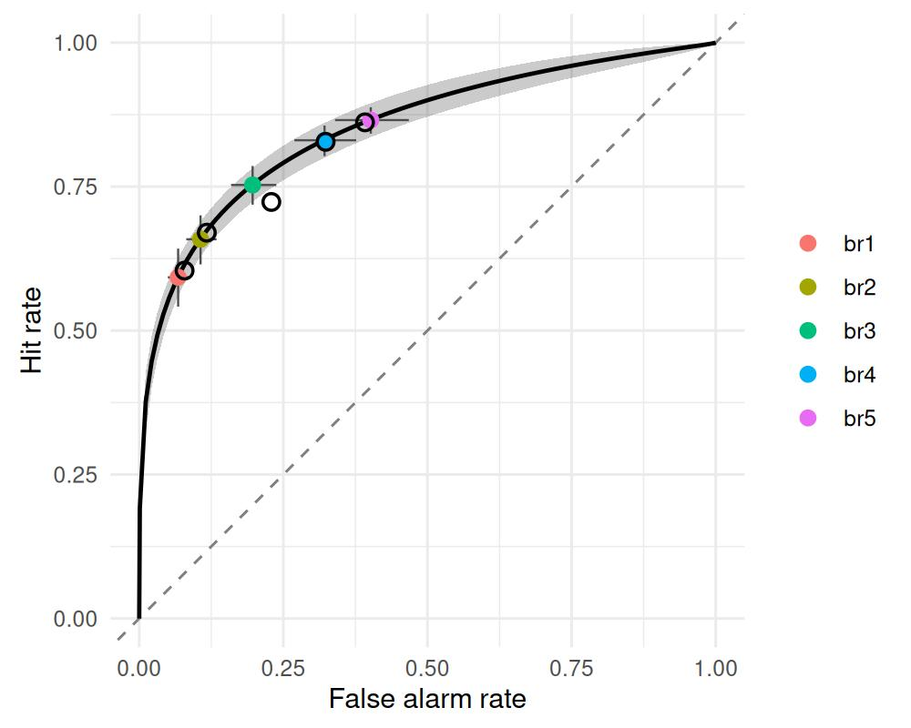

The smooth ribbon is the posterior ROC, the filled points with
crosshairs are the model-implied operating points per base-rate
condition, and the open circles are the observed points. A curvilinear
ROC that is asymmetric about the minor diagonal is the signature of
unequal variance (`sdratio > 1`).

[`auc_sdt()`](https://popov-lab.github.io/bmm/dev/reference/auc_sdt.md)
returns the posterior area under the curve. For *equal-variance* binary
fits it uses the closed forms \\\Phi(d'/\sqrt{2})\\ (Gaussian) and
\\\mathrm{logistic}(g')\\ (Gumbel-min and Gumbel-max); every other case
— unequal variance, the logistic distribution, and all rating fits — is
integrated numerically over the model-implied curve. The returned AUC is
always the area under the full curve (one value per curve, not the area
spanned by the discrete points).

``` r

auc <- auc_sdt(fit_uv)
plot(auc)
```

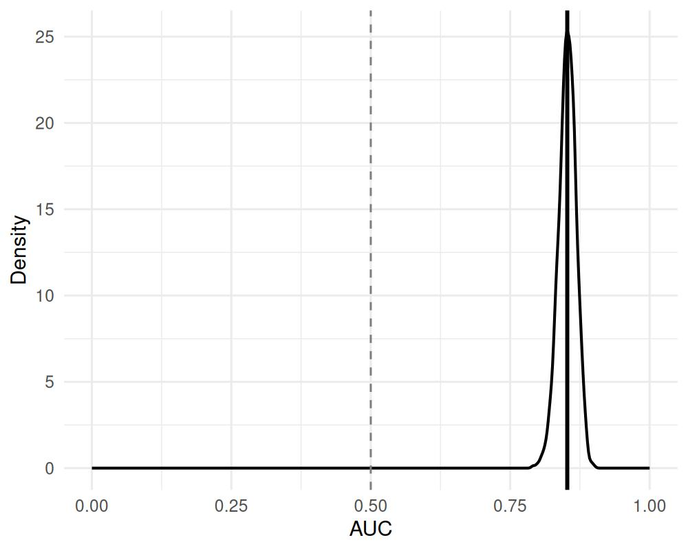

``` r

attr(auc, "summary")
#>    AUC_mean AUC_lower AUC_upper
#> 1 0.8522991 0.8194102 0.8817438
```

### 4.4 Quantile-transformed ROC and latent distributions

Passing `scale = "quantile"` to the ROC
[`plot()`](https://rdrr.io/r/graphics/plot.default.html) method reads
the rates on the noise distribution’s quantile axis via the transform
\\-q(1 - \text{rate})\\, where \\q\\ is the inverse CDF of the fitted
noise distribution (\\\Phi^{-1}(\text{rate})\\ for the Gaussian model).
The axis label names the transform: `z` for the normal (the classic
z-ROC, and `scale = "z"` is accepted as an alias), `logit` for the
logistic, and `loglog`/`cloglog` for the Gumbel distributions. On this
axis the model ROC is a straight line for every noise distribution, with
slope \\1/\exp(\mathtt{sdratio})\\ and intercept
\\\delta/\exp(\mathtt{sdratio})\\, where \\\delta\\ is the separation in
noise-scale units (the \\d_N\\ that
[`sdt_sensitivity()`](https://popov-lab.github.io/bmm/dev/reference/sdt_sensitivity.md)
reports, not the fitted `d`), so a slope below 1 is the visual signature
of unequal variance and observed points that bow away from a straight
line flag misfit. (The \\(0,0)\\ and \\(1,1)\\ endpoints map to infinity
and are dropped.)

``` r

plot(roc, observed = obs, scale = "quantile")
```

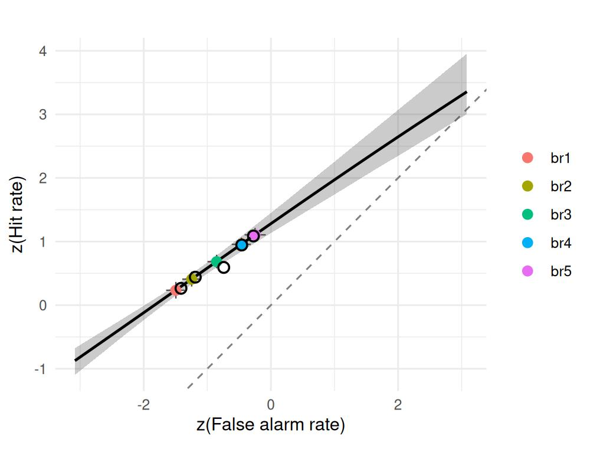

For the base-rate data the fitted slope is 0.70 (95% CrI \[0.60,
0.81\]). The equal-variance `gumbel_min` fit from the noise-distribution
section implied a slope of 0.59 through the same operating points,
without an `sdratio` parameter.

[`latent_sdt()`](https://popov-lab.github.io/bmm/dev/reference/latent_sdt.md)
reconstructs the latent decision-variable distributions themselves: the
noise and signal evidence densities, separated by the noise-SD distance
\\d_N\\ and scaled by `exp(sdratio)`, with the criterion drawn as a
dashed line carrying a credible band on its location. This is the
picture the criterion and `d` estimates describe. Here the criterion
varies across the base-rate conditions but `d`/`sdratio` do not, so the
densities are identical across conditions:
[`latent_sdt()`](https://popov-lab.github.io/bmm/dev/reference/latent_sdt.md)
collapses them into one panel and overlays the several criteria,
colour-coded by condition (pass `collapse = FALSE` for one panel per
condition).

``` r

plot(latent_sdt(fit_uv))
```

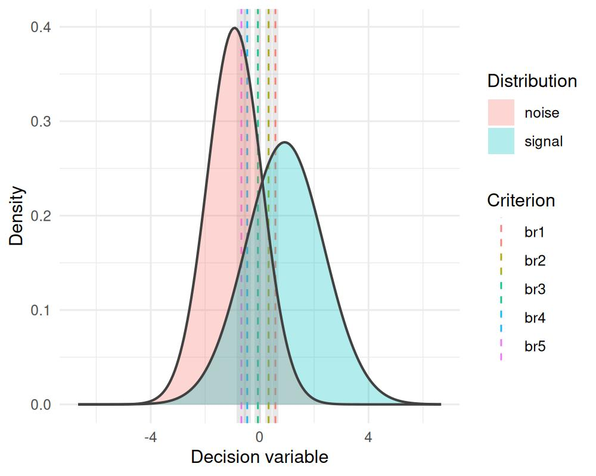

### 4.5 Posterior predictive checks

[`sdt_yn()`](https://popov-lab.github.io/bmm/dev/reference/sdt_yn.md)
uses a custom binomial family, so
[`pp_check()`](https://popov-lab.github.io/bmm/dev/reference/pp_check.bmmfit.md)
delegates to `brms`. The “old”-response counts span a wide range whose
ceiling differs across cells (the base-rate conditions have different
numbers of trials), so the bar view is cluttered and hard to read. An
overlaid empirical CDF split by stimulus type is a cleaner check that
the model reproduces the response distributions for signal and noise
items — and the ROC plot above already checks the operating points
directly:

``` r

pp_check(fit_uv, type = "ecdf_overlay", group = "stimulus", ndraws = 100)
```

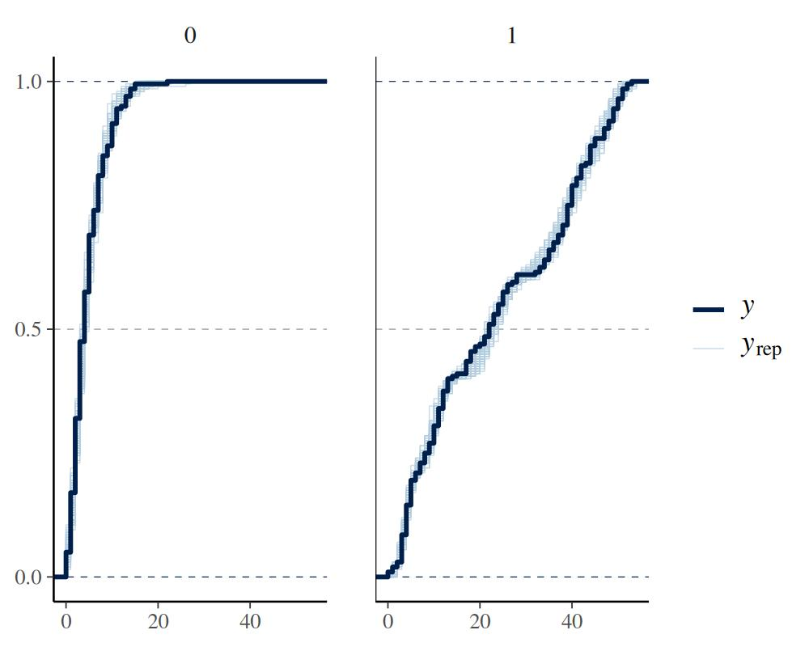

## 5 Rating SDT

In a confidence-rating task each item is judged on an ordered scale
(e.g. 1 = “sure new” … 6 = “sure old”). The data are counts per rating
category, one column per category. Internally `bmm` fits this with
`brms`’ native multinomial family; the K-1 confidence criteria are
parameterized by a `threshold_type` (Selker et al. 2019; Paulewicz and
Blaut 2020, 2022).

We use a real recognition ROC dataset. The `roc6` object in the
[MPTinR](https://cran.r-project.org/package=MPTinR) package collects 12
published old/new recognition experiments as per-subject counts of old
and new items across a 6-point confidence scale. Here we take Pratte et
al. (2010) (97 subjects, 240 trials per stimulus class — narrow
posteriors, clear effects) and reshape it to the format
[`sdt_rating()`](https://popov-lab.github.io/bmm/dev/reference/sdt_rating.md)
expects: one row per (subject × stimulus), with categories `r1` = “sure
new” … `r6` = “sure old”.

``` r

stopifnot(requireNamespace("MPTinR", quietly = TRUE))
data("roc6", package = "MPTinR")
pratte <- roc6[roc6$exp == "Pratte_2010", ]

rating_data <- rbind(
  data.frame(id = pratte$id, stimulus = 1L,
             r1 = pratte$OLD_3new, r2 = pratte$OLD_2new, r3 = pratte$OLD_1new,
             r4 = pratte$OLD_1old, r5 = pratte$OLD_2old, r6 = pratte$OLD_3old),
  data.frame(id = pratte$id, stimulus = 0L,
             r1 = pratte$NEW_3new, r2 = pratte$NEW_2new, r3 = pratte$NEW_1new,
             r4 = pratte$NEW_1old, r5 = pratte$NEW_2old, r6 = pratte$NEW_3old)
)

model <- sdt_rating(response = paste0("r", 1:6), stimulus = "stimulus")

# Recognition ROCs are classically asymmetric, so estimate unequal variance
fit_rating <- bmm(
  formula = bmf(d ~ 1 + (1 | id), criterion ~ 1 + (1 | id),
                spacing ~ 1, sdratio ~ 1),
  data = rating_data,
  model = model,
  backend = "cmdstanr",
  cores = 4,
  refresh = 0,
  silent = 2,
  chains = 4,
  iter = 7000,
  warmup = 1000,
  thin = 6,
  file = "assets/bmmfit_sdt_rating_vignette"
)
summary(fit_rating)
```

``` fansi
#>   Model: sdt_rating(response = paste0("r", 1:6),
#>                     stimulus = "stimulus") 
#>   Links: d = identity; criterion = identity; spacing = identity; sdratio = identity 
#> Formula: d ~ 1 + (1 | id)
#>          criterion ~ 1 + (1 | id)
#>          spacing ~ 1
#>          sdratio ~ 1 
#>    Data: (Number of observations: 194)
#>   Draws: 4 chains, each with iter = 7000; warmup = 1000; thin = 6;
#>          total post-warmup draws = 4000
#> 
#> Multilevel Hyperparameters:
#> ~id (Number of levels: 97) 
#>                         Estimate Est.Error l-95% CI u-95% CI Rhat Bulk_ESS
#> sd(d_Intercept)             0.53      0.04     0.46     0.62 1.00     2716
#> sd(criterion_Intercept)     0.33      0.03     0.28     0.38 1.00     2881
#>                         Tail_ESS
#> sd(d_Intercept)             3372
#> sd(criterion_Intercept)     3186
#> 
#> Regression Coefficients:
#>                     Estimate Est.Error l-95% CI u-95% CI Rhat Bulk_ESS Tail_ESS
#> d_Intercept             1.10      0.06     0.99     1.21 1.00     1725     2774
#> criterion_Intercept    -0.03      0.03    -0.09     0.04 1.00     1522     2282
#> spacing_Intercept      -0.26      0.01    -0.27    -0.25 1.00     4134     3955
#> sdratio_Intercept       0.35      0.01     0.33     0.37 1.00     4133     3778
#> 
#> Note: sdratio is not fixed at 0, so d is d_a (root-mean-square SD units), not the noise-standardized d'.
#>       sdt_sensitivity() converts it to d' (noise SD) and d_S (signal SD).
#> 
#> Draws were sampled using sample(hmc). For each parameter, Bulk_ESS
#> and Tail_ESS are effective sample size measures, and Rhat is the potential
#> scale reduction factor on split chains (at convergence, Rhat = 1).
```

### 5.1 Threshold parameterizations

A rating model is binary SDT with several criteria at once: for a
\\K\\-point scale the \\K-1\\ thresholds carve the latent evidence axis
into \\K\\ ordered response bins. The probability of each rating is the
area of the corresponding bin under the signal or noise distribution.


Figure 5.1: A 6-point rating scale places K-1 = 5 thresholds on the
evidence axis, splitting it into six ordered confidence bins.
threshold_type governs how these thresholds are spaced.

The `threshold_type` argument controls how those \\K-1\\ criteria are
placed and therefore how many parameters they cost:

- `"parsimonious"` (default) and `"equidistant"`: two parameters
  (`criterion` + `spacing`) — the thresholds are evenly spaced around
  the criterion, differing only in their canonical anchor positions
  (Selker et al. 2019).
- `"log_distance"` and `"log_ratio"`: K-2 `delta` parameters that allow
  uneven spacing while guaranteeing the thresholds stay ordered
  (Paulewicz and Blaut 2022).
- `"softmax"`: a shared `spacing` plus K-3 allocation `delta`
  parameters.

Add `sdratio ~ 1` to the formula to estimate unequal variance.

### 5.2 ROC, AUC, and observed ROC

For a rating model the K-1 thresholds define K-1 ROC points per
posterior draw.
[`roc_sdt()`](https://popov-lab.github.io/bmm/dev/reference/roc_sdt.md)
returns those points together with the smooth model-implied ROC curve
traced from the posterior of `d` (and `sdratio`);
[`plot()`](https://rdrr.io/r/graphics/plot.default.html) shows that
curve as a credible-band ribbon with the K-1 thresholds overlaid as
colour-coded operating points (`t1`..`t(K-1)`) carrying crosshair
credible intervals — the same display as the binary ROC.
[`roc_observed()`](https://popov-lab.github.io/bmm/dev/reference/roc_observed.md)
gives the empirical points from the pooled counts. The quantile axis
(`scale = "quantile"`) works here too.

``` r

roc <- roc_sdt(fit_rating)
plot(roc, observed = roc_observed(fit_rating))
```

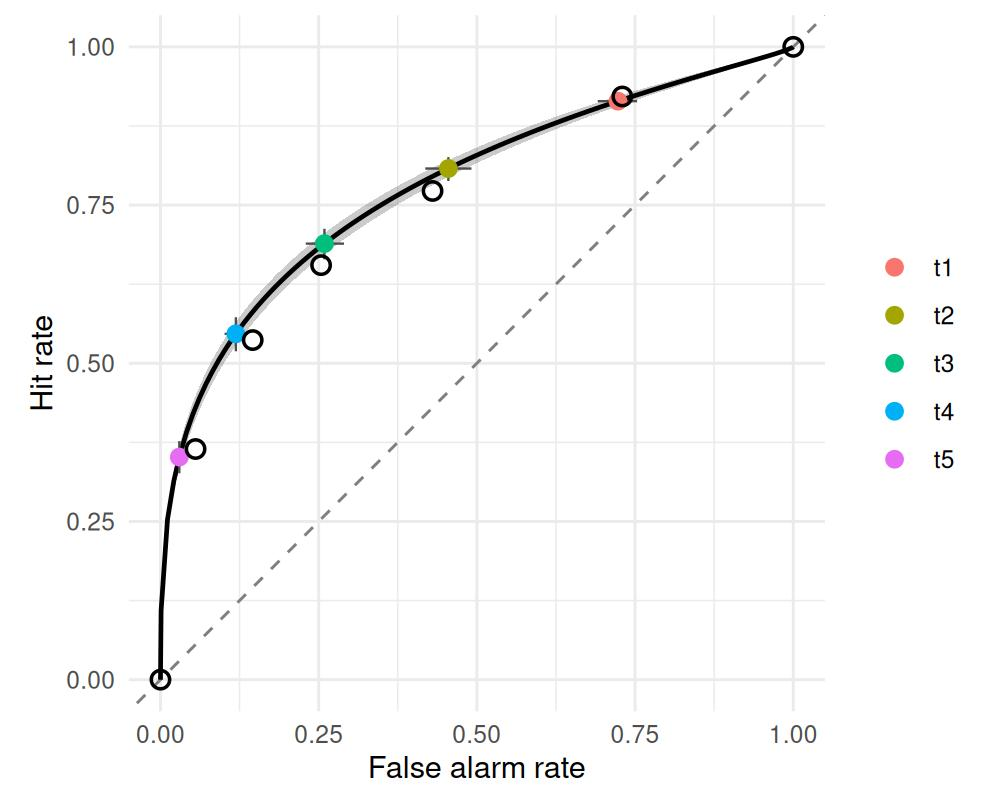

``` r


attr(auc_sdt(fit_rating), "summary")
#>    AUC_mean AUC_lower AUC_upper
#> 1 0.7809546 0.7579513 0.8030136
```

### 5.3 Posterior predictive checks

Because the rating model uses a multinomial family,
[`pp_check()`](https://popov-lab.github.io/bmm/dev/reference/pp_check.bmmfit.md)
produces a response-proportion profile (observed bars
vs. posterior-predictive point-ranges). For SDT the signal and noise
rating distributions should be checked separately, so
[`pp_check()`](https://popov-lab.github.io/bmm/dev/reference/pp_check.bmmfit.md)
**defaults to faceting by `stimulus`**:

``` r

pp_check(fit_rating, ndraws = 100)
```

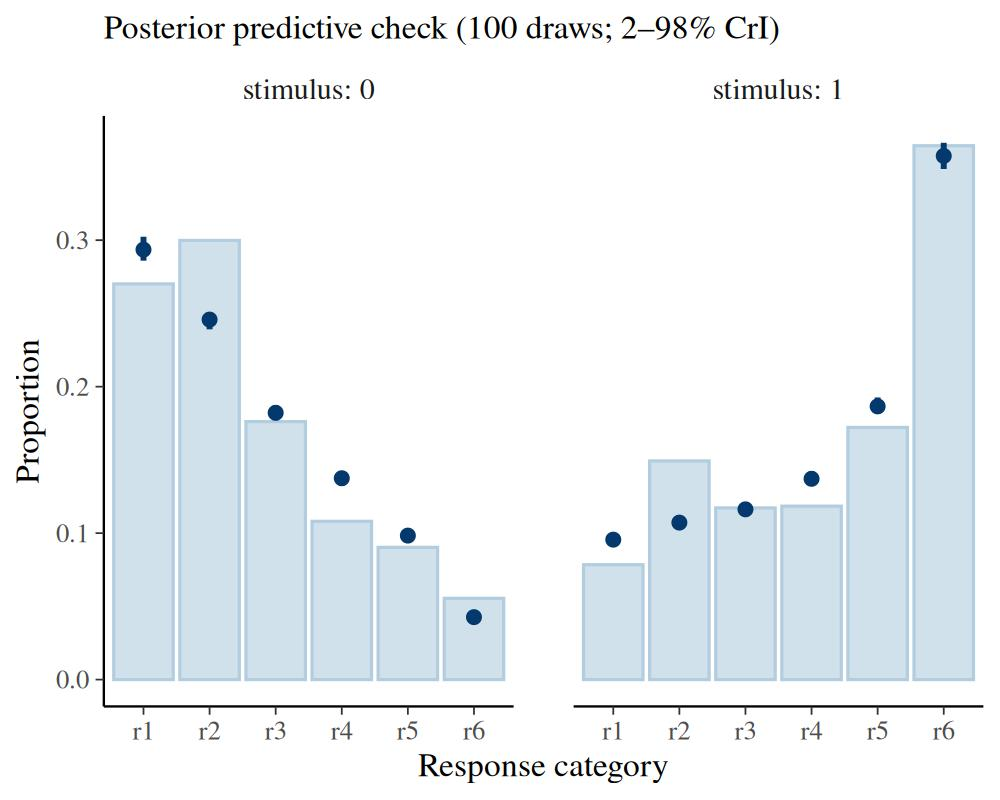

Pass `group = NA` to pool both stimulus types into a single profile, or
`group = "<predictor>"` to facet by another design variable.

The predicted point-ranges track the observed bars closely at the
extreme categories but **deviate systematically for the interior
categories** (r3–r5): the misses are smooth and one-sided rather than
random scatter. That pattern is the fingerprint of *threshold misfit*.
The default `"parsimonious"` parameterization buys its economy (two
threshold parameters) by fixing the K-1 criteria at regularly spaced
canonical positions, and when the true confidence thresholds are
unevenly spaced — as they usually are in recognition data — those two
parameters cannot reproduce the full rating profile.

### 5.4 Improving fit with flexible thresholds

The `"log_ratio"` parameterization frees the spacing with K-2 `delta`
parameters, so the thresholds can sit wherever the data require. For a
6-point scale they are `delta1` … `delta4`, one per interval between
adjacent thresholds: `delta3` is the log width of the interval just
above the criterion, and each of the others is the log ratio of an
interval to its neighbour nearer the criterion (printing the model
object lists what each `delta` measures). Refit with it and re-run the
same check:

``` r

model_lr <- sdt_rating(response = paste0("r", 1:6), stimulus = "stimulus",
                       threshold_type = "log_ratio")

fit_rating_lr <- bmm(
  formula = bmf(d ~ 1 + (1 | id), criterion ~ 1 + (1 | id),
                delta1 ~ 1, delta2 ~ 1, delta3 ~ 1, delta4 ~ 1,
                sdratio ~ 1),
  data = rating_data,
  model = model_lr,
  backend = "cmdstanr",
  cores = 4,
  chains = 4,
  iter = 4000,
  warmup = 1000,
  thin = 3,
  refresh = 0,
  silent = 2,
  file = "assets/bmmfit_sdt_rating_logratio_vignette"
)

pp_check(fit_rating_lr, ndraws = 100)
```

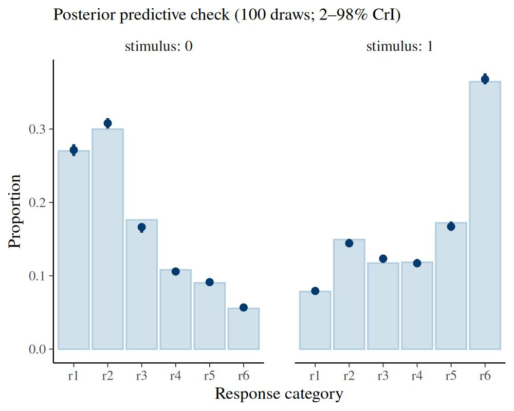

The interior categories are now captured: the flexible thresholds absorb
the systematic deviation that the parsimonious model could not. The
improvement is not free — it costs four threshold parameters (the
`delta`s) instead of two — so it should be weighed against the gain in
fit.

For these models the posterior predictive check is the most practical
guide to that trade-off: a parameterization that leaves systematic,
one-sided deviations is too rigid, while one whose predicted
point-ranges sit on the observed bars (as here) is adequate. A *formal*
predictive comparison is tempting, but the usual `loo()` is **not**
appropriate here: each observation is an aggregated count over many
trials, so leaving one out removes a large, highly influential chunk of
data and the PSIS-LOO approximation becomes unreliable — it flags most
observations with a high Pareto-\\k\\, and (because that reflects
heavy-tailed importance weights rather than Monte Carlo noise) more
posterior draws will not fix it. The principled alternative for
aggregated data is k-fold cross-validation via
[`brms::kfold()`](https://mc-stan.org/loo/reference/kfold-generic.html),
which refits on held-out folds and avoids importance sampling
altogether. `"log_distance"` behaves like `"log_ratio"`, and `"softmax"`
offers an intermediate option with a shared spacing plus fewer free
deltas.

### 5.5 Extracting the thresholds

The `delta` parameters are only interpretable through the
parameterization that maps them to threshold locations.
[`sdt_thresholds()`](https://popov-lab.github.io/bmm/dev/reference/sdt_thresholds.md)
performs that mapping: it reconstructs the K-1 thresholds per posterior
draw on the latent decision-variable scale, so the confidence criteria
can be reported directly, whatever the `threshold_type`.

``` r

attr(sdt_thresholds(fit_rating_lr), "summary")
#>   marker   position       lower      upper
#> 1     t1 -1.3041170 -1.37289582 -1.2385101
#> 2     t2 -0.4071132 -0.47385795 -0.3430747
#> 3     t3  0.0981242  0.03145709  0.1634927
#> 4     t4  0.5160744  0.44915164  0.5801853
#> 5     t5  1.1056789  1.03838991  1.1714890
```

[`latent_sdt()`](https://popov-lab.github.io/bmm/dev/reference/latent_sdt.md)
shows the same thresholds in context — the noise and signal evidence
densities with the K-1 confidence criteria cutting the axis into the six
rating bins, each threshold carrying the credible band on its location.
The uneven spacing the `log_ratio` fit recovered (and the parsimonious
model could not) is directly visible:

``` r

plot(latent_sdt(fit_rating_lr))
```

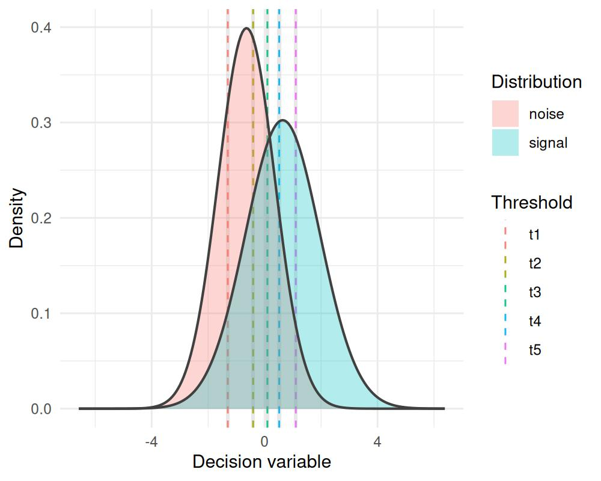

## 6 m-AFC SDT

In an m-alternative forced-choice task the observer picks the target
among `m` alternatives; the data are counts of correct responses. There
is no criterion and no stimulus column — accuracy alone identifies `d`
(DeCarlo 2012). A correct response occurs when the target’s evidence
exceeds that of all \\m-1\\ distractors; `d` is \\d'\\, the
target–distractor separation.
[`sdt_mafc()`](https://popov-lab.github.io/bmm/dev/reference/sdt_mafc.md)
has no `sdratio`, and its `d` is on the same scale as the `d` of
[`sdt_yn()`](https://popov-lab.github.io/bmm/dev/reference/sdt_yn.md),
including the \\d_a\\ that
[`sdt_yn()`](https://popov-lab.github.io/bmm/dev/reference/sdt_yn.md)
reports once its `sdratio` is estimated (exactly so for Gaussian noise;
see
[`?sdt_mafc`](https://popov-lab.github.io/bmm/dev/reference/sdt_mafc.md)).
For \\m = 2\\ the Gaussian model has the closed form
\\\Phi(d/\sqrt{2})\\, and for \\m \geq 3\\ the Gaussian and logistic
models evaluate the accuracy by quadrature while both Gumbel models stay
in closed form. The set size `m` may be a constant or a data column (for
mixed set sizes).

``` r

# rsdt_mafc() is vectorised over its arguments; varying d by subject
# gives hierarchical data.
set.seed(123)
dat <- data.frame(id = 1:30, n_trials = 100L)
dat$n_correct <- rsdt_mafc(nrow(dat), dat$n_trials, m = 4,
                           d = rnorm(30, mean = 1.5, sd = 0.3))

model <- sdt_mafc(response = "n_correct", n_trials = "n_trials", m = 4)

fit_mafc <- bmm(
  formula = bmf(d ~ 1 + (1 | id)),
  data = dat,
  model = model,
  backend = "cmdstanr",
  cores = 4,
  refresh = 0,
  silent = 2,
  file = "assets/bmmfit_sdt_mafc_vignette"
)
summary(fit_mafc)
```

``` fansi
#>   Model: sdt_mafc(response = "n_correct",
#>                   n_trials = "n_trials",
#>                   m = 4) 
#>   Links: d = identity 
#> Formula: d ~ 1 + (1 | id) 
#>    Data: dat (Number of observations: 30)
#>   Draws: 4 chains, each with iter = 2000; warmup = 1000; thin = 1;
#>          total post-warmup draws = 4000
#> 
#> Multilevel Hyperparameters:
#> ~id (Number of levels: 30) 
#>                 Estimate Est.Error l-95% CI u-95% CI Rhat Bulk_ESS Tail_ESS
#> sd(d_Intercept)     0.25      0.05     0.16     0.36 1.00     1245     2132
#> 
#> Regression Coefficients:
#>             Estimate Est.Error l-95% CI u-95% CI Rhat Bulk_ESS Tail_ESS
#> d_Intercept     1.46      0.06     1.35     1.57 1.00     1584     1872
#> 
#> Draws were sampled using sample(hmc). For each parameter, Bulk_ESS
#> and Tail_ESS are effective sample size measures, and Rhat is the potential
#> scale reduction factor on split chains (at convergence, Rhat = 1).
```

ROC curves are undefined here (`roc_sdt(fit_mafc)` errors), but
[`latent_sdt()`](https://popov-lab.github.io/bmm/dev/reference/latent_sdt.md)
still works: it shows the noise and signal evidence densities the
estimated `d` implies (the noise density stands for each of the \\m-1\\
distractors), now without a criterion line because the decision is a max
rule over the alternatives. Setting `show_competitors = TRUE` overlays
the density of the *maximum* of the \\m-1\\ distractor samples — the
effective competitor the target must beat — which shifts rightward as
\\m\\ grows and shows directly why accuracy falls with set size.

``` r

plot(latent_sdt(fit_mafc, show_competitors = TRUE))
```

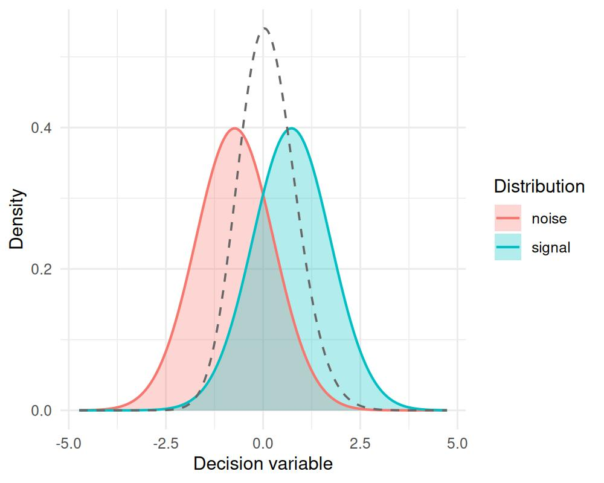

Each subject contributes one correct-response count, so a bar per count
value is sparse and noisy; an overlaid empirical CDF of the
correct-response counts is a compact check that the model captures the
spread of accuracy across subjects:

``` r

pp_check(fit_mafc, type = "ecdf_overlay", ndraws = 100)
```

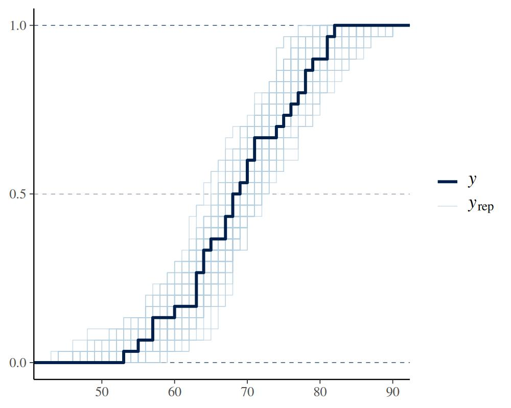

## 7 Ranking SDT

In a ranking task the observer orders `m` items by evidence and the data
are counts per rank position assigned to the target (Meyer-Grant et al.
2026). As with m-AFC there is no criterion: the rank assigned to the
target is an *order statistic* of the latent evidence, so the
probability of each rank follows from the evidence distribution
directly. With `dist = "gumbel_min"` these rank probabilities have a
closed form (the extreme-value assumption that makes ranking
analytically tractable); `dist = "normal"` is also available and
evaluated by quadrature — prefer `gumbel_min` for speed (its closed form
is exact), and `normal` for Gaussian evidence comparable to the other
SDT models (the classical Thurstonian ranking assumption). `d` is \\d'\\
(the \\g'\\ of Meyer-Grant et al. (2026) under `gumbel_min`); with
`dist = "normal"` and `sdratio ~ 1` it becomes \\d_a\\ as in the other
models. Ranking has no criterion, so here \\d_a\\ is not read off an
ROC: it keeps `d` on one scale across the family, and it fixes two-item
accuracy at \\\Phi(d/\sqrt{2})\\ whatever the SD ratio. The model uses
the native multinomial family with one category per rank position, and
`m` may again be a constant or a column for mixed set sizes. The bundled
`meyer_grant_jakob_2025` data (Meyer-Grant and Jakob 2025) illustrate
the wide format.

``` r

model <- sdt_ranking(
  response = c("rank1", "rank2", "rank3", "rank4", "rank5"),
  m = "set_size",
  dist = "gumbel_min"
)

fit_rank <- bmm(
  formula = bmf(d ~ 1 + (1 | id)),
  data = meyer_grant_jakob_2025,
  model = model,
  backend = "cmdstanr",
  cores = 4,
  refresh = 0,
  silent = 2,
  file = "assets/bmmfit_sdt_ranking_vignette"
)
summary(fit_rank)
```

``` fansi
#>   Model: sdt_ranking(response = c("rank1", "rank2", "rank3", "rank4", "rank5"),
#>                      m = "set_size",
#>                      dist = "gumbel_min") 
#>   Links: d = identity 
#> Formula: d ~ 1 + (1 | id) 
#>    Data: (Number of observations: 180)
#>   Draws: 4 chains, each with iter = 2000; warmup = 1000; thin = 1;
#>          total post-warmup draws = 4000
#> 
#> Multilevel Hyperparameters:
#> ~id (Number of levels: 60) 
#>                 Estimate Est.Error l-95% CI u-95% CI Rhat Bulk_ESS Tail_ESS
#> sd(d_Intercept)     0.30      0.03     0.24     0.37 1.00     1361     1812
#> 
#> Regression Coefficients:
#>             Estimate Est.Error l-95% CI u-95% CI Rhat Bulk_ESS Tail_ESS
#> d_Intercept     0.61      0.04     0.53     0.69 1.00     1488     2030
#> 
#> Draws were sampled using sample(hmc). For each parameter, Bulk_ESS
#> and Tail_ESS are effective sample size measures, and Rhat is the potential
#> scale reduction factor on split chains (at convergence, Rhat = 1).
```

ROC/AUC are undefined;
[`pp_check()`](https://popov-lab.github.io/bmm/dev/reference/pp_check.bmmfit.md)
shows the rank-position profile. With mixed set sizes, facet by the
set-size column so each panel has a homogeneous denominator:

``` r

pp_check(fit_rank, group = "set_size", ndraws = 100)
```

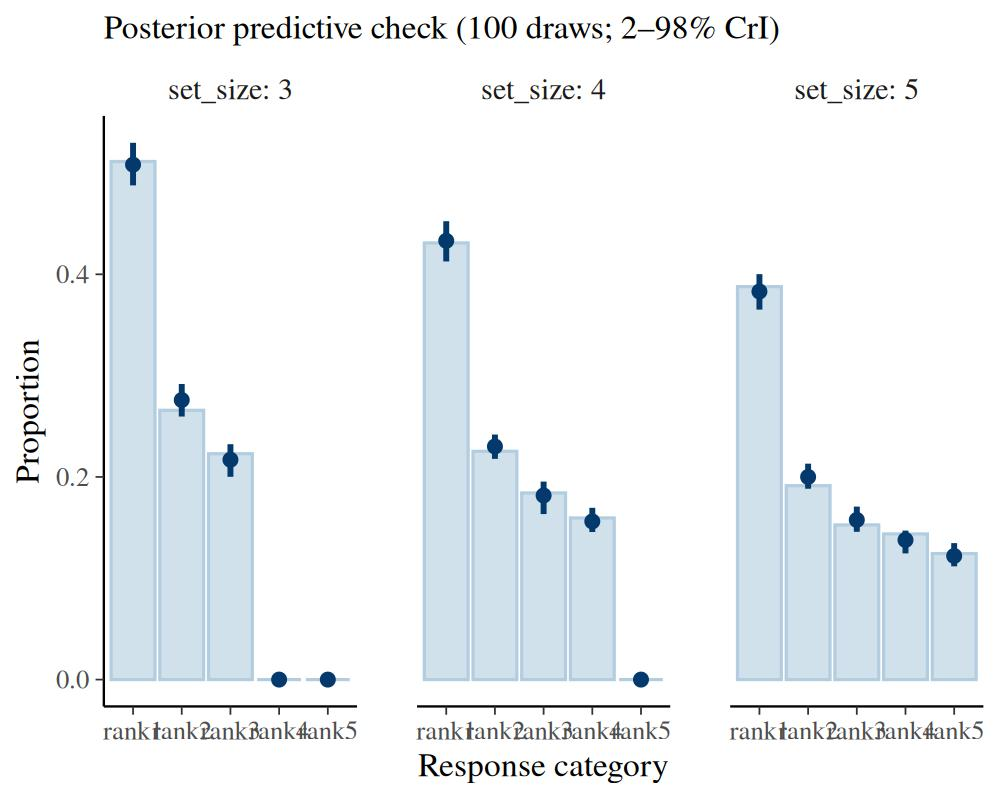

## 8 Post-processing reference

| Function | Models | Returns |
|----|----|----|
| [`roc_sdt()`](https://popov-lab.github.io/bmm/dev/reference/roc_sdt.md) | binary, rating | model-implied smooth ROC curve + operating points (criterion levels for multi-criteria binary; confidence thresholds for rating) |
| [`roc_observed()`](https://popov-lab.github.io/bmm/dev/reference/roc_observed.md) | binary, rating | empirical ROC points from the data |
| [`auc_sdt()`](https://popov-lab.github.io/bmm/dev/reference/auc_sdt.md) | binary, rating | posterior AUC |
| [`latent_sdt()`](https://popov-lab.github.io/bmm/dev/reference/latent_sdt.md) | all four | noise/signal latent densities + criterion/threshold locations (no boundary for m-AFC/ranking) |
| [`sdt_thresholds()`](https://popov-lab.github.io/bmm/dev/reference/sdt_thresholds.md) | rating | K-1 threshold locations per draw on the latent scale, with posterior summary |
| [`sdt_sensitivity()`](https://popov-lab.github.io/bmm/dev/reference/sdt_sensitivity.md) | all four | sensitivity converted per draw to \\d_a\\, \\d_N\\, and \\d_S\\, with posterior summary |
| [`plot()`](https://rdrr.io/r/graphics/plot.default.html) | `bmm_sdt_roc` (incl. `scale = "quantile"`), `bmm_sdt_auc`, `bmm_sdt_latent` | `ggplot2` ROC / quantile-ROC / AUC / latent-distribution figures |
| [`pp_check()`](https://popov-lab.github.io/bmm/dev/reference/pp_check.bmmfit.md) | all four | posterior predictive check |

## References

Bröder, Arndt, and Julia Schütz. 2009. “Recognition ROCs Are
Curvilinear—or Are They? On Premature Arguments Against the
Two-High-Threshold Model of Recognition.” *Journal of Experimental
Psychology: Learning, Memory, and Cognition* 35 (3): 587–606.
<https://doi.org/10.1037/a0015279>.

DeCarlo, Lawrence T. 1998. “Signal Detection Theory and Generalized
Linear Models.” *Psychological Methods* 3 (2): 186–205.
<https://doi.org/10.1037/1082-989X.3.2.186>.

DeCarlo, Lawrence T. 2012. “On a Signal Detection Approach to
m-Alternative Forced Choice with Bias, with Maximum Likelihood and
Bayesian Approaches to Estimation.” *Journal of Mathematical Psychology*
56 (3): 196–207. <https://doi.org/10.1016/j.jmp.2012.02.004>.

Green, David M., and John A. Swets. 1966. *Signal Detection Theory and
Psychophysics*. Wiley.

Macmillan, Neil A., and C. Douglas Creelman. 2005. *Detection Theory: A
User’s Guide*. 2nd ed. Lawrence Erlbaum Associates.

Meyer-Grant, Constantin G., and Marie Jakob. 2025. “Ranking Tasks in
Recognition Memory: A Direct Test of the Two-High-Threshold Contrast
Model.” *Journal of Experimental Psychology: General* 154 (5): 1445–55.
<https://doi.org/10.1037/xge0001700>.

Meyer-Grant, Constantin G., David Kellen, Samuel M. Harding, and Henrik
Singmann. 2026. “Extreme-Value Signal Detection Theory for Recognition
Memory: The Parametric Road Not Taken.” *Psychological Review*, ahead of
print. <https://doi.org/10.1037/rev0000615>.

Paulewicz, Borysław, and Agata Blaut. 2020. “The Bhsdtr Package: A
General-Purpose Method of Bayesian Inference for Signal Detection Theory
Models.” *Behavior Research Methods* 52 (5): 2122–41.
<https://doi.org/10.3758/s13428-020-01370-y>.

Paulewicz, Borysław, and Agata Blaut. 2022. “The General Causal
Cumulative Model of Ordinal Response.” *PsyArXiv*, ahead of print.
<https://doi.org/10.31234/osf.io/e7a3x>.

Pratte, Michael S., Jeffrey N. Rouder, and Richard D. Morey. 2010.
“Separating Mnemonic Process from Participant and Item Effects in the
Assessment of ROC Asymmetries.” *Journal of Experimental Psychology:
Learning, Memory, and Cognition* 36 (1): 224–32.
<https://doi.org/10.1037/a0017682>.

Robinson, Maria M., Isabella C. DeStefano, Edward Vul, and Timothy F.
Brady. 2023. “How Do People Build up Visual Memory Representations from
Sensory Evidence? Revisiting Two Classic Models of Choice.” *Journal of
Mathematical Psychology* 117: 102805.
<https://doi.org/10.1016/j.jmp.2023.102805>.

Selker, Ravi, Don van den Bergh, Amy H. Criss, and Eric-Jan Wagenmakers.
2019. “Parsimonious Estimation of Signal Detection Models from
Confidence Ratings.” *Behavior Research Methods* 51 (5): 1953–67.
<https://doi.org/10.3758/s13428-019-01231-3>.

Simpson, A. J., and M. J. Fitter. 1973. “What Is the Best Index of
Detectability?” *Psychological Bulletin* 80 (6): 481–88.
<https://doi.org/10.1037/h0035203>.

Yellott, John I. 1977. “The Relationship Between Luce’s Choice Axiom,
Thurstone’s Theory of Comparative Judgment, and the Double Exponential
Distribution.” *Journal of Mathematical Psychology* 15 (2): 109–44.
<https://doi.org/10.1016/0022-2496(77)90026-8>.
