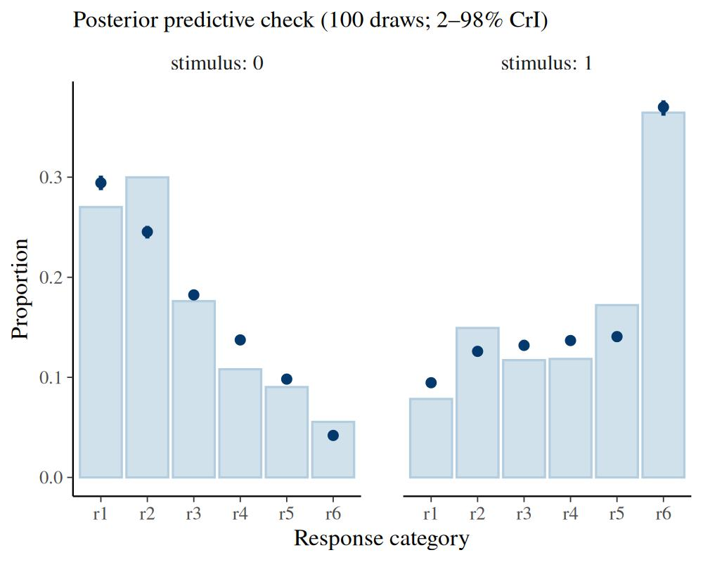
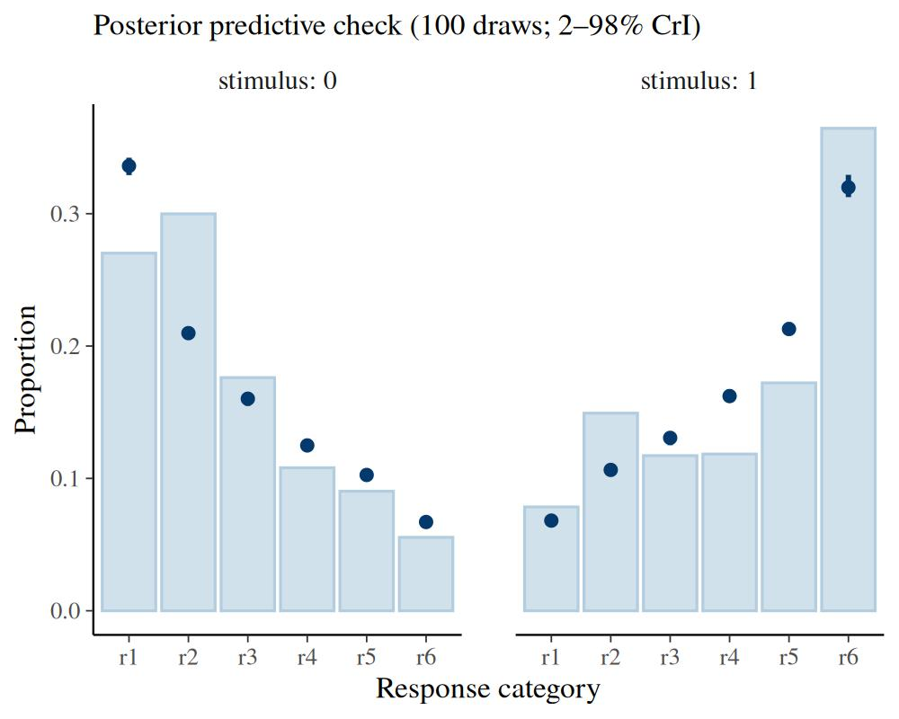

# Dual-process and meta-d′ signal detection models

``` r

library(bmm)
library(ggplot2)
```

## 1 Beyond familiarity: two process models

The [confidence-rating SDT
model](https://popov-lab.github.io/bmm/dev/articles/bmm_sdt.md) treats
recognition as a single continuous process: an item generates a sample
of memory *strength* (or *familiarity*), and the observer maps that one
number onto an ordered confidence scale. A persistent finding in
recognition memory is that the resulting ROC is **asymmetric** — on
z-transformed axes its slope is below one. The core SDT article reads
that asymmetry as *unequal variance*: the old-item distribution is
simply wider than the new-item distribution.

Unequal variance is not the only explanation. Two influential models
keep the familiarity process but add a **second process** that also
leaves its mark on the ROC:

- **Dual-process SDT** (Yonelinas 1994) adds a *recollection* process:
  besides graded familiarity, an item can be consciously recollected,
  which supports a confident, all-or-none response. Recollection is one
  of the two standard accounts of the recognition ROC’s shape, the other
  being unequal variance (Wixted and Mickes 2010; Yonelinas 2024).
- **Meta-d′** (Maniscalco and Lau 2012) adds a *metacognitive* read-out:
  it asks how well an observer’s confidence tracks whether their
  decision was actually correct, separately from how well they
  discriminate old from new.

Both are *versions of the same rating model* — they consume identical
data (counts per confidence category, with a 0/1 `stimulus` column) and
reduce to the standard model when their extra parameter is switched off.
They are selected with the `version` argument of
[`sdt_rating()`](https://popov-lab.github.io/bmm/dev/reference/sdt_rating.md):

| `version` | extra parameter(s) | captures | reduces to standard when |
|----|----|----|----|
| `"standard"` (default) | — | familiarity / strength only | always |
| `"dpsdt"` | `Ro`, `Rn` | recollection of old items / recall-to-reject (`Rn`) of new items | `Ro`, `Rn` → 0 |
| `"metad"` | `logmratio` | metacognitive efficiency (log M-ratio) | `logmratio` = 0 |

This article assumes the [core SDT
article](https://popov-lab.github.io/bmm/dev/articles/bmm_sdt.md): the
four-step fitting workflow, the standard rating model, confidence
thresholds, and the
[`roc_sdt()`](https://popov-lab.github.io/bmm/dev/reference/roc_sdt.md)
/
[`latent_sdt()`](https://popov-lab.github.io/bmm/dev/reference/latent_sdt.md)
/
[`sdt_thresholds()`](https://popov-lab.github.io/bmm/dev/reference/sdt_thresholds.md)
/
[`pp_check()`](https://popov-lab.github.io/bmm/dev/reference/pp_check.bmmfit.md)
toolkit. We focus here on what the second process adds — and because
both versions are plain `bmm` models, everything from that workflow
(hierarchical formulas, priors, post-processing) carries over unchanged.

## 2 Dual-process SDT

### 2.1 The model

Dual-process theory holds that a recognition decision can draw on two
separable sources (Yonelinas 1994; the description here follows Wixted
and Mickes 2010). *Familiarity* is a graded signal-detection process:
old and new items generate overlapping Gaussian evidence, exactly as in
the standard model. *Recollection* is a high-threshold process: with
some probability the observer retrieves specific details that settle the
decision with high confidence, and otherwise recollection fails and they
fall back on familiarity.

`bmm` parameterizes recollection with two probabilities, both on the
logit scale:

- `Ro` — *recall-to-accept*: the probability
  \\\mathrm{logit}^{-1}(\texttt{Ro})\\ that an **old** item is
  recollected as old, producing the most-confident “old” rating.
- `Rn` — *recall-to-reject*: the probability
  \\\mathrm{logit}^{-1}(\texttt{Rn})\\ that a **new** item is
  recollected as new (its absence from the studied set is recollected),
  producing the most-confident “new” rating.

The classic dual-process model of long-term recognition has recollection
for old items only (Wixted and Mickes 2010). The two-sided version with
a recall-to-reject term is the dual-process model that Yonelinas (2024)
applies to visual working memory, where the threshold component carries
both terms: in a single-probe test, the item held in memory rejects a
changed probe as readily as it accepts an unchanged one, and in change
detection with a whole-array probe it is recall-to-reject that
recollection mainly supports. The probability of each confidence
category is then a mixture: a recollection component that piles mass on
the extreme category, and a \\(1 - R)\\-weighted familiarity component
spread across the scale by the thresholds.


Figure 2.1: Dual-process model. Old and new items generate
equal-variance familiarity evidence (curves); on a fraction Ro of old
trials recollection succeeds and the item is reported with maximal ‘old’
confidence (right spike), and on a fraction Rn of new trials
recall-to-reject yields maximal ‘new’ confidence (left spike). The
recollection mass sits on top of the familiarity process, not on the
evidence axis.

Because recollection adds mass at the *high-confidence* ends, its
fingerprint is a **curved** z-transformed ROC: a pure unequal-variance
Gaussian produces a *straight* zROC (slope \\1/s\\), whereas a threshold
component bends it (Yonelinas 2024). We return to this contrast below.

`Ro` and `Rn` are **fixed off by default** (a constant near \\-\infty\\
on the logit scale, so recollection probability \\\approx 0\\ and the
model is exactly the standard rating model). You switch recollection on
by adding it to the formula — `Ro ~ 1` for the one-sided model
(recollection of old items only) or `Ro ~ 1, Rn ~ 1` for the two-sided
model.

### 2.2 Worked example: recognition memory

We use the same Pratte et al. (2010) recognition data as the core
article (from the `roc6` collection in the
[MPTinR](https://cran.r-project.org/package=MPTinR) package): 97
subjects judging old and new items on a 6-point confidence scale.

``` r

stopifnot(requireNamespace("MPTinR", quietly = TRUE))
data("roc6", package = "MPTinR")
pratte <- roc6[roc6$exp == "Pratte_2010", ]

rating_data <- rbind(
  data.frame(id = pratte$id, stimulus = 1L,
             r1 = pratte$OLD_3new, r2 = pratte$OLD_2new, r3 = pratte$OLD_1new,
             r4 = pratte$OLD_1old, r5 = pratte$OLD_2old, r6 = pratte$OLD_3old),
  data.frame(id = pratte$id, stimulus = 0L,
             r1 = pratte$NEW_3new, r2 = pratte$NEW_2new, r3 = pratte$NEW_1new,
             r4 = pratte$NEW_1old, r5 = pratte$NEW_2old, r6 = pratte$NEW_3old)
)
```

The dual-process model attributes the ROC asymmetry to recollection, so
we keep the familiarity process *equal-variance* (we do not estimate
`sdratio`) and free both recollection terms:

``` r

model_dp <- sdt_rating(response = paste0("r", 1:6), stimulus = "stimulus",
                       version = "dpsdt")

fit_dp <- bmm(
  formula = bmf(d ~ 1 + (1 | id), criterion ~ 1 + (1 | id),
                spacing ~ 1, Ro ~ 1, Rn ~ 1),
  data = rating_data,
  model = model_dp,
  backend = "cmdstanr",
  cores = 4,
  chains = 4,
  iter = 7000,
  warmup = 1000,
  thin = 6,
  refresh = 0,
  silent = 2,
  file = "assets/bmmfit_sdt_dpsdt_vignette"
)
summary(fit_dp)
```

``` fansi
#>   Model: sdt_rating(response = paste0("r", 1:6),
#>                     stimulus = "stimulus",
#>                     version = "dpsdt") 
#>   Links: d = identity; criterion = identity; spacing = identity; sdratio = identity; Ro = identity; Rn = identity 
#> Formula: d ~ 1 + (1 | id)
#>          criterion ~ 1 + (1 | id)
#>          spacing ~ 1
#>          sdratio = 0
#>          Ro ~ 1
#>          Rn ~ 1 
#>    Data: (Number of observations: 194)
#>   Draws: 4 chains, each with iter = 7000; warmup = 1000; thin = 6;
#>          total post-warmup draws = 4000
#> 
#> Multilevel Hyperparameters:
#> ~id (Number of levels: 97) 
#>                         Estimate Est.Error l-95% CI u-95% CI Rhat Bulk_ESS
#> sd(d_Intercept)             0.49      0.04     0.42     0.58 1.00     2631
#> sd(criterion_Intercept)     0.45      0.03     0.39     0.52 1.00     2060
#>                         Tail_ESS
#> sd(d_Intercept)             3234
#> sd(criterion_Intercept)     2873
#> 
#> Regression Coefficients:
#>                     Estimate Est.Error l-95% CI u-95% CI Rhat Bulk_ESS Tail_ESS
#> d_Intercept             0.68      0.05     0.57     0.78 1.01     1197     2156
#> criterion_Intercept     0.31      0.05     0.22     0.40 1.00      665      966
#> spacing_Intercept      -0.26      0.01    -0.27    -0.25 1.00     3814     3892
#> Ro_Intercept           -1.00      0.02    -1.05    -0.96 1.00     3983     3817
#> Rn_Intercept           -6.43      0.37    -7.21    -5.75 1.00     3685     3723
#> 
#> Constant Parameters:
#>                       Value
#> sdratio_Intercept      0.00
#> 
#> Note: d is the familiarity sensitivity; the observed ROC also carries recollection (Ro, Rn): see auc_sdt().
#> 
#> Draws were sampled using sample(hmc). For each parameter, Bulk_ESS
#> and Tail_ESS are effective sample size measures, and Rhat is the potential
#> scale reduction factor on split chains (at convergence, Rhat = 1).
```

The recollection terms are reported on the logit scale.
[`latent_sdt()`](https://popov-lab.github.io/bmm/dev/reference/latent_sdt.md)
converts them to probabilities and prints them alongside the familiarity
distributions:

``` r

latent_dp <- latent_sdt(fit_dp)
attr(latent_dp, "extra")
#>    parameter        mean        lower       upper
#> Ro        Ro 0.268355813 0.2590777931 0.277253483
#> Rn        Rn 0.001713203 0.0007397265 0.003185263
```

Recollection of old items (`Ro`) is credibly positive — it contributes
to high-confidence “old” responses over and above familiarity, the
dual-process signature. Recall-to-reject (`Rn`), by contrast, is
estimated at essentially zero. That is exactly what we should expect for
standard old/new recognition: recollecting that an item was *not*
studied has little to work with here. Freeing `Rn` does no harm: the
two-sided fit simply recovers the classic one-sided model.
Recall-to-reject is expected to carry weight in single-probe and
change-detection tests of visual working memory, where memory for the
studied item also rejects the changed probe, whereas item-recognition
tests favour recall-to-accept (Yonelinas 2024).

Two cautions. Freeing `sdratio` alongside `Ro` is weakly identified from
a single ROC: in simulation the two are correlated at about −0.8 in the
posterior and `Ro` is pulled down while `exp(sdratio)` is pulled above
1; keep the familiarity process equal-variance unless the design
separates them. And a recollection probability near zero is reported as
the tail of its prior: on the probability scale the interval cannot
include 0, so the test of “no recollection” is a comparison with the fit
that leaves the parameter fixed off, not the interval.

### 2.3 Two accounts of the same asymmetry

The core article fit these same data with an *unequal-variance* Gaussian
(`sdratio ~ 1`, no recollection). Both models reproduce the asymmetric
recognition ROC, but they tell different stories: unequal variance says
the old-item *strength distribution* is wider, while dual-process says a
separate *recollection process* adds high-confidence hits. We fit the
unequal-variance model here too, for a direct comparison. When comparing
the two, keep in mind that `d` is the familiarity \\d'\\ in the
equal-variance dual-process fit but \\d_a\\, the separation in
root-mean-square SD units, in the unequal-variance fit (see “Which
sensitivity index?” in the core article):

``` r

model_uv <- sdt_rating(response = paste0("r", 1:6), stimulus = "stimulus")

fit_uv <- bmm(
  formula = bmf(d ~ 1 + (1 | id), criterion ~ 1 + (1 | id),
                spacing ~ 1, sdratio ~ 1),
  data = rating_data,
  model = model_uv,
  backend = "cmdstanr",
  cores = 4,
  chains = 4,
  iter = 4000,
  warmup = 1000,
  thin = 3,
  refresh = 0,
  silent = 2,
  file = "assets/bmmfit_sdt_dp_uv_vignette"
)
```

On probability axes both ROCs bend through the operating points. The
**z-transformed** ROC (`scale = "z"`) is the diagnostic that separates
them: the unequal-variance Gaussian is a straight line, whereas the
dual-process curve is bowed by the recollection mass.

``` r

plot(roc_sdt(fit_uv), observed = roc_observed(fit_uv), scale = "z") +
  ggplot2::ggtitle("Unequal-variance Gaussian")
plot(roc_sdt(fit_dp), observed = roc_observed(fit_dp), scale = "z") +
  ggplot2::ggtitle("Dual-process (recollection)")
```


Figure 2.2: The same recognition asymmetry, two accounts, on
z-transformed ROC axes. Left: unequal-variance Gaussian — a straight
zROC with slope below one. Right: dual-process — recollection bows the
zROC. Points are the observed operating points.

In practice the two are hard to separate from a single ROC: recognition
zROCs are only gently curved, and an unequal-variance Gaussian mimics
the dual-process shape closely (the same flexibility caveat that applies
to the extreme-value vs Gaussian comparison in the core article;
Meyer-Grant et al. (2026)). The choice is best driven by theory and by
whether parameters stay invariant across conditions — for instance
whether a manipulation moves recollection but leaves familiarity in
place, or the reverse, as Yonelinas (2024) reports for working-memory
ROCs — rather than by ROC fit alone. The continuous dual-process model
(Wixted and Mickes 2010) and finite-mixture SDT (DeCarlo 2002) are
further variations on the same theme of a second component shaping the
ROC.

### 2.4 Posterior predictive checks

As for the standard rating model,
[`pp_check()`](https://popov-lab.github.io/bmm/dev/reference/pp_check.bmmfit.md)
compares the observed rating-category proportions against the posterior
predictive distribution, faceted by `stimulus`:

``` r

pp_check(fit_dp, ndraws = 100)
```



If recollection is doing real work, the dual-process model should track
the high-confidence categories (r1 and r6) more closely than an
equal-variance familiarity-only model, whose single strength axis cannot
put enough mass at the extremes.

## 3 Meta-d′

### 3.1 The model

A confidence-rating task answers two different questions at once.
*Type-1*: how well does the observer tell old from new? That is ordinary
sensitivity, `d`. *Type-2*: how well does the observer’s **confidence**
track whether each decision was actually correct? That is
*metacognitive* sensitivity, and it need not match type-1 sensitivity —
an observer can discriminate well yet place confidence poorly, or vice
versa (Maniscalco and Lau 2012).

Meta-d′ (Maniscalco and Lau 2012) expresses type-2 sensitivity in the
same units as type-1 `d`. It is the sensitivity that a metacognitively
*ideal* signal-detection observer would need in order to produce the
observed confidence data, **holding the type-1 decision fixed** — that
is, the old/new response rates are constrained to match what `d` already
implies, so meta-d′ is identified purely from the *spread of confidence*
within each response. The natural summary is the

\\ \text{M-ratio} = \frac{\text{meta-}d'}{\texttt{d}}, \\

the **metacognitive efficiency**: a value of 1 means confidence is as
informative as the decision (ideal), below 1 means confidence carries
less information than the decision used (the common case), and above 1
means confidence draws on information the decision did not.

Rather than estimating meta-d′ directly, `bmm` estimates the **log
M-ratio**, `logmratio` \\= \log(\text{meta-}d'/d')\\, and recovers
meta-d′ as `exp(logmratio) * d`. This is the parameterization used by
the HMeta-d toolbox (Fleming 2017): the M-ratio is the quantity
researchers actually report, so making it the estimated parameter places
the prior, hierarchical between-subject SD, and any group contrasts
directly on metacognitive efficiency. It also keeps meta-d′ positive and
regularizes it toward `d`, and it anchors the ideal point — perfect
metacognition, meta-d′ = `d` — at `logmratio = 0`, which recovers the
standard rating model. Add `logmratio` to the formula to estimate it;
extract the M-ratio posterior with
[`mratio()`](https://popov-lab.github.io/bmm/dev/reference/mratio.md).


Figure 3.1: Metacognitive efficiency. Both panels have the same type-1
sensitivity (old/new discrimination) and the same old/new criterion
(solid line). When metacognition is efficient (left, M-ratio = 1) the
confidence thresholds (dashed) are well spread, so confidence separates
likely-correct from likely-incorrect responses. When it is inefficient
(right, M-ratio \< 1) the thresholds bunch toward the criterion:
confidence varies little and is weakly diagnostic of accuracy.

### 3.2 Worked example: metacognitive efficiency in recognition memory

We stay with the same Pratte et al. (2010) recognition data reshaped
above (`rating_data`). No new response format is needed: in a
confidence-rating task the 6-point scale is exactly the *joint*
type-1/type-2 response — the side of the scale is the old/new decision
and the distance from the middle is confidence — so the same counts that
identified `d` also identify metacognitive efficiency. Only the
`version` changes:

``` r

model_md <- sdt_rating(response = paste0("r", 1:6), stimulus = "stimulus",
                       version = "metad")

fit_md <- bmm(
  formula = bmf(d ~ 1 + (1 | id), criterion ~ 1 + (1 | id),
                spacing ~ 1, logmratio ~ 1 + (1 | id)),
  data = rating_data,
  model = model_md,
  backend = "cmdstanr",
  cores = 4,
  chains = 4,
  iter = 7000,
  warmup = 1000,
  thin = 6,
  refresh = 0,
  silent = 2,
  file = "assets/bmmfit_sdt_metad_pratte_vignette"
)
summary(fit_md)
```

``` fansi
#>   Model: sdt_rating(response = paste0("r", 1:6),
#>                     stimulus = "stimulus",
#>                     version = "metad") 
#>   Links: d = identity; criterion = identity; spacing = identity; sdratio = identity; logmratio = identity 
#> Formula: d ~ 1 + (1 | id)
#>          criterion ~ 1 + (1 | id)
#>          spacing ~ 1
#>          sdratio = 0
#>          logmratio ~ 1 + (1 | id) 
#>    Data: (Number of observations: 194)
#>   Draws: 4 chains, each with iter = 7000; warmup = 1000; thin = 6;
#>          total post-warmup draws = 4000
#> 
#> Multilevel Hyperparameters:
#> ~id (Number of levels: 97) 
#>                         Estimate Est.Error l-95% CI u-95% CI Rhat Bulk_ESS
#> sd(d_Intercept)             0.41      0.03     0.35     0.48 1.00     2998
#> sd(criterion_Intercept)     0.27      0.02     0.23     0.31 1.00     1819
#> sd(logmratio_Intercept)     0.64      0.06     0.53     0.77 1.00     2581
#>                         Tail_ESS
#> sd(d_Intercept)             3280
#> sd(criterion_Intercept)     3081
#> sd(logmratio_Intercept)     3468
#> 
#> Regression Coefficients:
#>                     Estimate Est.Error l-95% CI u-95% CI Rhat Bulk_ESS Tail_ESS
#> d_Intercept             1.10      0.04     1.02     1.19 1.00     2011     2635
#> criterion_Intercept     0.02      0.03    -0.03     0.07 1.00     1184     1934
#> spacing_Intercept      -0.44      0.00    -0.45    -0.43 1.00     3965     3667
#> logmratio_Intercept    -0.20      0.07    -0.34    -0.06 1.00     2229     3139
#> 
#> Constant Parameters:
#>                       Value
#> sdratio_Intercept      0.00
#> 
#> Draws were sampled using sample(hmc). For each parameter, Bulk_ESS
#> and Tail_ESS are effective sample size measures, and Rhat is the potential
#> scale reduction factor on split chains (at convergence, Rhat = 1).
```

The M-ratio is the headline quantity, so `bmm` provides it directly:
[`mratio()`](https://popov-lab.github.io/bmm/dev/reference/mratio.md)
reconstructs meta-d′ \\= \exp(\texttt{logmratio}) \times \texttt{d}\\
from the fit and returns a posterior summary of both the M-ratio and
meta-d′ (with the full per-draw posteriors kept in the `draws` attribute
for plotting or contrasts).

``` r

mratio(fit_md)
#> Metacognitive efficiency (meta-d' SDT)
#> posterior mean/median with 95% CrI [lower, upper]
#>  parameter  mean median lower upper
#>     mratio 0.821  0.820 0.709 0.942
#>      metad 0.906  0.904 0.773 1.053
```

The population M-ratio sits a little below 1, the typical finding for
recognition memory: confidence tracks accuracy well but not perfectly,
carrying slightly less information than the old/new decision itself. The
`(1 | id)` term on `logmratio` lets metacognitive efficiency vary across
subjects, so this single fit also gives a posterior for *individual
differences* in metacognition — the question that motivates most meta-d′
analyses.

The ROC makes the inefficiency visible. For a `metad` fit the smooth
curve drawn by
[`roc_sdt()`](https://popov-lab.github.io/bmm/dev/reference/roc_sdt.md)
is the type-1 (`d`, `sdratio`) ROC, and the threshold points are the
model’s confidence operating points; they lie inside the curve when the
M-ratio is below 1, by the amount of the metacognitive inefficiency.
Only the middle threshold, the old/new criterion, sits on the curve,
because the type-1 rates are held to `d`.

``` r

plot(roc_sdt(fit_md), observed = roc_observed(fit_md))
```


Figure 3.2: Meta-d′ fit: the smooth curve is the type-1 ROC implied by
d; the confidence operating points (t1 to t5) fall inside it, except the
criterion t3, by the metacognitive inefficiency.

Recognition ROCs are classically asymmetric, which is usually modelled
as unequal variance; adding `sdratio ~ 1` to the formula fits an
**unequal-variance meta-d′** model. In `bmm` the two parameters draw on
different parts of the data: `sdratio` is identified from the slope of
the zROC across the whole rating scale, `logmratio` from how confidence
spreads within each response. The meta-d′ literature, which fits type-2
ROCs on their own, warns that there the variance ratio and metacognitive
efficiency are confounded and recommends the equal-variance model unless
the variance ratio is known independently (Maniscalco and Lau 2014;
Fleming 2017); estimates from an unequal-variance `bmm` fit are
therefore not comparable with an MLE meta-d′ computed under a fixed
\\s\\. `d` and meta-d′ are then both \\d_a\\ indices, so the M-ratio
keeps its meaning.

### 3.3 Interpreting meta-d′

Meta-d′ is most useful when the substantive question is about
*metacognition* — whether confidence is well-calibrated to performance —
rather than about discrimination itself. Expressing type-2 sensitivity
on the `d` scale makes the M-ratio comparable across tasks and observers
with different type-1 performance, which is why it has become the
standard index of metacognitive efficiency (Maniscalco and Lau 2012;
Fleming 2017).

Two cautions carry over from the rest of SDT. First, like all the rating
models here, meta-d′ is fit to *aggregated counts*, so the type-2
estimate is only as informative as the number of trials per confidence
category. Second, meta-d′ inherits the standard model’s assumptions
about how confidence criteria are placed; systematic
[`pp_check()`](https://popov-lab.github.io/bmm/dev/reference/pp_check.bmmfit.md)
deviations flag when those assumptions strain.

#### 3.3.1 Confidence-threshold parameterization

In the canonical meta-d′ model the type-2 confidence criteria are
*free*: their spacing is exactly what makes the metacognitive fit
informative. In `bmm` those criteria are the rating thresholds, so the
`threshold_type` you choose ([core SDT
article](https://popov-lab.github.io/bmm/dev/articles/bmm_sdt.md))
governs how freely they can move. The delta-based parameterizations
(`"log_distance"`, `"log_ratio"`) leave each threshold distance free and
stay closest to the textbook meta-d′ estimator. The two-parameter
`"parsimonious"` (default) and `"equidistant"` types instead tie the
thresholds to a single spacing parameter: this regularizes the fit and
is often desirable with few trials per category, but it constrains the
type-2 ROC and can mask genuine asymmetries in how confidence is used
for “old” versus “new” responses. If the metacognitive question hinges
on that asymmetry, prefer a delta-based `threshold_type`. Whatever the
parameterization,
[`sdt_thresholds()`](https://popov-lab.github.io/bmm/dev/reference/sdt_thresholds.md)
reconstructs the fitted confidence criteria on the latent scale — it
works for all three versions, so the type-2 criterion placements can be
inspected directly.

#### 3.3.2 How the type-1 criterion anchors confidence

Meta-d′ models must fix the type-2 confidence scale relative to the
type-1 criterion. `bmm` uses the **absolute** convention — the
confidence criteria are anchored at the same boundary as the old/new
decision (meta-\\c = c\\), as in the HMeta-d toolbox (Fleming 2017). The
maximum-likelihood estimator instead uses a **relative** convention that
scales the anchor with metacognitive efficiency (meta-\\c' = c'\\,
i.e. meta-\\c = M \cdot c\\) (Maniscalco and Lau 2014); Fleming (2017)
states that relative constraint for the maximum-likelihood estimator and
writes the hierarchical model’s type-2 probabilities with the type-1
criterion itself (its Appendix). `bmm` does not currently expose that
toggle. The two rarely diverge materially when the criterion sits near
the centre of the rating scale, but with a strongly biased criterion the
choice can shift meta-d′, so it is worth keeping in mind when comparing
estimates against toolboxes that use the relative anchor.

### 3.4 Posterior predictive checks

The rating-profile check works as for the other rating models, faceted
by `stimulus`. For meta-d′ the categories to watch are the *interior*
ones: the model constrains the total “old”/“new” rates to match `d`, so
any misfit shows up in how confidence spreads within each response side.
Systematic one-sided deviations there suggest the confidence thresholds
are too constrained — see the threshold-parameterization note above.

``` r

pp_check(fit_md, ndraws = 100)
```



## 4 Choosing and comparing the models

All three models share the same response interface and the same
familiarity core, so the choice is about which *additional question* the
data are meant to answer:

- Reach for **`version = "dpsdt"`** when the question is about
  *recollection* — whether a threshold retrieval process contributes
  beyond graded familiarity, as in recognition-memory and
  change-detection paradigms.
- Reach for **`version = "metad"`** when the question is about
  *metacognition* — whether confidence is efficiently calibrated to
  accuracy.
- Stay with **`version = "standard"`** when a single strength process
  suffices; both extensions reduce to it when their extra parameter is
  switched off (`Ro`, `Rn` → 0; `logmratio` = 0, i.e. meta-d′ = `d`).

Because each extension nests the standard model, the most direct
evidence is the **posterior of the extra parameter**: is `Ro` credibly
greater than zero, is `logmratio` credibly different from zero (M-ratio
different from 1)? That, together with
[`pp_check()`](https://popov-lab.github.io/bmm/dev/reference/pp_check.bmmfit.md)
and the ROC/zROC fit, is the practical guide. A *formal* predictive
comparison via `loo()` is **not** appropriate for these aggregated-count
models — leaving out one multinomial observation removes a large,
influential block of data and the PSIS-LOO approximation becomes
unreliable. The principled alternative is k-fold cross-validation with
[`brms::kfold()`](https://mc-stan.org/loo/reference/kfold-generic.html),
which refits on held-out folds. As always, let theory and parameter
invariance across designs — not ROC fit alone — arbitrate between
accounts that can mimic one another (Meyer-Grant et al. 2026; Robinson
et al. 2023).

## References

DeCarlo, Lawrence T. 2002. “Signal Detection Theory with Finite Mixture
Distributions: Theoretical Developments with Applications to Recognition
Memory.” *Psychological Review* 109 (4): 710–21.
<https://doi.org/10.1037/0033-295X.109.4.710>.

Fleming, Stephen M. 2017. “HMeta-d: Hierarchical Bayesian Estimation of
Metacognitive Efficiency from Confidence Ratings.” *Neuroscience of
Consciousness* 2017 (1): nix007. <https://doi.org/10.1093/nc/nix007>.

Maniscalco, Brian, and Hakwan Lau. 2012. “A Signal Detection Theoretic
Approach for Estimating Metacognitive Sensitivity from Confidence
Ratings.” *Consciousness and Cognition* 21 (1): 422–30.
<https://doi.org/10.1016/j.concog.2011.09.021>.

Maniscalco, Brian, and Hakwan Lau. 2014. “Signal Detection Theory
Analysis of Type 1 and Type 2 Data: Meta-d’, Response-Specific Meta-d’,
and the Unequal Variance SDT Model.” In *The Cognitive Neuroscience of
Metacognition*, edited by Stephen M. Fleming and Christopher D. Frith.
Springer. <https://doi.org/10.1007/978-3-642-45190-4_3>.

Meyer-Grant, Constantin G., David Kellen, Samuel M. Harding, and Henrik
Singmann. 2026. “Extreme-Value Signal Detection Theory for Recognition
Memory: The Parametric Road Not Taken.” *Psychological Review*, ahead of
print. <https://doi.org/10.1037/rev0000615>.

Pratte, Michael S., Jeffrey N. Rouder, and Richard D. Morey. 2010.
“Separating Mnemonic Process from Participant and Item Effects in the
Assessment of ROC Asymmetries.” *Journal of Experimental Psychology:
Learning, Memory, and Cognition* 36 (1): 224–32.
<https://doi.org/10.1037/a0017682>.

Robinson, Maria M., Isabella C. DeStefano, Edward Vul, and Timothy F.
Brady. 2023. “How Do People Build up Visual Memory Representations from
Sensory Evidence? Revisiting Two Classic Models of Choice.” *Journal of
Mathematical Psychology* 117: 102805.
<https://doi.org/10.1016/j.jmp.2023.102805>.

Wixted, John T., and Laura Mickes. 2010. “A Continuous Dual-Process
Model of Remember/Know Judgments.” *Psychological Review* 117 (4):
1025–54. <https://doi.org/10.1037/a0020874>.

Yonelinas, Andrew P. 1994. “Receiver-Operating Characteristics in
Recognition Memory: Evidence for a Dual-Process Model.” *Journal of
Experimental Psychology: Learning, Memory, and Cognition* 20 (6):
1341–54. <https://doi.org/10.1037/0278-7393.20.6.1341>.

Yonelinas, Andrew P. 2024. “The Role of Recollection and Familiarity in
Visual Working Memory: A Mixture of Threshold and Signal Detection
Processes.” *Psychological Review* 131 (2): 321–48.
<https://doi.org/10.1037/rev0000432>.
